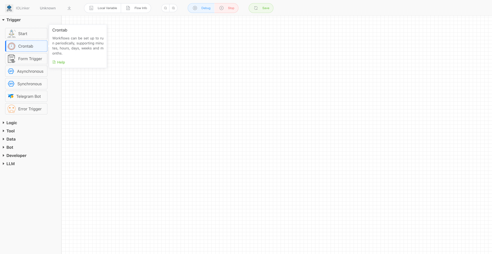
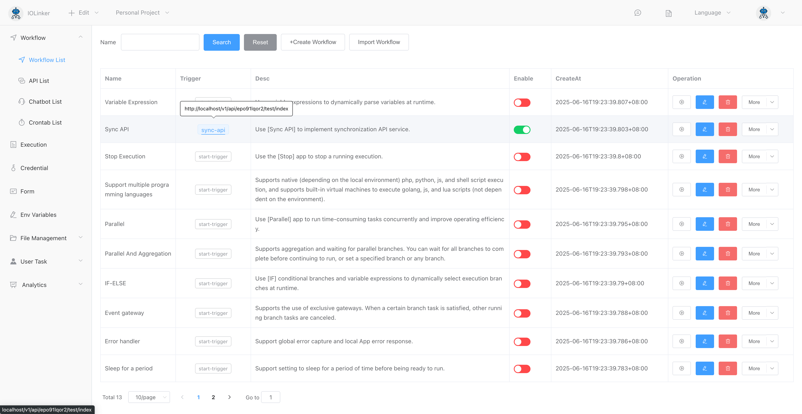
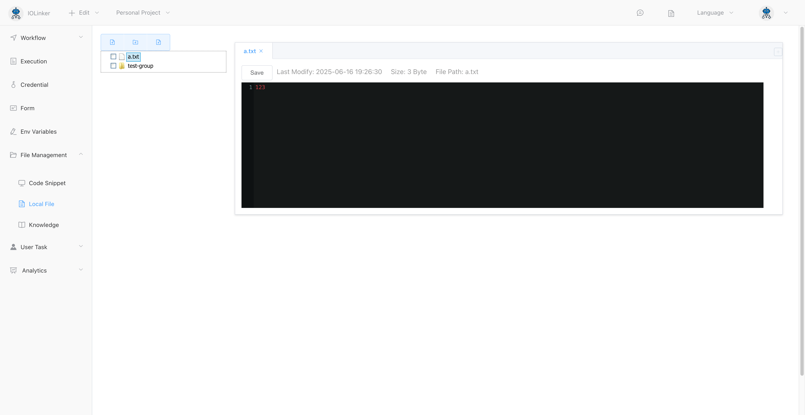
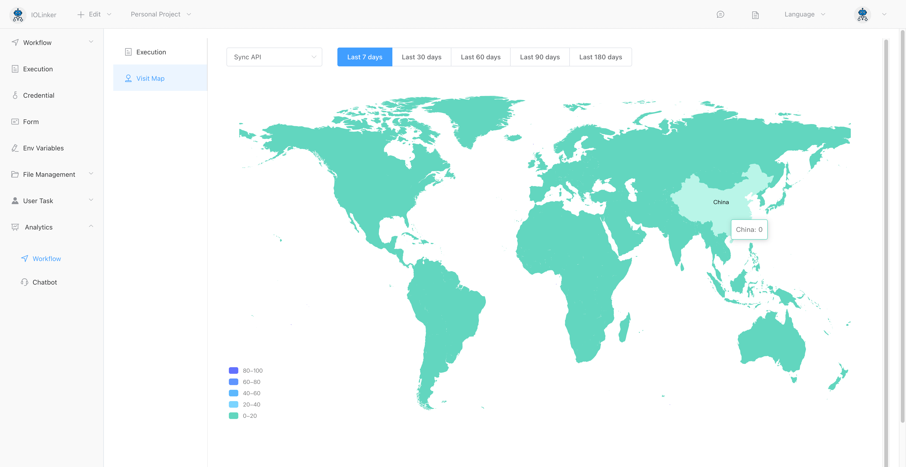

# IOLinker AI Workflow


**The most powerful personal AI workflow tool**

-  ⚡ Easy To Use.

  Low-code concept supports drag-and-drop design of workflow

- 🤖 Agentic Workflow

  By visually orchestrating intelligent agents, an efficient automated tool is developed that can perceive the environment, make autonomous decisions, and execute tasks to achieve goals.

- ⚒️ Rich Functions

  A variety of trigger modes and rich logic components, and supports flexible expansion of various common programming 

  <iframe 
    width="800" 
    height="600" 
    src="https://www.youtube.com/embed/0st8gw2a54s"  
    frameborder="0" 
    allow="accelerometer; autoplay; encrypted-media; gyroscope; picture-in-picture" 
    allowfullscreen>
  </iframe>


## 🌟 Rich Triggers


## 🌟 Rich Logic Components


## 🌟 Workflow Management


## 🌟 Variable Expression


## 🌟 Retrieval-augmented generation(RAG)


## 🗂️ File Management


## 📊 Data Analytics


## 🌟 Support Multi Platform
- [Mac Apple](https://github.com/iolinker/iolinker.com/releases/download/v1.2.4/iolinker-standalone-darwin-arm64-v1.2.4.tar.gz)
- [Mac Intel](https://github.com/iolinker/iolinker.com/releases/download/v1.2.4/iolinker-standalone-darwin-amd64-v1.2.4.tar.gz)
- [Linux AMD64](https://github.com/iolinker/iolinker.com/releases/download/v1.2.4/iolinker-standalone-linux-amd64-v1.2.4.tar.gz)
- [Linux ARM64](https://github.com/iolinker/iolinker.com/releases/download/v1.2.4/iolinker-standalone-linux-amd64-v1.2.4.tar.gz)
- [Raspberry PI 4B](https://github.com/iolinker/iolinker.com/releases/download/v1.2.4/iolinker-standalone-linux-armv7-v1.2.4.tar.gz)
- [Synology NAS](https://github.com/iolinker/iolinker.com/releases/download/v1.2.4/iolinker-standalone-linux-armv7-v1.2.4.tar.gz)
- [Docker]
```
docker run --name iolinker -p 80:80 -e Domain=localhost iolinker/iolinker:latest

```

::: slot footer
Copyright © 2024 [IOLinker] Email：iolinker@outlook.com
:::