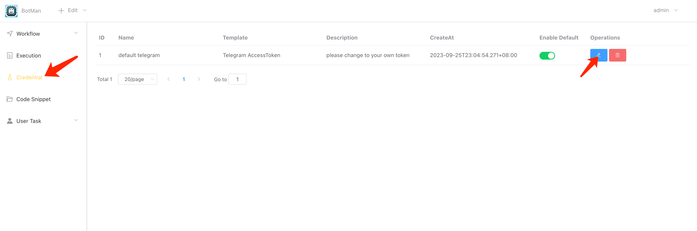
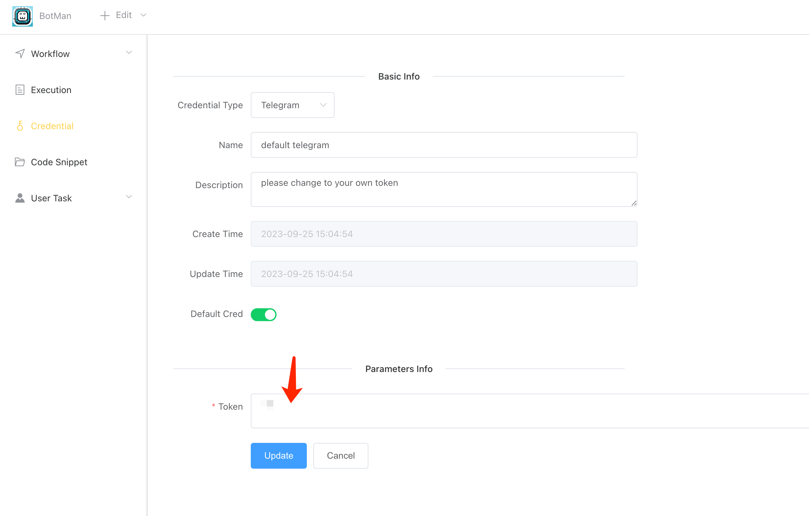
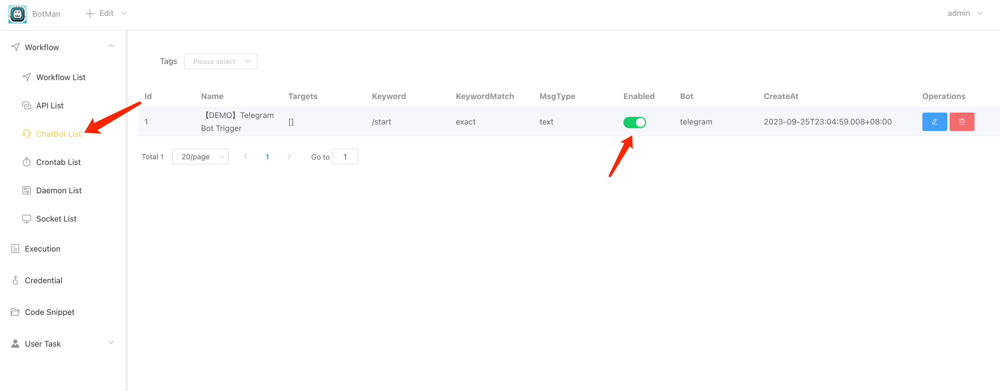
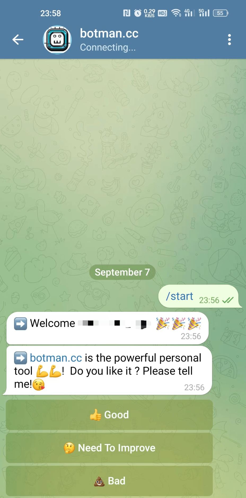

# 1 minute create powerful telegram bot😍

<iframe width="800" height="600" src="https://www.youtube.com/embed/cGxT9cmANGw" frameborder="0" allowfullscreen></iframe>

## Step1: Create telegram bot token from [Bot Father]

Please refer to [How to create telegram bot and get token](how_to_create_telegram_bot_and_get_token.md)

## Step2: Download and run iolinker tool

Please refer to [How to run iolinker](how-to-run-iolinker.md)

## Step3: Config telegram token in iolinker

After run batman tool, go to **[Credential]** page, you will see the page below.

Click **[edit]** button and set the telegram token you created in Step1.

## Step4: Enable Demo telegram command workflow

Switch the button to green status.

## Step5: Finished!🎉🎉

Go to telegram and open your bot, input "**/start**" command and you will see it works.

