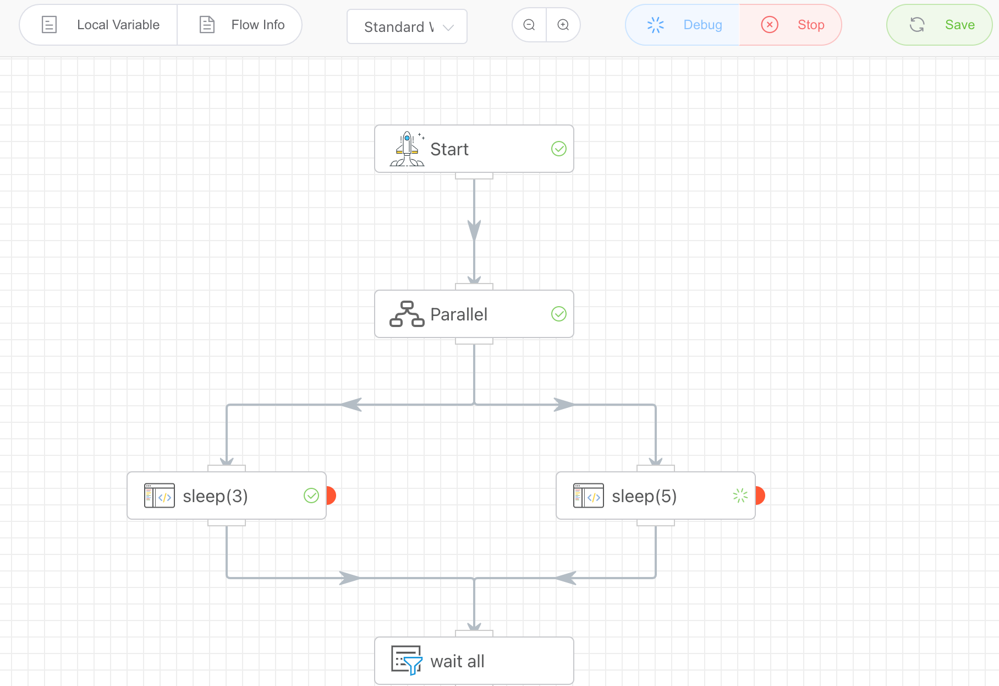
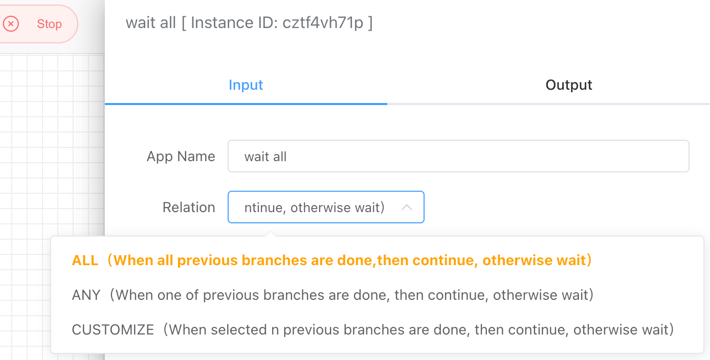

## Parallel Aggregation

Wait for the specified preceding parallel branches to finish running before continuing execution. This should be used in conjunction with the **Parallel Execution** app.

<iframe 
    width="800" 
    height="600" 
    src="https://www.youtube.com/embed/yeeWO2zKVgA"  frameborder="0" 
    allow="accelerometer; autoplay; encrypted-media; gyroscope; picture-in-picture" 
    allowfullscreen>
</iframe>

## Input

- **All**

  Requires waiting for all preceding parallel branches to finish running before continuing execution.

- **Any**

  Only needs to wait for any one of the preceding branches to finish running before continuing execution.

- **Custom**

  Requires waiting for specified preceding branches to finish running before continuing execution.

## Output

None

