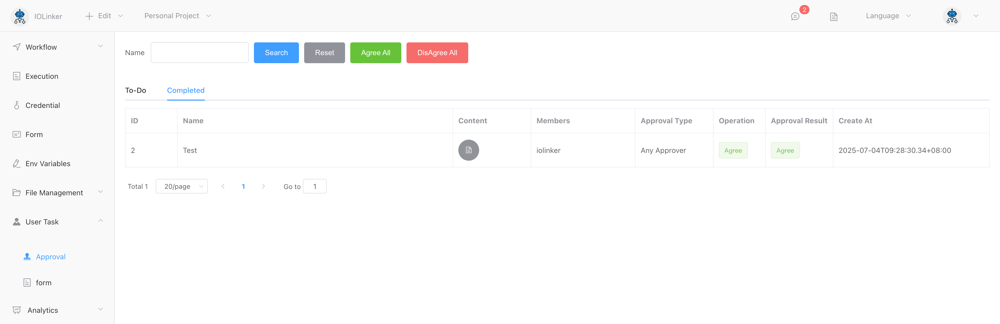

## Approval

Supports both single-signature and co-signature approval methods. Approval can be conducted on the web page as well as on Telegram. You can also set a timeout period and its corresponding response branches.

A green output indicates approval, red indicates disapproval, and a gray output indicates a timeout.


Personal pending approval data can be viewed under **User Tasks** in the **Approval** section, with support for one-click batch operations.


By clicking on the approval details, you can view the complete content and actions of the approval.





## Input

### Approval Channels

By default, Web is mandatory, and Telegram is optional. If you select Telegram, you will need to configure the associated bot credentials (Token), which must be created in the credentials section.


### Name

Approval name.


### Content

Approval content.


### Members

Approval members. This section will display a list of accounts, supporting fuzzy search. If Telegram approval is enabled, you need to configure the users' Telegram IDs in the user list; otherwise, messages cannot be sent to Telegram users.


### Type

Supports two common approval types:

- **Single-signature**: Only one approver needs to handle it. If this approver agrees, the process moves to the next node; if they reject it, the approval process ends.
- **Co-signature**: All approvers must agree for the process to move to the next node. If any approver rejects, the approval request will be denied, and the process will end.


### Timeout

Defaults to 0, indicating no timeout limit. If set to greater than 0, if the approval time exceeds the specified duration, the approval process will end and flow to the timeout branch.

Users can set the response actions for the timeout here.


## Output

The output contains two fields:

- **approval**: Represents the details of the approval, including the approval title, content, members, and approval results.

- **operationList**: Represents the results submitted by each approval member, including their comments and messages.

Below is an example of an output result:

```json
[
    {
        "approval": {
            "appInstId": "kjs6f044cs",
            "attr": "Any",
            "content": "hello world",
            "createAt": "2024-01-01T0xxxx",
            "endAt": "2024-01-01 xxxx",
            "executionUid": "2172667998xxxx",
            "expireAt": 0,
            "id": 4,
            "index": 0,
            "isTimeout": false,
            "name": "Test",
            "startAt": "2024-01-01 xxxx",
            "status": -99,
            "template": "approval",
            "timeout": 0,
            "updateAt": "2024-01-xxxx",
            "users": "iolinker",
            "workflowId": 1,
            "workflowUser": "iolinker"
        },
        "operationList": [
            {
                "approvalId": 4,
                "comment": "",
                "createAt": "2024-01-xxxx",
                "id": 4,
                "name": "Test",
                "status": 0,
                "updateAt": "2024-01-xxxx",
                "user": "iolinker"
            }
        ]
    }
]
```

