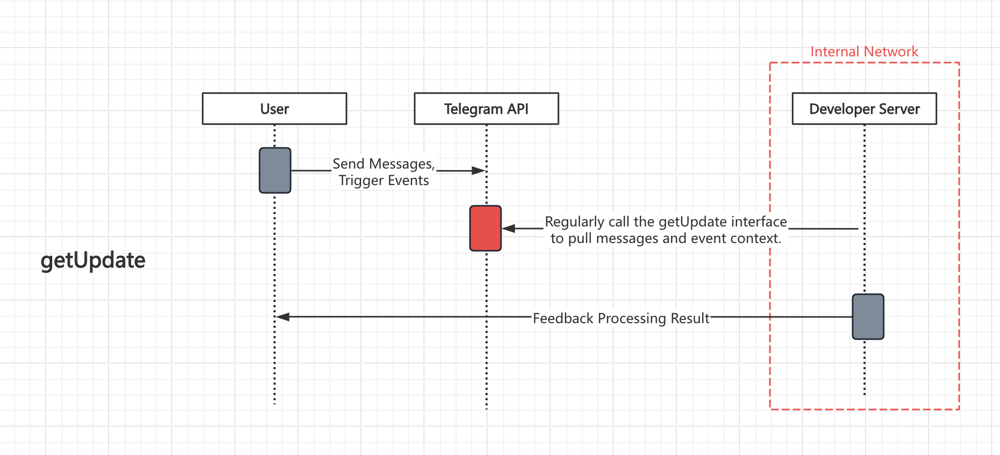

# 1-Minute Zero-Code Quick Implementation of a Telegram Bot Command Interaction Robot

The following article will show you how to implement a complex Telegram interactive bot using a low-code orchestration approach. Even without programming knowledge, you can quickly create your own bot—and it will be a command-interactive one!

<iframe 
    width="800" 
    height="600" 
    src="https://www.youtube.com/embed/zoEYr-Z1f1s"  frameborder="0" 
    allow="accelerometer; autoplay; encrypted-media; gyroscope; picture-in-picture" 
    allowfullscreen>
</iframe>

## 一、Demo

First and foremost, let’s take a look at the final result of the Telegram bot we’re going to build:

## 二、Two Methods for Receiving Telegram Callback Messages

For individual developers, using the getUpdates method has lower entry barriers and requires fewer prerequisites. However, if high real-time performance and handling large volumes of messages are necessary, the webhook mode may be considered.

### （1）getUpdate mode

Polling Telegram's getUpdates API to retrieve messages and event data sent to the bot eliminates the need for a domain name or public network exposure (as required by WebHook). This method even allows receiving Telegram bot callback messages within an internal network. Below is the workflow principle of this mode.
> Advantages 
- No need to expose public network servers; Telegram callback messages can be polled within an internal network, ensuring high security 
- No domain name or HTTPS certificate required 
- No need to register a webhook interface with Telegram BotFather; data can be directly fetched via polling

> DIsAdvantages

- Requires periodic polling to fetch messages, resulting in slightly lower real-time performance
- Requires local storage to track previously processed messages and avoid duplicate responses
- Only suitable for scenarios with low message volume

### （2）webhook mode

Provide a callback URL (requiring an HTTPS domain) to Telegram. Telegram will then push messages and event data received by the bot to this callback interface. This method offers higher real-time performance but requires users to expose their system to the public network and provide a domain with an HTTPS certificate. Below is the workflow principle of this mode.

> Advantages

- **Strong real-time performance**, suitable for high-volume messaging scenarios
- **No need to track previously synced messages**, simplifying implementation

> DIsAdvantages

- Requires a server exposed to the public network, which may pose security risks
- Requires a domain name with an HTTPS certificate
- Requires manual registration of the callback interface with Telegram's BotFather

## 三、Python Library Implementation

I believe many developers who have built Telegram bots using Python have encountered or used the following library. This open-source Python library wraps numerous official Telegram APIs, significantly reducing the difficulty of interacting with Telegram’s interfaces. However, it still requires writing substantial amounts of code, especially when implementing a Telegram bot with complex interactive capabilities. This often involves various programming techniques and challenges related to local data storage and maintenance.

For developers with programming experience, this can already be quite challenging—let alone for those without any coding background!

Open-source Telegram Python library: https://github.com/python-telegram-bot/python-telegram-bot

Telegram Official Bot API (Extensive!!):

Of course, such a cumbersome implementation method is not within our consideration. Let‘s explore another approach below.

## 四、IOLinker Workflow Orchestration Tool Implementation

### (1) Download IOLinker and Launch It

Refer to the official documentation: [How to Run IOLinker](https://iolinker.com/how-to-run-iolinker.html)

### (2) Create Telegram Credential

Most people likely already have this set up, so we won’t go into excessive detail. The key step is to apply through the official BotFather.

After creating the credentials, navigate to the **Credentials Management** page in IOLinker and enter the Telegram credentials you just created:

- Set this credential as the default. When chatting with the bot, the system will automatically identify which Telegram credential to use.

- Enable built-in preset commands. Once enabled, the default custom commands `/start`, `/man`, and `/list`will be available, effortlessly implementing command functionality without writing a single line of code. To modify command descriptions, go to the credential creation page to make changes.

  

  

  Custom Command List:

  

  

### (3) Create and configure a Telegram bot trigger

Click the [Create Workflow] button under the [Edit] menu.

Under the [Triggers] category on the left, select [Telegram Trigger], double-click it, and configure according to the image below.
- Cred: Use the Telegram credentials created previously  
 - Message Type: Select "Text" here  

 - Allowed Users: Leave blank by default to respond to inputs from all users  

 - Trigger Scope: Choose "Command Input Trigger". Note: The default is "Any Input Trigger", meaning any string input will trigger a response  

 - Command: Use the default /start command included with every bot  

 - Command Description: Settings here will be displayed in the bot's preset command list  

 - Command Parameters: Refer to the documentation: [Commands and Parameters](https://iolinker.com/trigger_telegram.html#commands-and-parameters)

 - Debug Data: This primarily simulates the output results after the Telegram bot trigger is executed, allowing simulated data output without actually running the bot

At this point, if we save and enable the configuration directly, it will actually be operational. However, note that this setup only captures user input without providing actual feedback to the user, as shown below.

The IOLinker tool will automatically register the created Telegram Bot commands to the preset command list.

When we manually enter the command `/nmap -h 1.1.1.1`with parameters, it triggers the workflow to run (it can also be triggered without parameters, in which case default values will be used).

After entering the `/nmap`command in the Telegram bot, we can see the workflow's execution records in the workflow list.

Click on the execution record to view detailed response data. The previously entered parameters will be automatically parsed and extracted:

At this point, we have successfully implemented the input and response mechanism for bot commands. Subsequent steps can now involve adding other workflow logic, such as sending messages or interactive approval buttons.

### (4) Add Telegram Bot Interactive Approval Functionality

- Click on the [Logic Components] on the left, select the [Approval] app, drag it into the editor, and double-click to configure.

   - Approval Channel: By default, approvals can be processed on the web. Here, we additionally select Telegram.

   - Telegram Credentials: Select the Telegram credentials created earlier.

   - Name: The title of the message.

   - Content: The specific content of the approval request.

   - Members: By default, only configured sets can be selected (viewable in the Settings section). Note: You must first set your Telegram account ID under Settings → Account. For instructions on how to find your Telegram ID, refer to the documentation: [How to get Telegram ChatId](https://iolinker.com/send_telegram_message.html#chatid).

   - Type: Or-sign (i.e., only one approval is required).

   - Timeout: Set the duration (in seconds) after which the approval request times out, proceeding to the branch indicated by the gray dotted connection.

   - Yes Label: Set the label text for approval.

   - No Label: Set the label text for rejection.

As shown in the figure below, after configuring the Approval app, you can set up follow-up response branches for approval (green node) and rejection (red node), such as executing other Python code or sending messages via Telegram.

### (5) Save and Enable

After saving, you can view the created bot information under **[Chatbot List]** in the **[Workflow]** section, or check it in the **[Workflow List]**.

### (6) Test Robot

Open the created bot, enter the `/start`command, and you will see the bot send us interactive approval buttons.

Click the **[Yes]** or **[No]** button to execute the subsequent approval or rejection branch processes.

Returning to the **[Execution]**, we can see the workflow's response history. Here, it is visible that the workflow selected and executed the corresponding branch based on the bot's interaction.

If familiar with the process, the entire setup can be completed in under a minute—far more efficient than traditional coding methods!

