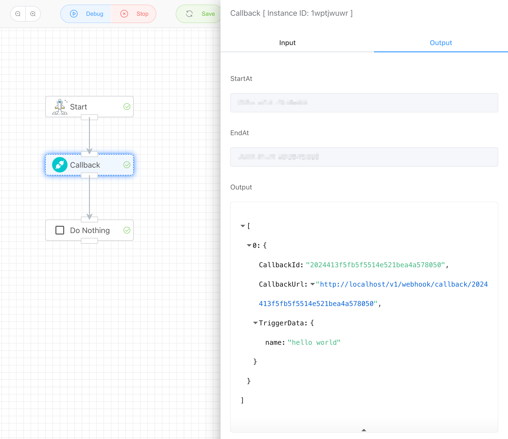

## Callback Interface

The **Callback Interface** application generates a unique URL address. The application will wait for the interface to be called before continuing execution; otherwise, it remains in a sleep state.

This callback address can accept parameters via POST and display the output in the TriggerData.

```
>> curl -d '{"name":"hello world"}' http://localhost/v1/webhook/callback/2024413f5fb5f5514e521bea4a578050
>> {"response":{}}
```




If a duplicate submission occurs, an error will be prompted, ensuring that each callback interface can only be called once.

```
>> curl -d '{"name":"hello world"}' http://localhost/v1/webhook/callback/2024413f5fb5f5514e521bea4a578050
>> {"response":{"error":{"code":"requestError.repeatedOperation","message":"requestError.repeatedOperation"}}}
```


## Input

None


## Output

- CallbackId：Task ID
- CallbackUrl：Callback Address
- TriggerData：The received POST data

```json
{
    "CallbackId": "2024413f5fb5f5514e521bea4a578050",
    "CallbackUrl": "http://localhost/v1/webhook/callback/2024413f5fb5f5514e521bea4a578050",
    "TriggerData": {
        "name": "hello world"
    }
}
```

