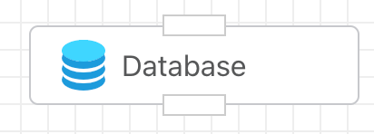
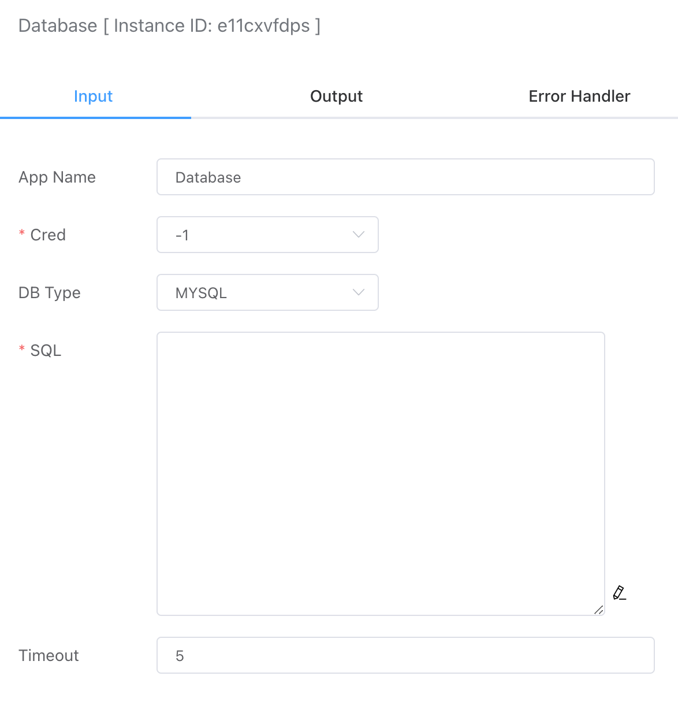
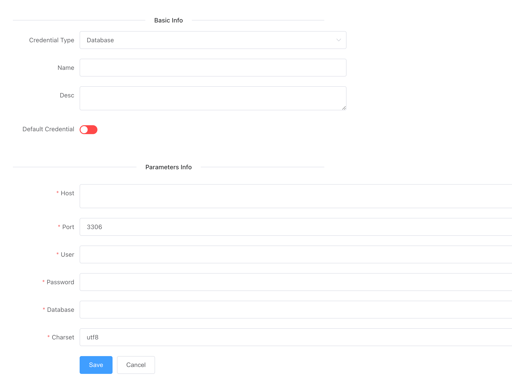

## Database

Supports inputting SQL statements to perform operations such as adding, deleting, modifying, and querying data in the database.



## Input



- ### Credentials

  You can create a database credential type in the **Credential** section. The following options need to be configured:

  - **Host:** The address of the remote host.
  - **Port:** The database port, default is 3306.
  - **User:** The database account.
  - **Password:** The database password.
  - **Encoding:** The encoding format for reading and writing to the database, default is UTF-8.




### Database Types

Currently, the following database types are supported:

- MySQL
- PostgreSQL
- SQL Server


### SQL Statements

Basic CRUD (Create, Read, Update, Delete) commands are supported, including `SELECT`, `UPDATE`, `DELETE`, and `INSERT` statements.


## Output

- If it is a `SELECT` operation, the return will be a JSON array, for example:

  ```json
  [{"id":1, "name":"test1"}]
  ```

- If it is an `INSERT` operation, the return will include the auto-incremented ID and the number of affected rows:

  ```json
  {
      "LastInsertId": 16,
      "RowAffected": 1
  }
  ```

- For `DELETE` and `UPDATE` operations, the return will include the number of affected rows.

  ```json
  {
      "RowAffected": 1
  }
  ```


