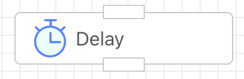

## Delay

You can set a delay for a specified amount of time (in seconds) before continuing execution.

<iframe 
    width="800" 
    height="600" 
    src="https://www.youtube.com/embed/0eBUO_7ptG4"  frameborder="0" 
    allow="accelerometer; autoplay; encrypted-media; gyroscope; picture-in-picture" 
    allowfullscreen>
</iframe>

## Input

### Seconds

Specify the number of seconds to wait before executing.

## Output

None