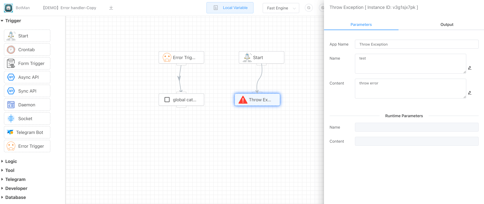
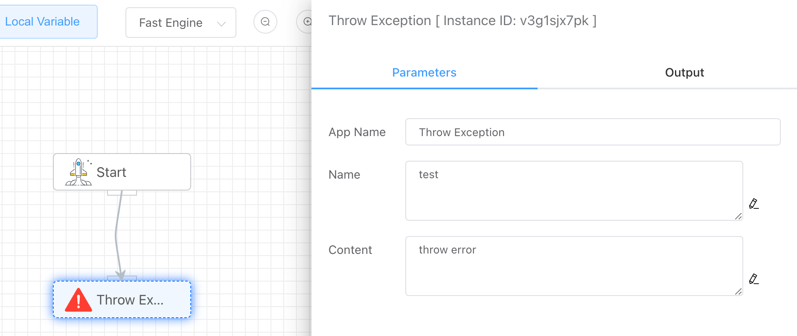
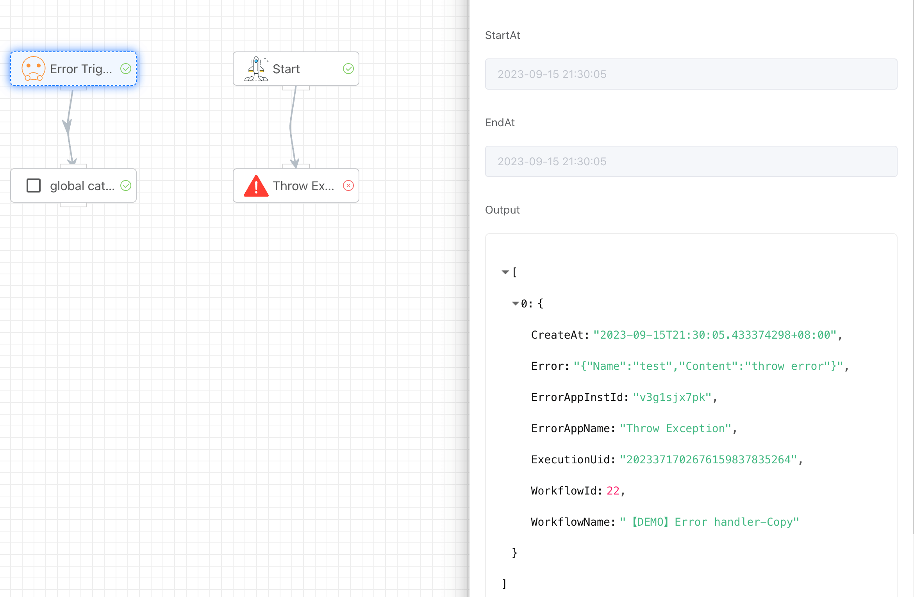

## Indroduction

- **[Throw Exception]** app can raise exception.
- **[Error Trigger]** app can catch global error and run error branch.

<iframe width="800" height="600" src="https://www.youtube.com/embed/y7N8uWXESgw" frameborder="0" allowfullscreen></iframe>

## How to use

### Throw Exception

The content of the exception can be set.

### Error Trigger

Catch errors and display abnormal app information.

