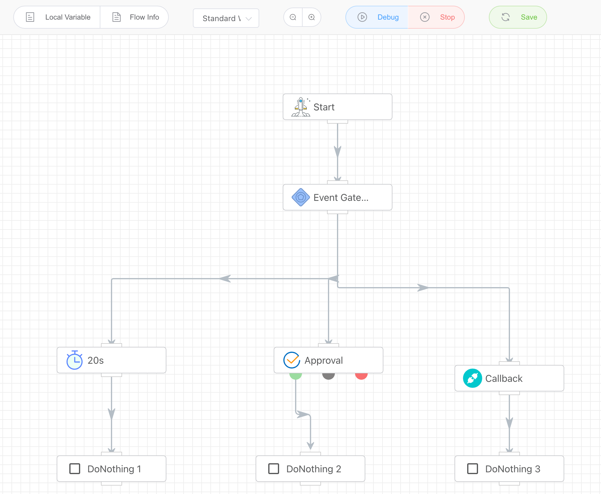

## Event Gateway

Select the branch with the shortest path (the one that finishes execution first) and cancel the other branches. For example, in the event gateway with three branches: a 20-second delay, approval, and callback interface invocation (providing a callback interface for third-party systems). As soon as any one of them finishes execution, the other two will be canceled.

## Input

None

## Output

None