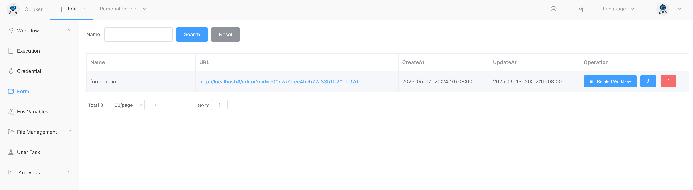

## Form Task

Generate a unique form task URL for each form-filling member, and submitting the form can trigger the workflow to proceed.


### Steps

#### 1. Create Form


#### 2. Design and Save the Form


The saved form can be viewed under the **[Form]** menu option on the left.



#### 3. Create a workflow and link it to the form

Use the **[Form Task]** and select the previously created form from the dropdown list, indicating that this node's form task will use the chosen form.


Under the **[Form]** menu, you can also view the associated workflows for each form.


#### 4. Launch the workflow and create a form task instance

In the **[Workflow]** section, you can locate the previously created workflow. Click the first "Start" button in the actions column. Once the workflow execution reaches the form task node, it will generate one or multiple form task instances.


Under the **[Form]** menu in **[User Task]**, you can view the created form task instances. Each form member will be assigned a unique form task instance (corresponding to a distinct form submission URL) for submitting their form task.


####  5.Submit form

Click the pending form submission link under the **[Form]** menu to access the form submission page. After entering the required data, click **Submit**. The workflow engine will then determine whether to proceed to the next node based on the **OR-sign (Any Approver)** or **AND-sign (All Approvers)** logic, depending on the actual submission status.


#### 6. View form submission records.

**Form Submission Records (Workflow Execution Logs):**


Click **View Details** to see the submitted form data.


## Input

### Form

Here you can select the form to be associated from the dropdown menu.

### Members

Set the members who are allowed to fill out the form.

### Type

- **OR-Sign (Any Approver)**: Proceeds to the next node as soon as one member approves.
- **AND-Sign (All Approver)**: Advances only after every designated member grants approval.


## Output

As shown below, the output will display the submitter's information, the timestamp of submission, and the values of all form fields (under `submitData`).

```
[
  {
    "CreateAt": "2025-05-13 20:09:03",
    "Members": "iolinker",
    "Name": "Form Task",
    "SubmitList": [
      {
        "opId": 45,
        "status": 1,
        "submitAt": "2025-05-13 20:12:24",
        "submitData": {
          "field101": "test"
        },
        "user": "iolinker"
      }
    ]
  }
]
```

