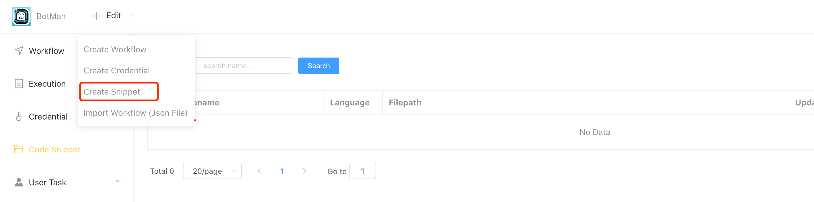
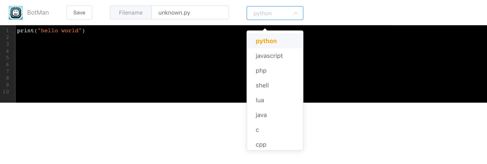
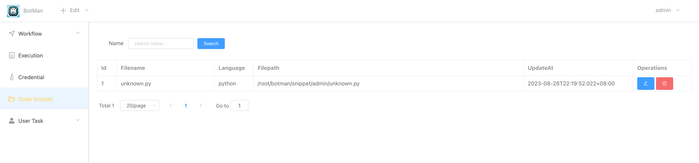

## Intruduction

**[Code Snippet]** supports the management of various code fragments, and supports reference execution in **[Script-Task]** app.

## How to use

Click **[+Edit > Create Snippet]**

Write code and save.

Back to **[Code Snippet]** page ,you can see the code snippet list.

