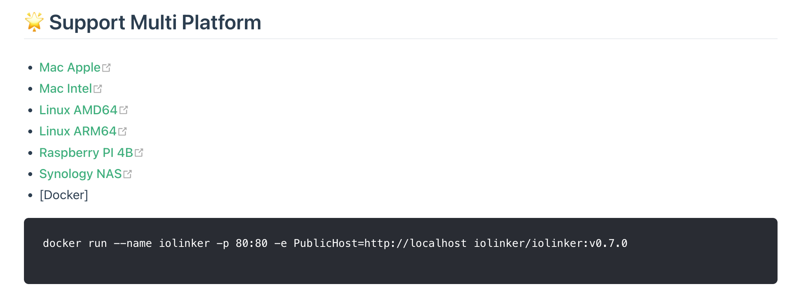

# Docker

```
docker run --name iolinker -d PublicHost=http://localhost iolinker/iolinker:v0.5.1
```


# On Device

The current binary executable file supports direct execution on the following systems:

> Linux amd64
>
> Linux arm(Like Raspberry PI 4B、NAS)
>
> Mac (M1/M2/Intel cpu)


- Step 1 : 

  Enter the [https://iolinker.com](https://iolinker.com) official website and download the corresponding executable file according to your current system.

  

- Step 2: 

  Unzip it to the target folder.

  ```
  tar -xvf iolinker-standalone-xxx-xxx-v0.5.1.tar.gz
  ```

- Step 3: 

  Run the executable file. By default, port 80 is used. The accessible address is http://localhost. The login account is: iolinker. The default password is: iolinker.com.

  It is recommended to change the password after logging in.

  ```
  ./iolinker
  ```

- Step 4 (Help): 

  If you want to view the command line parameters, you can display them using the following command.

  If you want to deploy for public access, you can specify the public access address using the -d parameter.

  For example, the following command specifies the public access address as: [http://test.com](http://test.com).

  ```
  ./iolinker -d http://test.com
  ```

  ```
  ./iolinker -h

██╗ ██████╗ ██╗     ██╗███╗   ██╗██╗  ██╗███████╗██████╗ 
██║██╔═══██╗██║     ██║████╗  ██║██║ ██╔╝██╔════╝██╔══██╗
██║██║   ██║██║     ██║██╔██╗ ██║█████╔╝ █████╗  ██████╔╝
██║██║   ██║██║     ██║██║╚██╗██║██╔═██╗ ██╔══╝  ██╔══██╗
██║╚██████╔╝███████╗██║██║ ╚████║██║  ██╗███████╗██║  ██║
╚═╝ ╚═════╝ ╚══════╝╚═╝╚═╝  ╚═══╝╚═╝  ╚═╝╚══════╝╚═╝  ╚═╝
  
  Complete documentation is available at https://iolinker.com
  
  Usage:
    iolinker [flags]
  
  Flags:
    -h, --help                   help for iolinker
    -d, --public_domain string   Set server's address. Usage: ./iolinker -d http://localhost:8080
    
  ```


# Performance and Requirements

- **High Concurrency**: Using synchronous/asynchronous API workflows (fast workflow mode) on a single machine, the **QPS can reach over 1500**.

- **High Capacity**: The Crontab workflow supports over **100,000** concurrent active workflows.

- **Low Resource Consumption**: Low hardware requirements; the system can run on a machine with 1 core and 1GB of memory or more.


```
ab -n 2000 -c 10 http://localhost/v1/api/iolinker/test/index
This is ApacheBench, Version 2.3 <$Revision: 1913912 $>
Copyright 1996 Adam Twiss, Zeus Technology Ltd, http://www.zeustech.net/
Licensed to The Apache Software Foundation, http://www.apache.org/

Benchmarking localhost (be patient)
Completed 200 requests
Completed 400 requests
Completed 600 requests
Completed 800 requests
Completed 1000 requests
Completed 1200 requests
Completed 1400 requests
Completed 1600 requests
Completed 1800 requests
Completed 2000 requests
Finished 2000 requests


Server Software:
Server Hostname:        localhost
Server Port:            80

Document Path:          /v1/api/iolinker/test/index
Document Length:        21 bytes

Concurrency Level:      10
Time taken for tests:   1.290 seconds
Complete requests:      2000
Failed requests:        0
Total transferred:      438000 bytes
HTML transferred:       42000 bytes
Requests per second:    1550.46 [#/sec] (mean)
Time per request:       6.450 [ms] (mean)
Time per request:       0.645 [ms] (mean, across all concurrent requests)
Transfer rate:          331.59 [Kbytes/sec] received

Connection Times (ms)
              min  mean[+/-sd] median   max
Connect:        0    0   0.4      0      19
Processing:     2    6   3.4      6      38
Waiting:        2    6   3.4      6      38
Total:          3    6   3.5      6      39

Percentage of the requests served within a certain time (ms)
  50%      6
  66%      6
  75%      7
  80%      7
  90%      8
  95%      9
  98%     13
  99%     31
 100%     39 (longest request)
```


