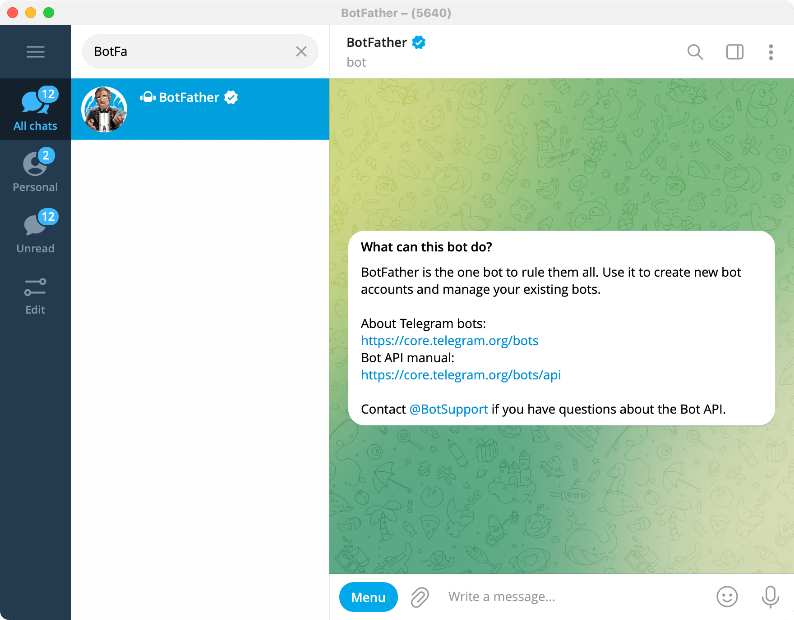
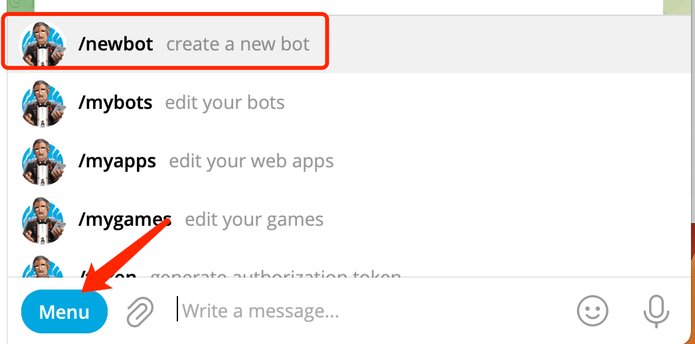
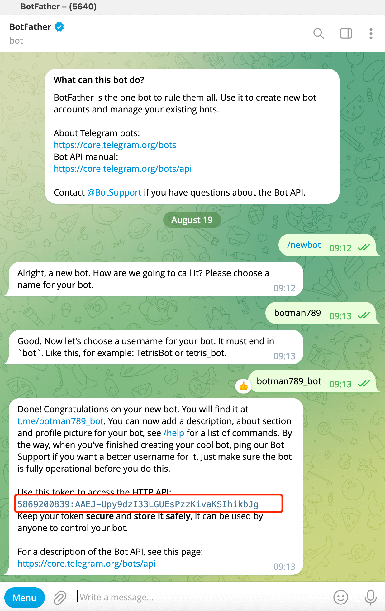
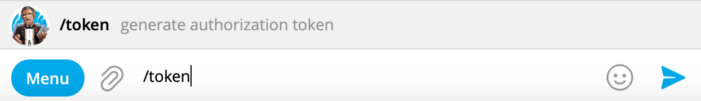
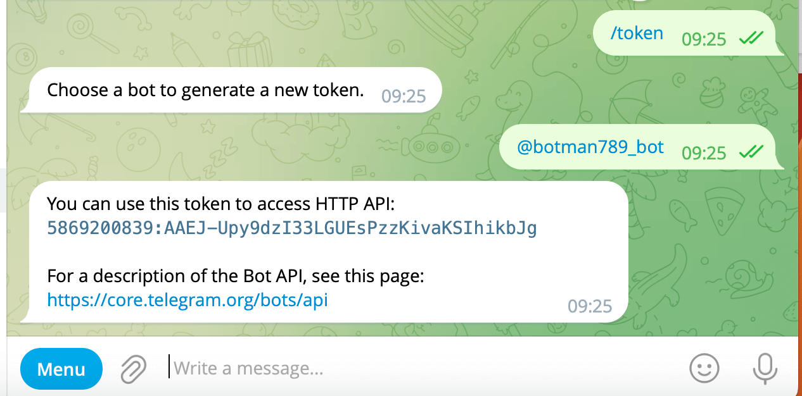

## 1. Search [BotFather] in search tab in telegram messenger

## 2. /netbot

Click the **[Menu]** button and select **[/newbot]**

Enter the name of the robot according to BotFather's prompt, and soon you will successfully create a robot and get the access token of the robot.

## 3. /token

If you foget you bot's token , you can use [/token] command in [BotFather] to

If you forget the token of the robot, you can enter the [/token] command in [BotFather] to get it back 

