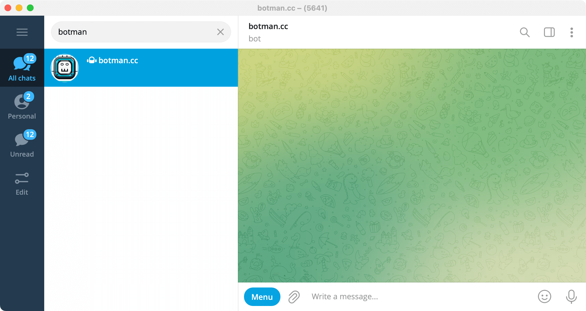
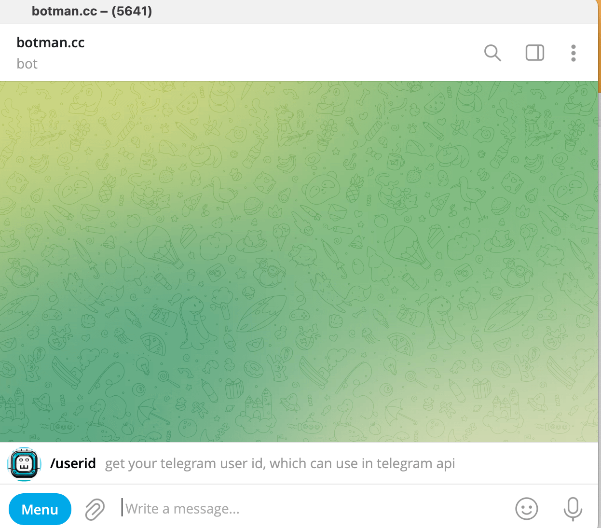
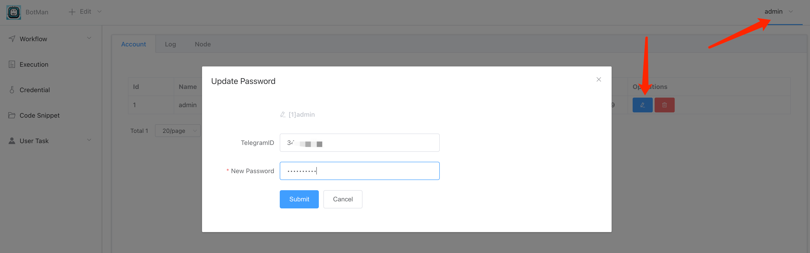

## 1. Search [iolinker.com] in search tab in telegram messenger

## 2. /userid

Click the **[Menu]** button and select **[/userid]**

## 3. Associate userid to admin account

Click the **setting** button in the upper right corner, select the **Account** tab page, and update the telegram userid.

