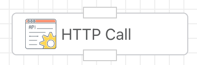
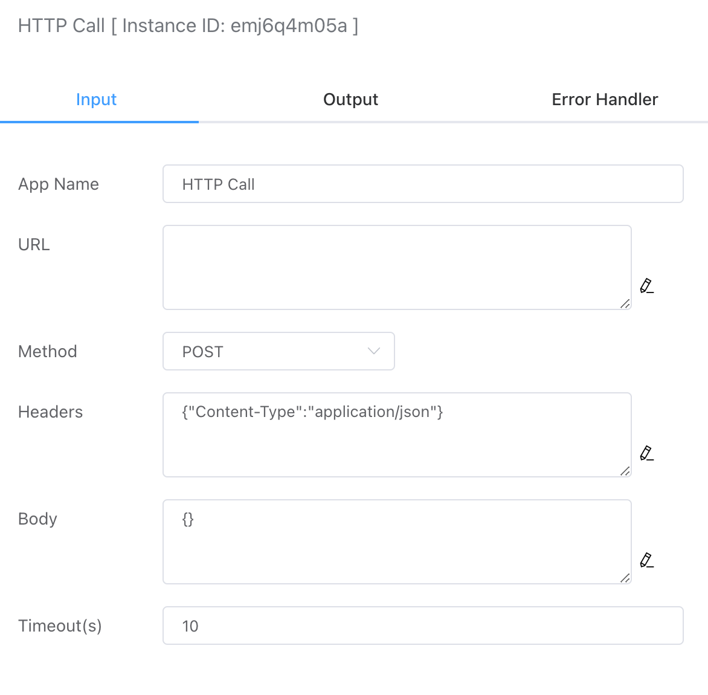

## HTTP Call

Supports sending POST or GET requests.



## Input



### URL

The request URL, supporting both HTTP and HTTPS protocols.


### Method

Currently supports GET and POST request methods.


### Request Headers

This is represented using a JSON string format, for example:

```json
{"Content-Type":"application/json"}
```


### Request Body

The request body for the POST method, typically represented as a JSON string, for example:

```json
{"site":"iolinker.com"}
```


### Timeout

You can set the timeout duration for the HTTP call, with the default being 10 seconds.


## Output Parameters

The output returns various fields from the HTTP response package, as follows:

### Body

The message body of the response.


### Code

The response status code.


### Content Length

The length of the message body content.


### Header

The headers of the response.

```json
{
    "body": {
        "code": 0,
        "msg": "ok"
    },
    "code": 200,
    "content_length": 21,
    "header": {
        "Content-Length": [
            "21"
        ],
        "Content-Type": [
            "application/json; charset=utf-8"
        ],
        "Date": [
            "Wed, 18 Sep 2024 14:05:00 GMT"
        ],
        "Set-Cookie": [
            "botman_uid=41be9c6324d09c5544a9ffb18908ae11; Path=/; HttpOnly"
        ]
    }
}
```


