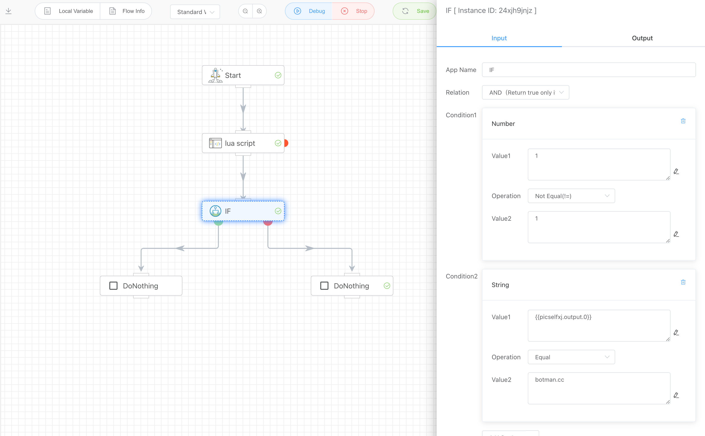
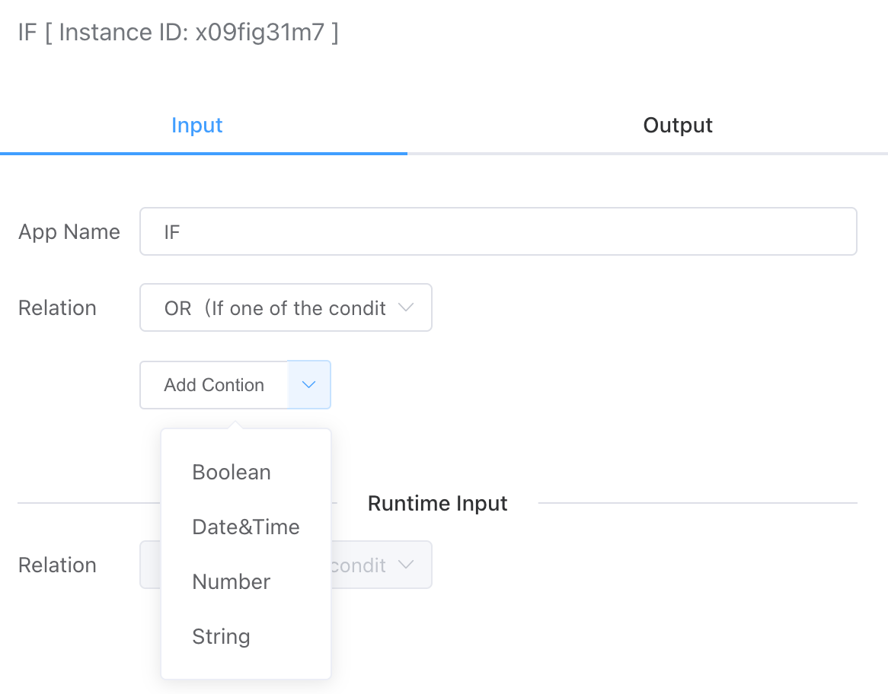
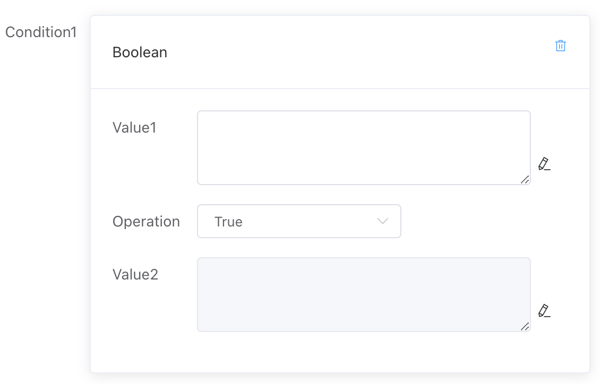
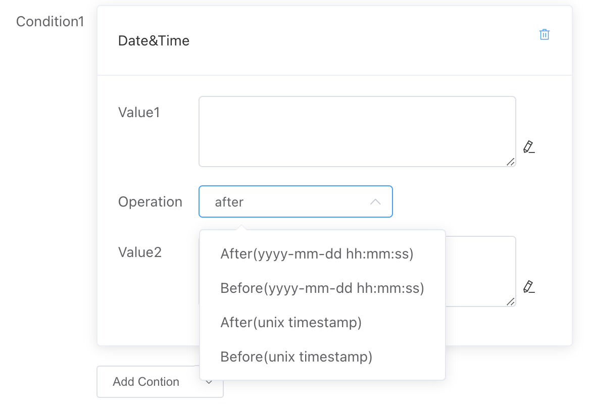
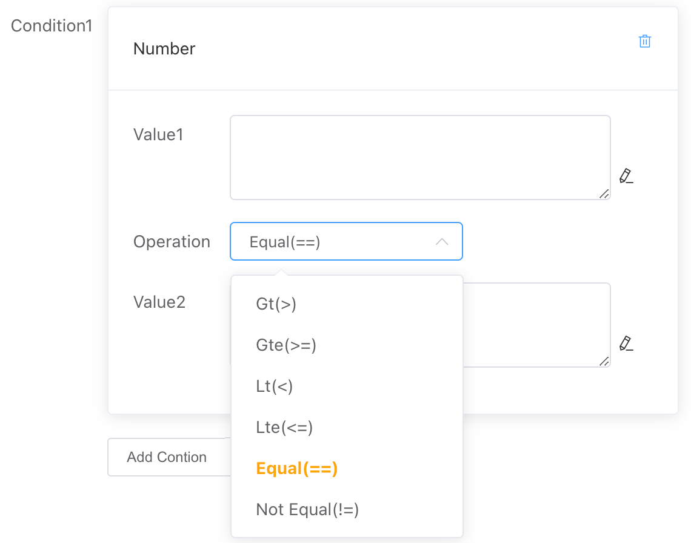
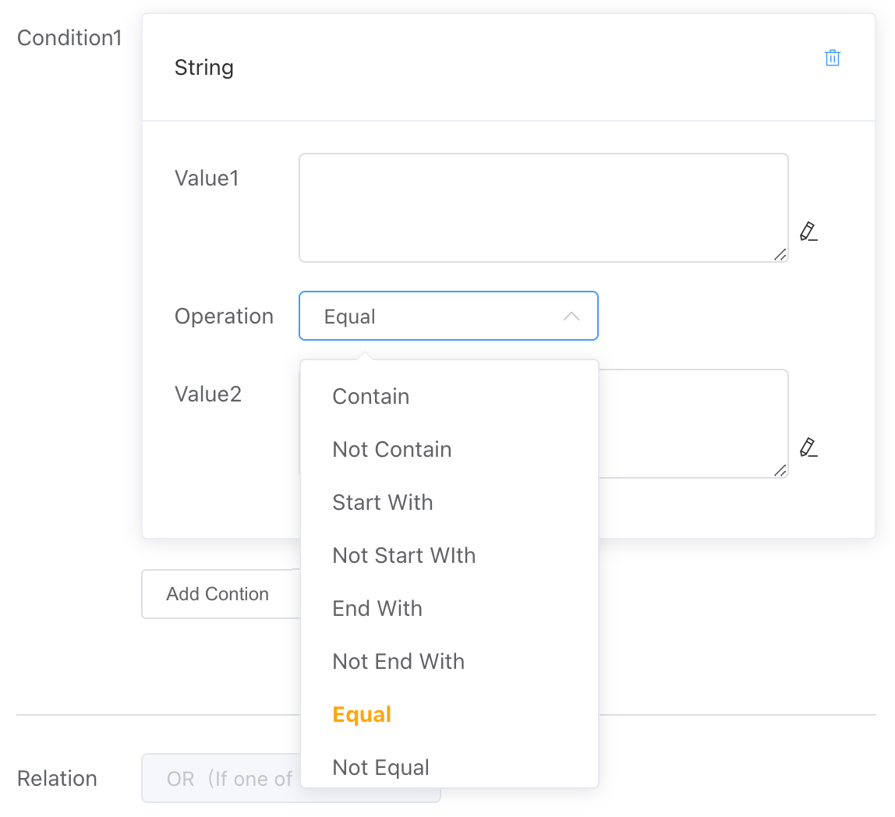

## Conditional Judgment

Determine the output as true or false based on the input and select the corresponding branch for execution. Supports the use of "and" and "or" to combine conditions, and allows for the use of variable expressions to make dynamic decisions at runtime.




## Input

### Conditional Relationships

Complex conditional combinations can be formed using "and" and "or" relationships. If both "and" and "or" appear in a combination, the relationship is as follows: `CondX and CondY or CondZ...`

- **And**

  Returns true only if all conditions (Condition 1, Condition 2, ... Condition N) are true; otherwise, it returns false.

- **Or**

  Returns true if any one of the conditions is true; otherwise, it returns false if all conditions are false.


### Conditional Value Types

Currently, the following four types of value comparisons are supported: boolean, date and time, numeric, and string.




Values 1 and 2 can be constants or variable expressions (dynamically retrieved at runtime).

#### Boolean Value

Determine whether Value 1 is true or false (Value 2 is not applicable here).




#### Date and Time

Compare the relationship between Value 1 and Value 2 in terms of dates. You can compare strings in the format `yyyy-mm-dd hh:mm:ss` as well as Unix timestamp formats.




#### Numeric

Compare the relationship between Value 1 and Value 2 in terms of size, including:

- Greater than
- Greater than or equal to
- Less than
- Less than or equal to
- Equal to
- Not equal to



#### String

Compare the relationship between Value 1 and Value 2 in terms of strings, including:

- Contains
- Does not contain
- Starts with...
- Does not start with...
- Ends with...
- Does not end with...
- Equal to
- Not equal to




## Output

```
[true/false]
```


