## IOLinker Agent

  <iframe 
    width="800" 
    height="600" 
    src="https://www.youtube.com/embed/0st8gw2a54s"  
    frameborder="0" 
    allow="accelerometer; autoplay; encrypted-media; gyroscope; picture-in-picture" 
    allowfullscreen>
  </iframe>


### Create LLM Credential

Create an LLM API key credential in [Credential]. Currently supported LLM models include: Deepseek, Doubao, Kimi, OpenAI, Qwen, and the open-source Ollama.

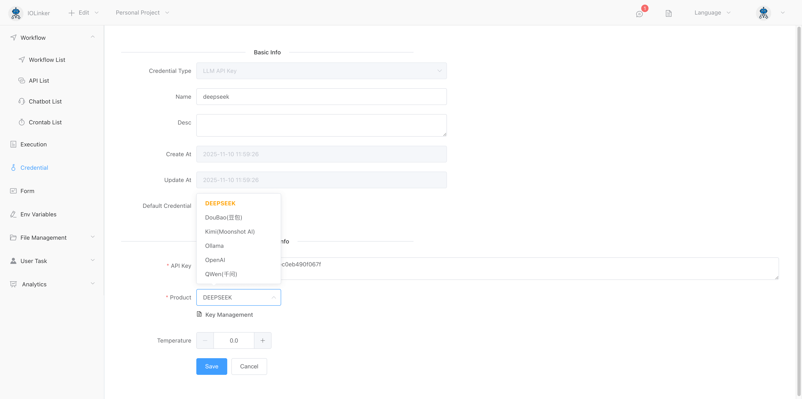

### Configure IOLinker Agent

Here you can use it in combination with the Telegram trigger. You can send messages to the Agent via Telegram, and the app will deliver the Agent's processing results back to the user through Telegram messages.

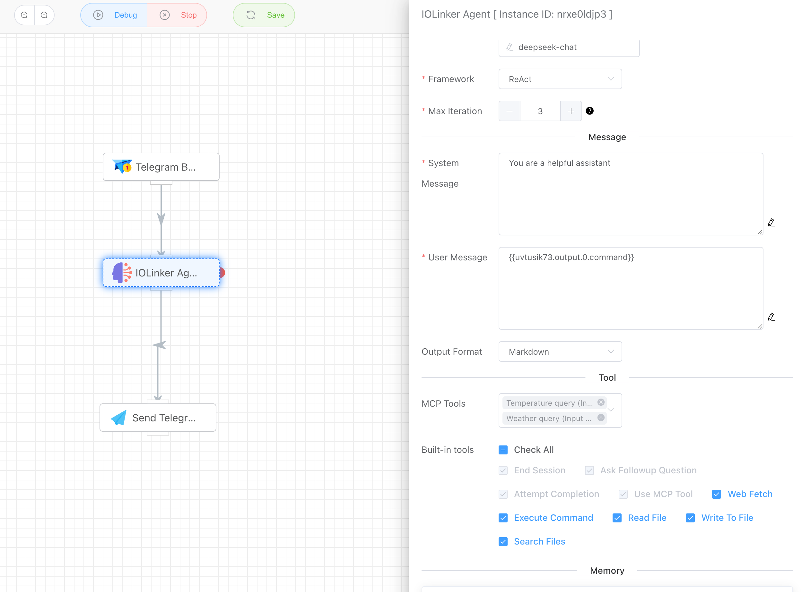


### Test IOLinker Agent

We can open the configured Telegram bot and interact with it directly. For example, if you ask it "What can you do?", it will provide a response message based on the current environment and the external tools it can utilize. Each reply from the bot generates an execution record in the `Execution List`.

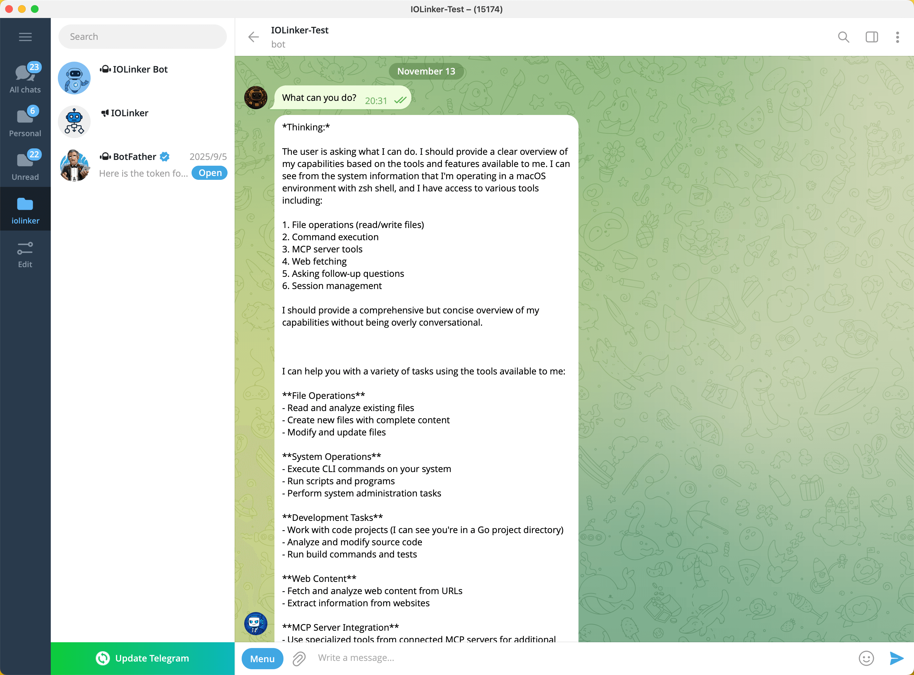


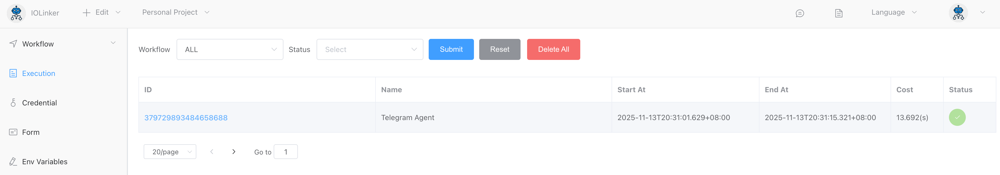

Double-clicking the app will display the current app's output.

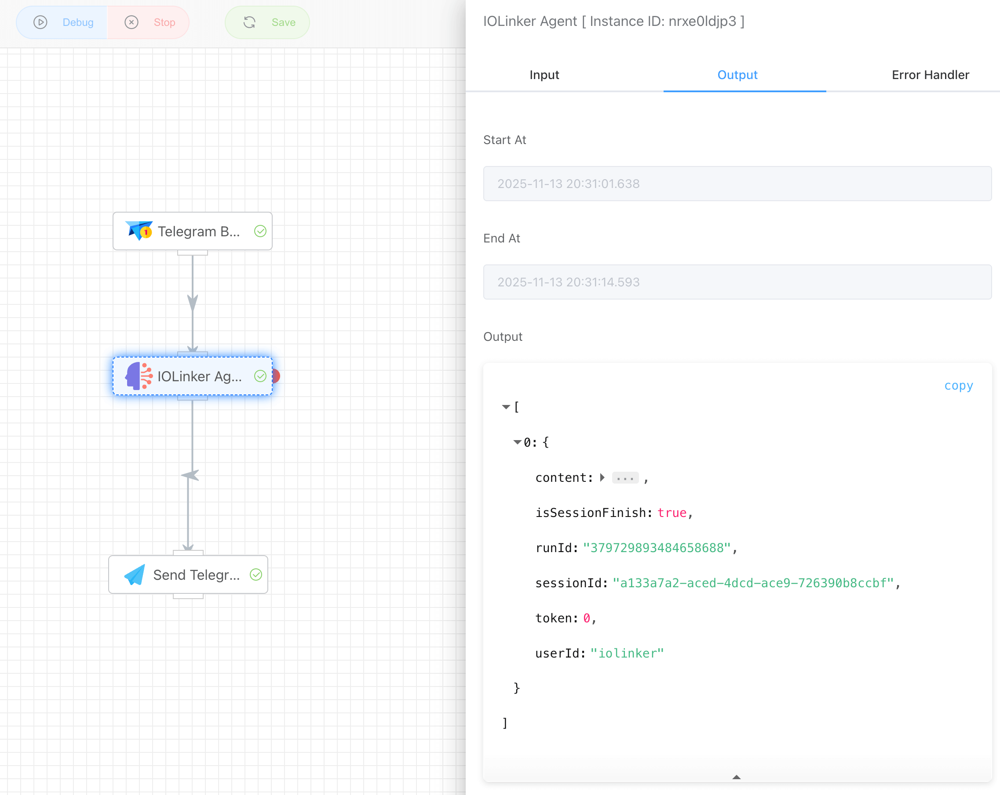

Right-click to view the conversation history:

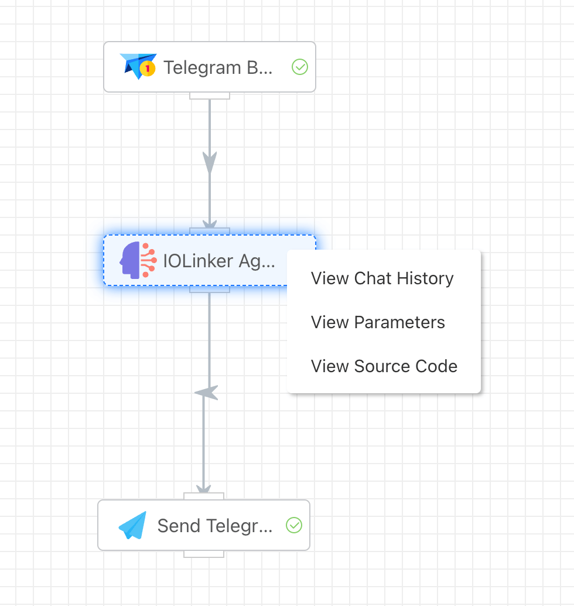


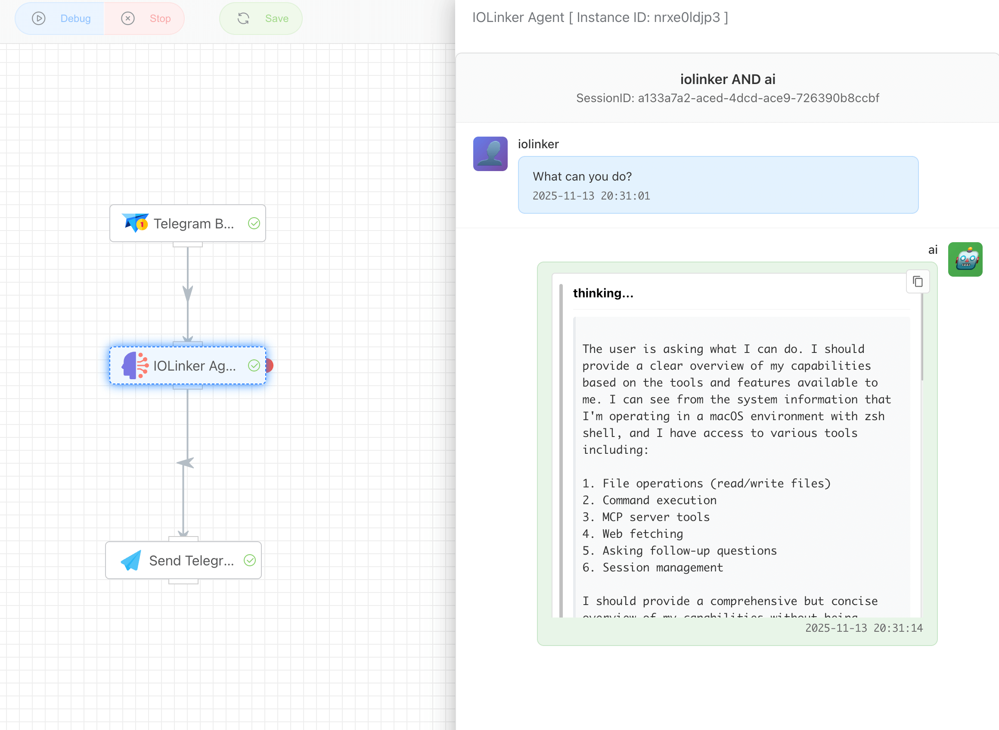


### Tool call

When we want to check the weather, the Agent finds a corresponding MCP tool, which automatically plans the request parameters and initiates the call.

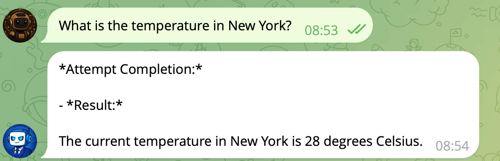


Since the Agent invoked MCP tools, in addition to the Agent's execution records, there is also an MCP execution record here.

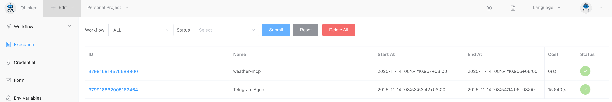


We can view the complete interaction process between the Agent and the user in the execution details, as well as observe how it reasons and invokes tools.

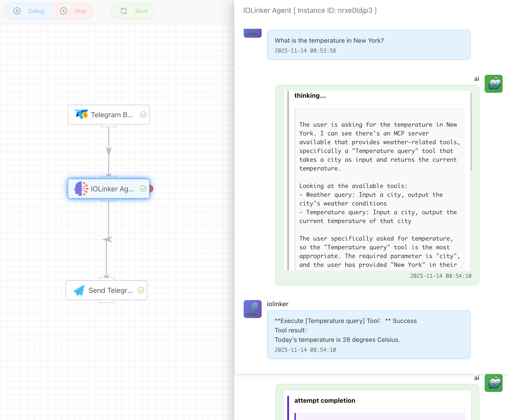


## Input


### API Key

You can choose to create an LLM API key in Credentials Management.


### Model

The system will return a list of supported models based on the currently selected LLM vendor platform type. If a model is not in the returned drop-down list, you can enter it directly in the edit box.


### Framework

**ReAct** is a framework that enables AI agents to solve problems through **reasoning** and **action**. Its core concept is: **instead of having the AI provide answers directly, it engages in a human-like cycle of "think-act-think-again" to complete tasks.**

The workflow of ReAct follows a typical loop, which can be summarized into the following three steps, repeated iteratively until the problem is resolved:

**though → action → observation**

1. **Thinking**

   The AI analyzes the current problem and the information it has already obtained. **Key:** The AI must write down its thought process. **For example:** "The user asked about today's weather, but I don't know the current date and location. I need to get the current date first, and then ask the user for their location." This step externalizes the AI's "inner monologue," allowing us to track its logic and helping it clarify its own thought process.

2. **Action**

   Based on the reasoning from the previous step, the AI decides to perform a specific action. Actions are typically executed by calling a **tool**.

   For example:

   - ∙`Search["today's date"]`(calling the search tool)
   - ∙`Calculator["(25 * 4) / 2"]`(calling the calculator tool)
   - ∙`BrowseWebsite["a specific URL"]`(calling the web browsing tool) It can also directly ask the user a question: `AskUser["Which city are you located in?"]`

3. **Observation**

   After the action is executed, the environment (or tool) returns a result. The AI receives and records this outcome.

   For example, after searching for "today's date," the observed result might be "May 20, 2024." This observation becomes new information for solving the problem.

The cycle then continues: the AI engages in **a new round of reasoning** based on all available information (the original question + newly observed results), decides on the next action, and repeats this process until it determines there is sufficient information to provide a final answer.


### Max Iteration

Set the maximum number of cycles for the Agent based on the ReAct framework, i.e., limit the number of `Thought → Action → Observation`loops to prevent the Agent from falling into an endless loop.

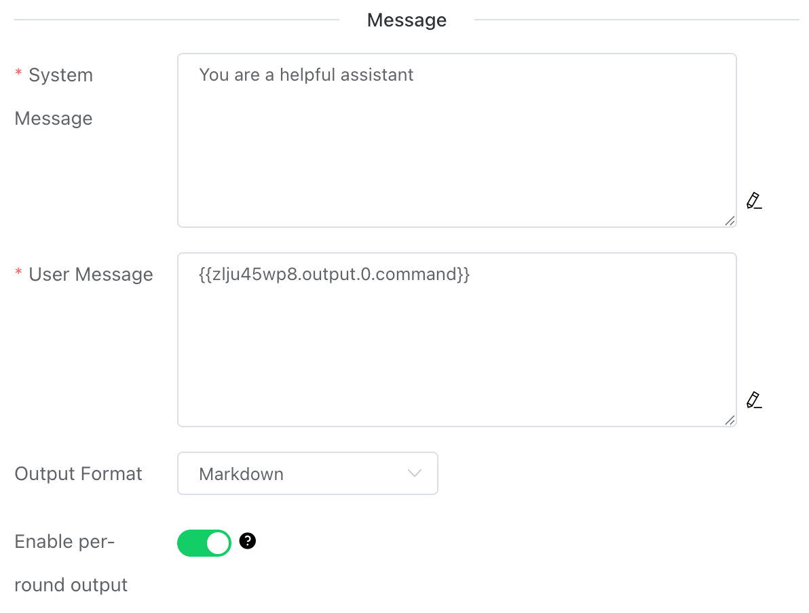


### System Message

Define the AI Agent's "persona," role, behavioral guidelines, and conversational boundaries.


### User Message

Assign a specific task instruction to the Agent.


### Output Format

Set the string output format for the Agent.

- **Raw (XML)**: This is the Agent's native output format. The string may contain XML elements that document the Agent's thought process and tool invocations.
- **Markdown**: Converts the aforementioned XML markup into Markdown format.


### Enable per-round output

Once enabled, the Agent's thought process will be output in each ReAct iteration. If it's a Telegram trigger, a Telegram message will be sent.


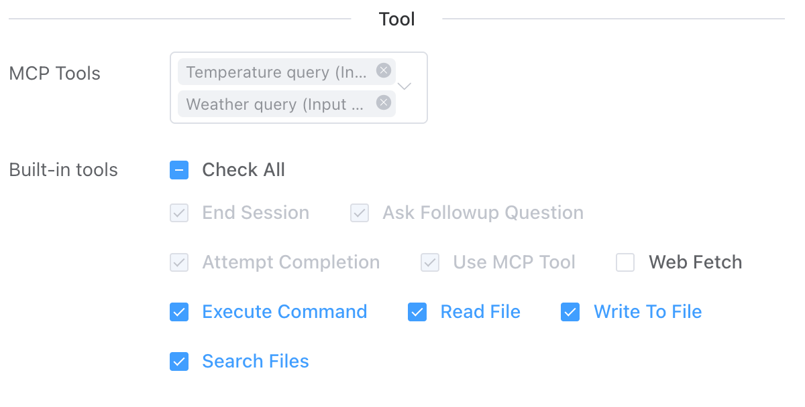


### MCP Tools

Here, you can select the MCP Server tools created by the [MCP trigger](https://iolinker.com/mcp.html) from the workflow list. Once checked, the Agent will analyze the task and choose the corresponding tools to invoke accordingly.


### Built-in Tools

Here are the built-in tools provided by the system. Users can select them as needed based on actual requirements.

- End Session。

  ```
  This function is used to end the current session or initiate a new one. When a user gives the Agent a clear termination intent, such as "end" or "restart conversation," the Agent will interpret it as a request to end the current session or start a new one.
  ```

  Note: A single session may involve multiple dialogue records and potentially multiple workflow executions.

- Ask Followup Question

  ```
  The Agent asks the user questions to gather additional information needed to complete the task. This tool is used when the Agent encounters ambiguity, requires clarification, or needs more details to proceed effectively. It enables direct communication with the user, facilitating interactive problem-solving.
  ```

- Attempt Completion

  ```
  After each tool usage by the Agent, the user will provide feedback on the tool's execution result—indicating success or failure, along with the reason for any failure. Upon receiving the tool execution result and confirming task completion, the Agent will use this tool to present the work outcome to the user.
  ```

- Use MCP Tool

  ```
  The Agent will request to use tools provided by the connected MCP server based on the actual situation. Each MCP server can offer multiple tools with different functions.
  ```

- Web Fetch

  ```
  When the Agent determines that it needs to retrieve and analyze web content, it will use this tool.
  ```

- Execute Command

  ```
  When the Agent determines that system operations or specific commands need to be executed to complete any step of the user's task, it will use this function to run CLI commands on the system.
  ```

- Read File

  ```
  When the Agent determines that it needs to inspect an existing file with unknown content—such as analyzing code, viewing a text file, or extracting information from a configuration file—it will use this function to request reading the content of the file at the specified path.
  ```

- Write To File

  ```
  Request to write content to a file at the specified path. If the file already exists, it will be overwritten with the provided content. If the file does not exist, it will be created. This tool automatically creates any directories required for writing the file.
  ```

- Search Files

  ```
  Request to perform a regular expression search on files in the specified directory and provide results with contextual information.
  ```


### Conversation History

- When the historical conversation feature is enabled, the Agent can achieve memory functionality, enabling coherent dialogues.
  - **Conversation Rounds**: Loads the most recent n turns of historical conversation records, with a maximum of 1000 turns loadable.
  - **Conversation Time(Minute)**: Loads historical conversation records from the most recent n minutes, with records from up to 10 days ago being loadable.


## Output

- **content**: The result returned by the Agent
- **isSessionFinish**: Indicates whether the current session has ended. If the historical conversation feature is not enabled, this value is always `true`, meaning the conversation is one-off. If the historical conversation feature is enabled, since the session involves multiple turns, intermediate execution results will set this value to `false`. Only when the Agent detects an explicit intent to end the session (e.g., by invoking the `End Session`tool), this value will be set to `true`.
- **sessionId**: The session ID. If historical conversation is enabled, the same `sessionId`will be used for intermediate interactions, indicating they belong to the same session.
- **userId**: The user associated with the session.

```
[
    {
        "content": "....",
        "isSessionFinish": true,
        "runId": "379709981500375040",
        "sessionId": "e4da7671-aa01-41f3-9b51-826ea0955f6c",
        "token": 0,
        "userId": "iolinker"
    }
]
```

