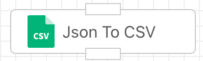
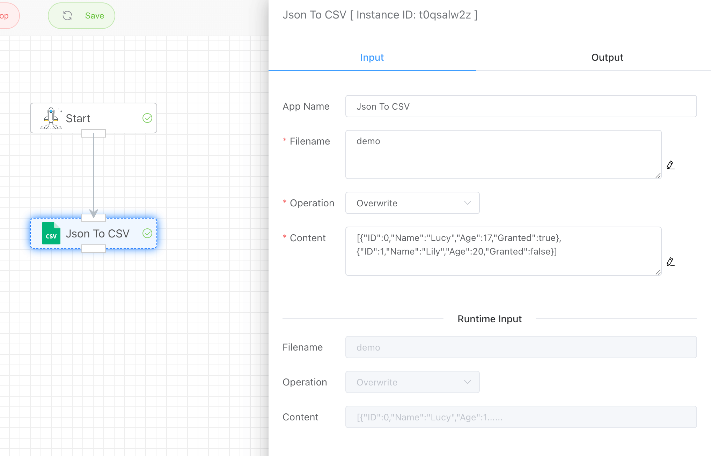
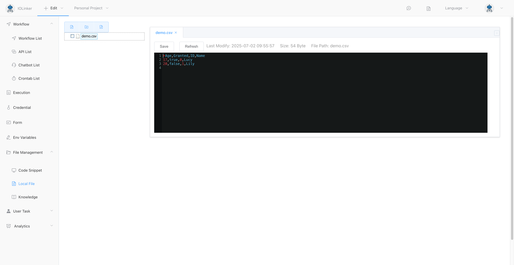
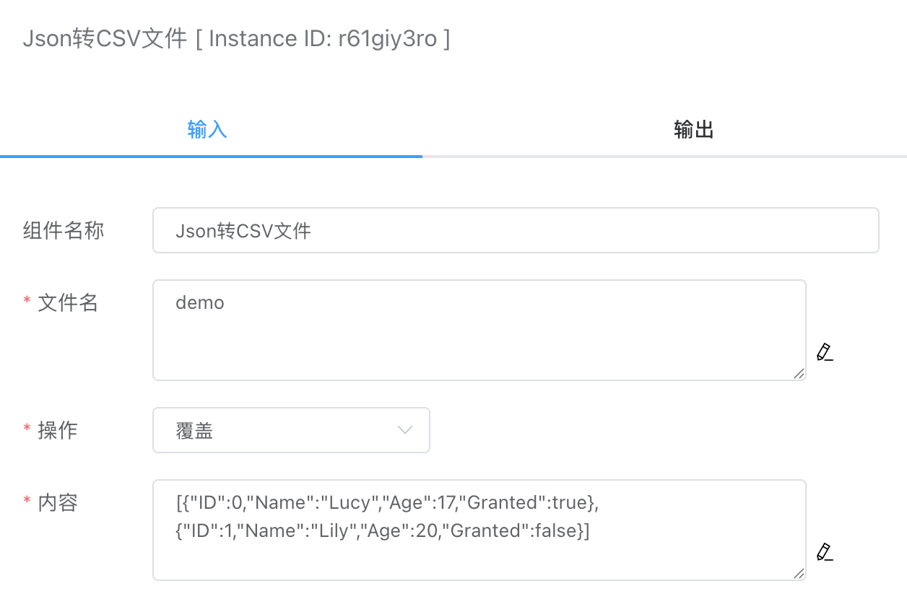
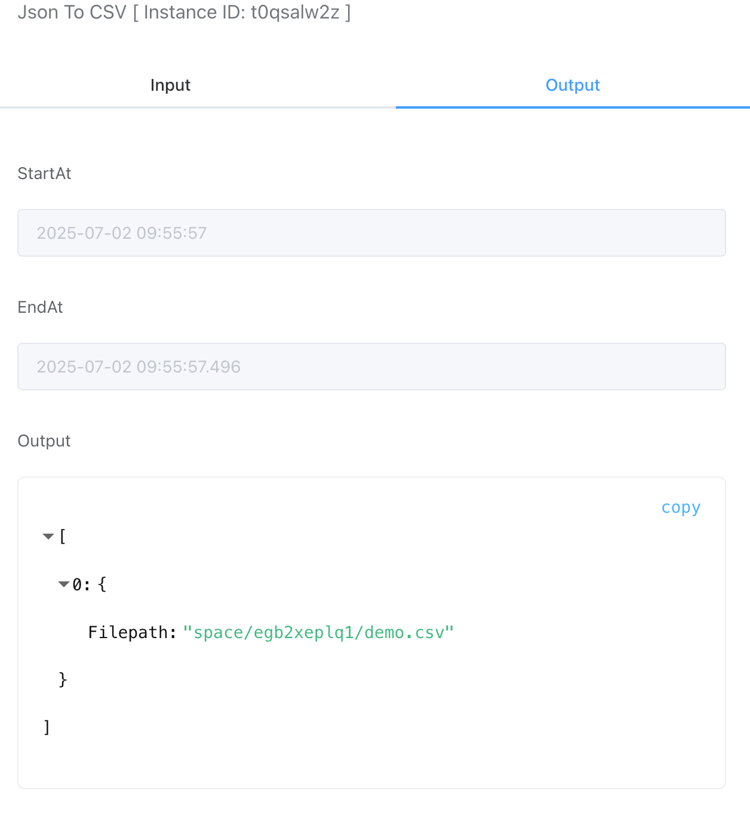

## JSON To CSV

You can convert Json data (array) into a csv file.

The successfully written files can be viewed in [Local File] under [File Management], and can be edited and updated here.

<iframe 
    width="800" 
    height="600" 
    src="https://www.youtube.com/embed/NU_r3PXgsC0"  frameborder="0" 
    allow="accelerometer; autoplay; encrypted-media; gyroscope; picture-in-picture" 
    allowfullscreen>
</iframe>

## Input

### Filename

The name of the saved file, for example: test. No need to add the suffix .csv, the system will add it automatically.

### Operation

- Overwrite

  If there is a file with the same name, the file data will be overwritten. If there is no file with the same name, a new file will be created.

- Delete File

  Deletes the specified file.

### Content

The JSON array text data content to be written.

## Output

Output csv file path.

