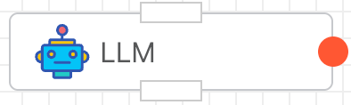
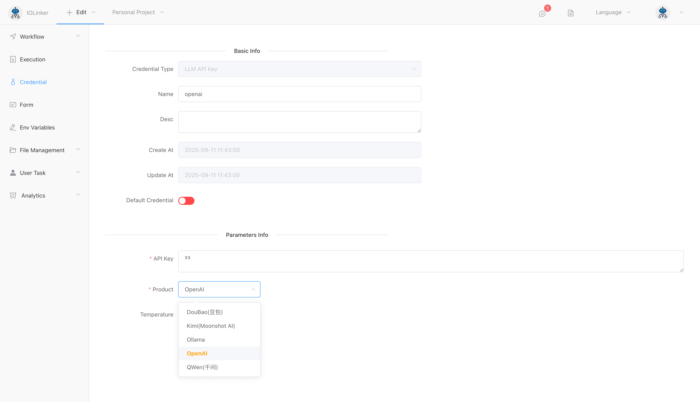
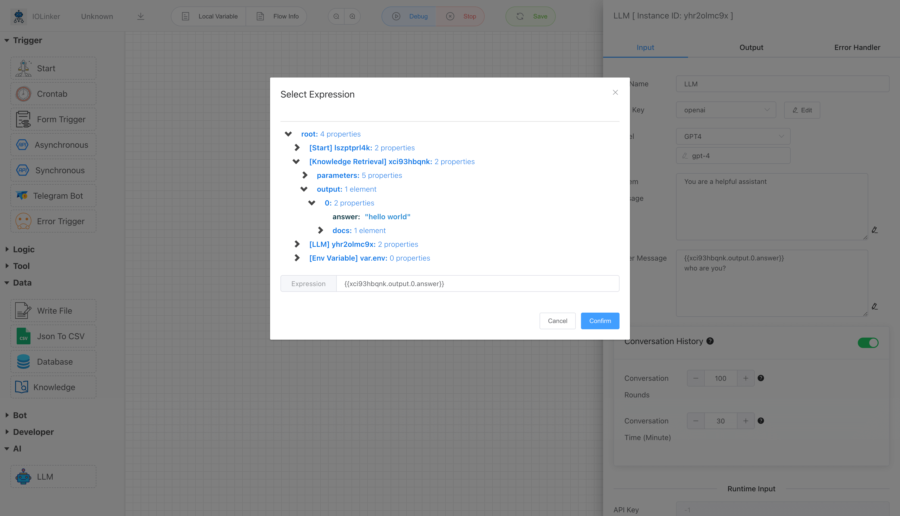
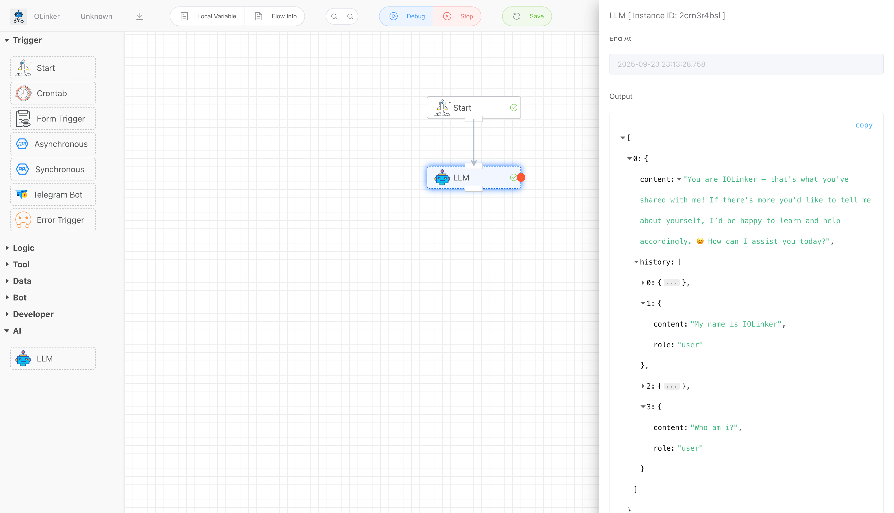

## LLM

Integrated support for mainstream large language models (LLMs), including OpenAI, QWen, Doubao, Kimi, and the open-source Ollama. It enables memory functionality (loading historical conversation records) for more coherent dialogues and supports error handling mechanisms such as failure retries and response capturing for exceptions.




## Input


### API Key

You can create a Large Model API Key credential type in the 【Credential】 section. The following options need to be configured:

- **Product**: The large model provider, including: Doubao, Kimi, Ollama, OpenAI, and QWen
- **API Key**: The API key generated on each provider’s platform




### Model

Depending on the LLM provider credential selected, different models can be chosen. If the desired model is not listed, the model name can be manually entered.


### System Message

A system message is used to assign a role or persona to the LLM, such as the common example: "You are a helpful AI assistant." This helps make the LLM's responses more professional and accurate.


### User Message

This refers to the user's query content. Here, you can use variable expressions to integrate outputs from other app nodes in the workflow.



### Conversation History

Enabling the history dialogue feature allows loading conversation content from a specific past period into the LLM. This gives the LLM a human brain-like memory function, making the dialogue more coherent. However, loading more historical dialogue rounds will consume more tokens.


For example, the following process loads the previous historical conversation record into the LLM, enabling it to retain memory functionality.




## Error Handler

You can configure how the system responds when an exception occurs:

- **Retry**: Set the number of retry attempts and the interval frequency.
- **Ignore**: Proceed without interruption.
- **Throw Exception**: Halt the workflow and report an error.
- **Catch**: Capture the exception and configure a branch (red dot) to handle it.


## Output

The following is a coherent conversation record, which includes both historically loaded dialogue data and responses to the current query.

The "role" in the history has three types: **system**, **user**, and **assistant**.

```json
[
  {
    "content": "You are IOLinker — that's what you've shared with me! If there's more you'd like to tell me about yourself, I’d be happy to learn and help accordingly. 😊 How can I assist you today?",
    "history": [
      {
        "content": "You are a helpful assistant",
        "role": "system"
      },
      {
        "content": "My name is IOLinker",
        "role": "user"
      },
      {
        "content": "{Hello, IOLinker! That's a unique name. How can I assist you today? 😊 [{system You are a helpful assistant} {user My name is IOLinker}]}",
        "role": "assistant"
      },
      {
        "content": "Who am i?",
        "role": "user"
      }
    ]
  }
]
```


