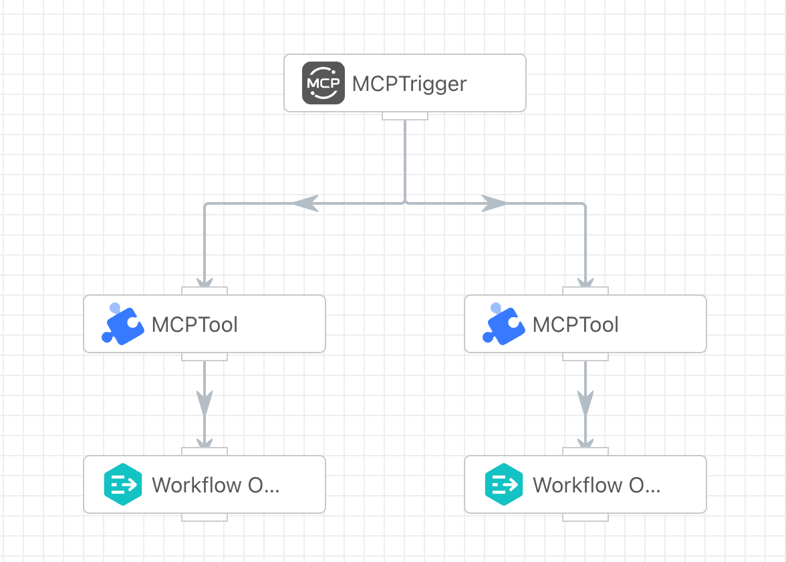
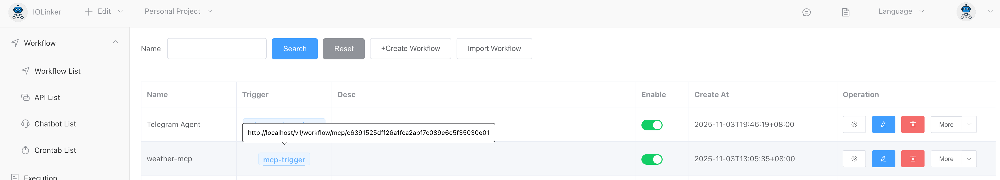
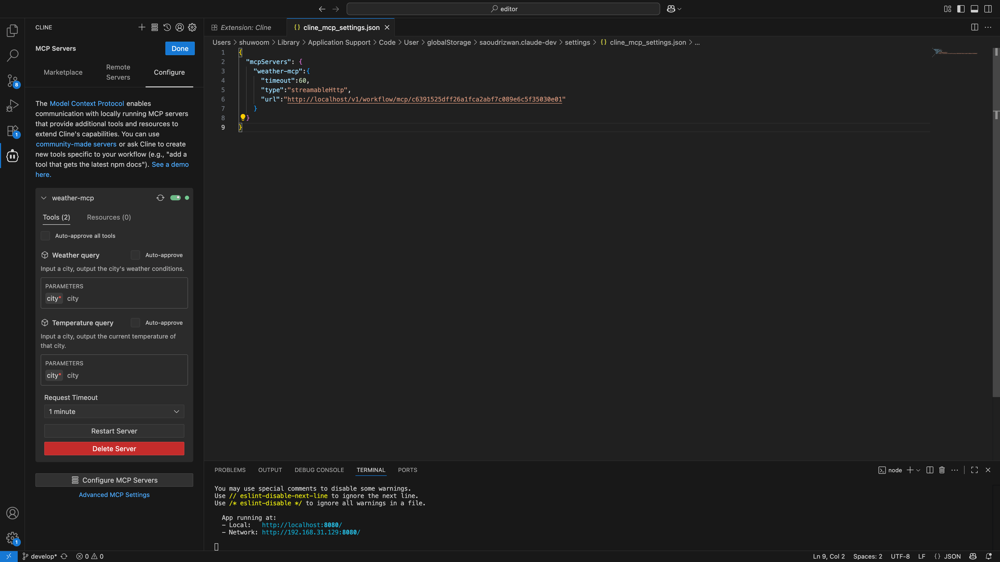
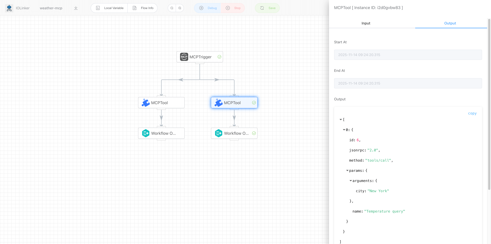
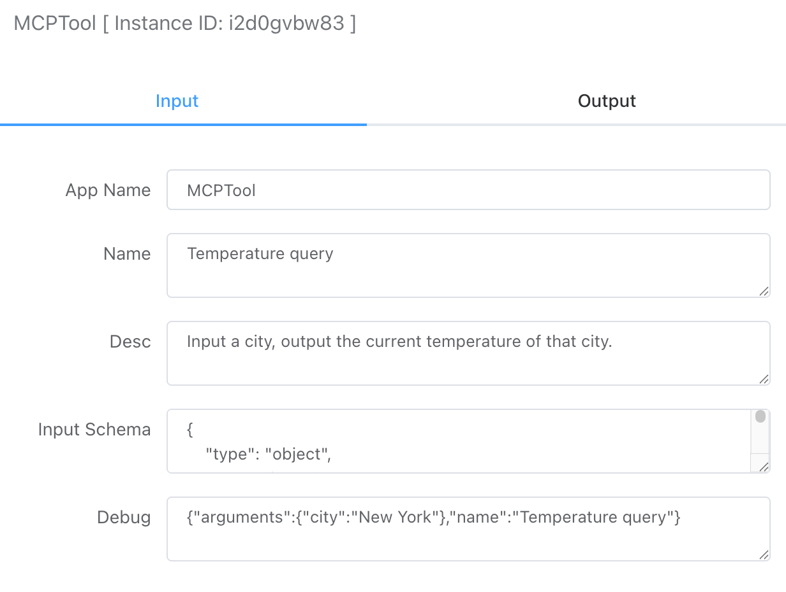

## MCP Server

### Create MCP Server Workflow

The development of an MCP Server requires the combined use of two apps: the MCP Trigger and the MCP Tool, to be implemented together.

The MCP Trigger selects the corresponding routing branch to execute the tool app based on the tool name requested by the client.



After creating the MCP Server workflow, you can view its address in the [Workflow List]. Once you obtain the address, you can configure and use the MCP Server in third-party clients such as Cherry Studio and Cline.



### Configure MCP Server on the client side.

The following is the list of tools queried after Cline establishes a connection with the MCP Server:


After Cline establishes a connection with the MCP Server, it queries the list of tools. Here, you can see the correspondence between the tool list and the workflows.


### Call MCP Server
After selecting the MCP tool in Cline, when we ask the large language model "What is the temperature in New York?", the model will choose the appropriate tool from the tool list based on the request, retrieve the result, and return it to the user, as shown in the figure below:


### View Execution Records

After the large language model calls the MCP Server above, we can check the corresponding execution record details in the 【Execution List】 section of the workflow platform:




## MCP Trigger

### Input


#### Name

Set the name of the current MCP Server.


#### Debug

When developing an MCP Server, you can simulate the request parameters sent by the client for debugging purposes. To simulate calling a specific MCP tool here, simply modify the `name`field to the corresponding tool name and pass the relevant JSON parameters in the `arguments`field.

```json
{
    "id": 1,
    "jsonrpc": "2.0",
    "method": "tools/call",
    "params": {
        "arguments": {
            "city": "New York"
        },
        "name": "Temperature query"
    }
}
```


### Output

The output parameters mainly display the complete request parameters passed by the MCP client, as shown in the example below:

```json
[
  {
    "id": 1,
    "jsonrpc": "2.0",
    "method": "tools/call",
    "params": {
      "arguments": {
        "city": "New York"
      },
      "name": "Temperature query"
    }
  }
]
```


## MCP Tool

### Input



#### Name
The name set here is for the MCP tool. Once configured, it will be displayed in third-party client tools.


#### Description
The description set here is for the MCP tool. Once configured, it will be displayed in third-party client tools.


#### Input Schema
Configure the input parameter format for the MCP tool. This JSON format is implemented according to the MCP protocol specifications. These format descriptions are primarily returned to third-party MCP client tools for reference. If the parameters passed by the large language model do not comply with the input format requirements, the MCP Server will return an error.

 - type: Defaults to object and does not need to be changed.  

 - properties: Define the properties of the input parameters. Set using key-value pairs, where the key is the parameter name and the value is a JSON structure containing two attributes:  

   - description: Describes the parameter field.  
   - type: Specifies the parameter type, including: string, number, array, boolean, object.  

 - required: Specify which input parameter fields are mandatory.

```json
{
    "type": "object",
    "properties": {
        "city": {
            "description": "city",
            "type": "string"
        }
    },
    "required": [
        "city"
    ]
}
```


### Output

The output primarily displays the tool parameters passed by the MCP client. For example, as shown below:

```json
[
  {
    "arguments": {
      "city": "New York"
    },
    "name": "Temperature query"
  }
]
```

