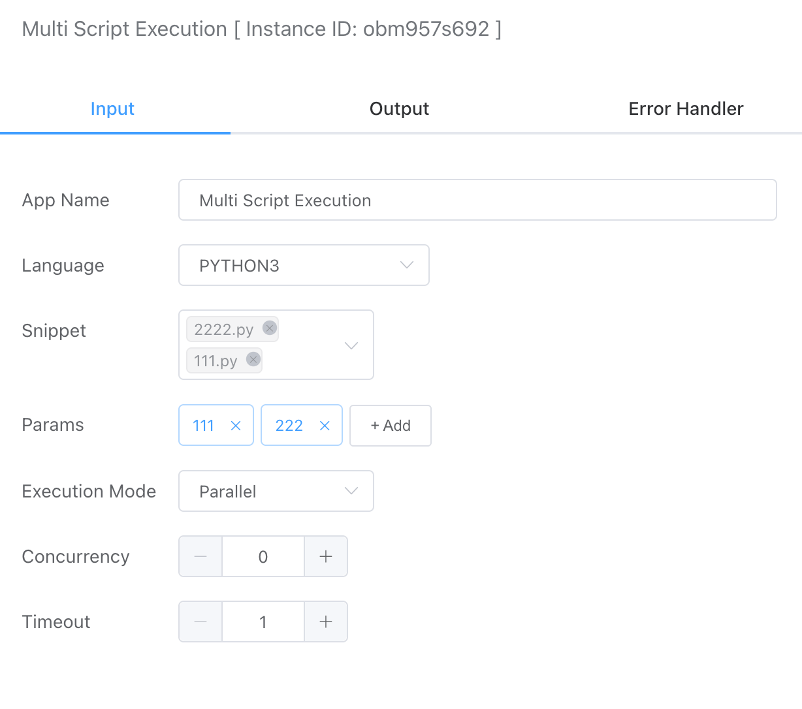
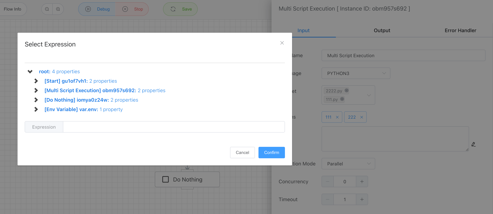
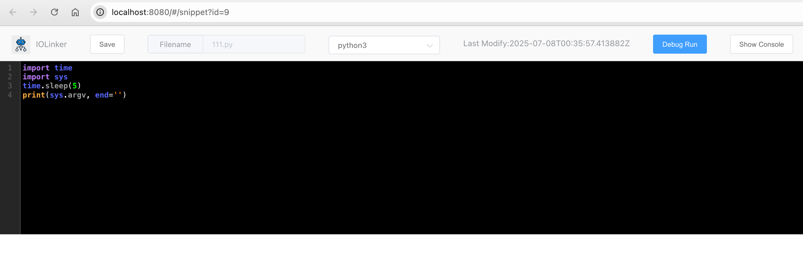
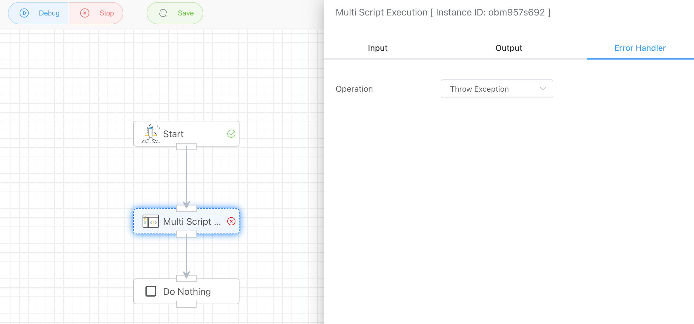

## Multi Script Execution

It supports running multiple scripts either concurrently in parallel or sequentially one after another.


## Input



### Language

> Local Native Virtual Machine

- Python3
- JavaScript
- PHP
- LUA
- SHELL

Note: The local native virtual machine depends on the current machine environment. If the corresponding virtual machine is not available, the script cannot be executed.


### Snippet

Code snippets will be displayed under the corresponding programming language list in **File Management** -> **Code Snippet**.


### Params

Here you can pass parameters to the script through sys.argv (python script) or $argv (php script). Of course, you can also use variable expressions to reference previous output as input to the script.






### Execution Mode

- Parallel Execution

  The selected scripts run simultaneously, which can improve execution efficiency. You can set the number of scripts to run at runtime. The default value is 0, which means all scripts are executed simultaneously.

  

- Sequential Execution

  The selected scripts run one after another, with each script only starting after the previous one has finished.


### Timeout

Set the script execution timeout. If the execution exceeds this time, the system will forcibly terminate the script and output an error message.

```json
[
  {
    "./snippet/xqnnyrdgdv/111.py": {
      "cost": 1004,
      "endAt": "2025-07-08 08:14:57.643",
      "error": "execute command timeout",
      "output": null,
      "startAt": "2025-07-08 08:14:56.639"
    },
    "./snippet/xqnnyrdgdv/2222.py": {
      "cost": 1004,
      "endAt": "2025-07-08 08:14:56.639",
      "error": "execute command timeout",
      "output": null,
      "startAt": "2025-07-08 08:14:55.635"
    }
  }
]
```

### Error Handler

By default, the App will throw an exception when an error occurs, and then stop the subsequent App from running. Here, even if only one script is abnormal, the entire App will report an error. If you want to ignore the error and continue running, you can choose to ignore it in the exception handling operation.



Ignore the error and continue running:


## Output

Since multiple script executions can be selected, the output structure is in the form of Key-Value pairs as follows:

```
[
  {
    "./snippet/xqnnyrdgdv/111.py": {
      "cost": 5038,
      "endAt": "2025-07-08 08:41:18.755",
      "error": "",
      "output": "['/iolinker/snippet/xqnnyrdgdv/111.py', '111', '222']",
      "startAt": "2025-07-08 08:41:13.717"
    },
    "./snippet/xqnnyrdgdv/2222.py": {
      "cost": 3036,
      "endAt": "2025-07-08 08:41:16.753",
      "error": "",
      "output": "['/iolinker/snippet/xqnnyrdgdv/2222.py', '111', '222']",
      "startAt": "2025-07-08 08:41:13.717"
    }
  }
]
```


Here, the output from the terminal will be used as the result for this APP. For example:

- **Python3**
  
  You can output using `print`:
  
  ```python
  print('xxx')
  ```

  Note: The `print` method adds a newline by default, which affects the output. To avoid newlines, use:
  
  ```python
  print('xx', end='')
  ```

- **JavaScript**

  You can output using `console.log`:
  
  ```javascript
  console.log('xxx')
  ```

- **PHP**

  You can output using `echo`:
  
  ```php
  <?php
  echo "123";
  ```