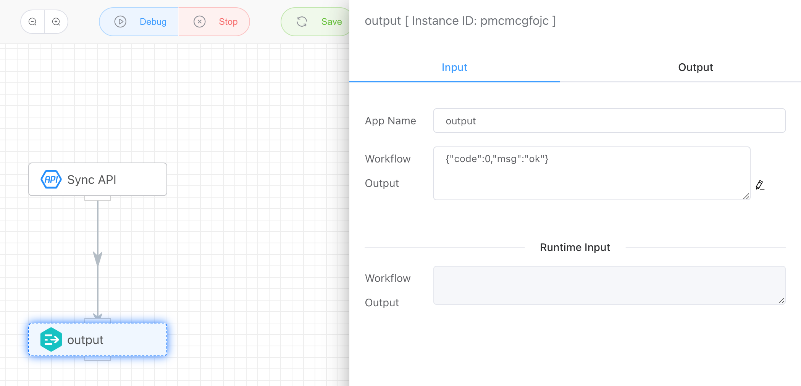

## Set Workflow Output

Used together with the **Synchronous API**, this allows setting the output result of the synchronous API, which is also the output of the entire workflow. As shown in the example, a JSON output is set. When the synchronous API is called and a result is requested, the configured JSON output will be returned as the API output result.

```json
>> curl http://localhost/v1/api/iolinker/test/index
>> {"code":0,"msg":"ok"}
```





## Input

- **Workflow Output**

  Set the output result of the current workflow, which is also the return result of the synchronous API.
  
  

## Output

Whatever is set, will be output as the result.
