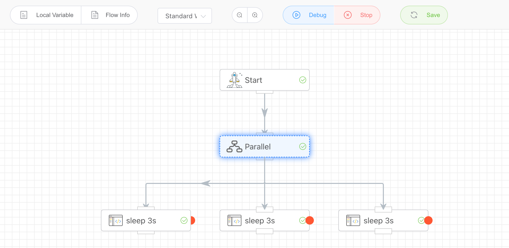

## Parallel Branches

Simultaneously run multiple subsequent branch tasks in parallel. For tasks that involve multiple time-consuming concurrent operations, this can significantly improve efficiency.

## Input

None

## Output

None

