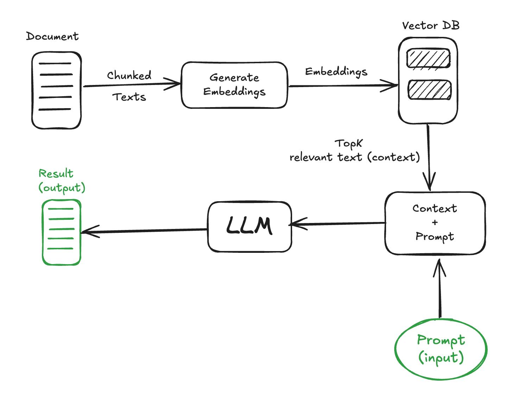
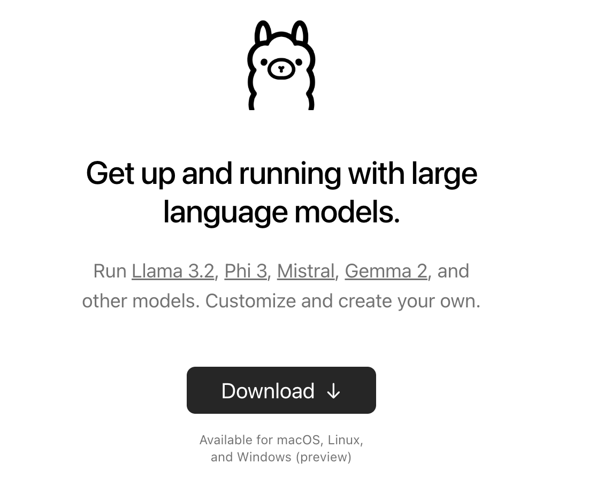
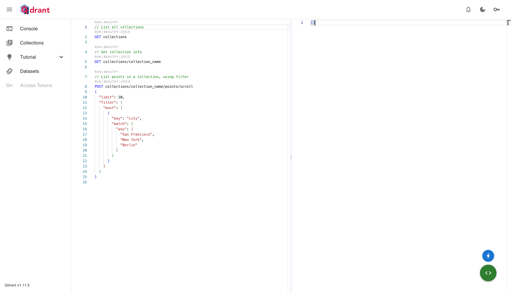
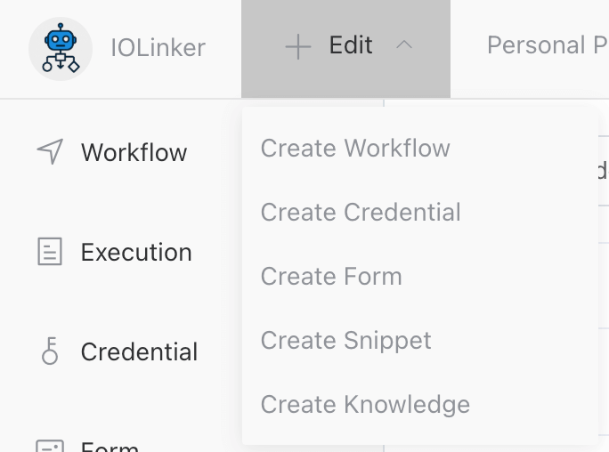
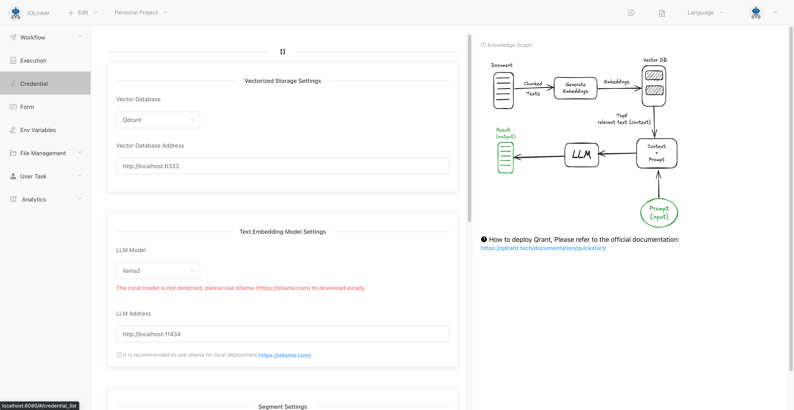
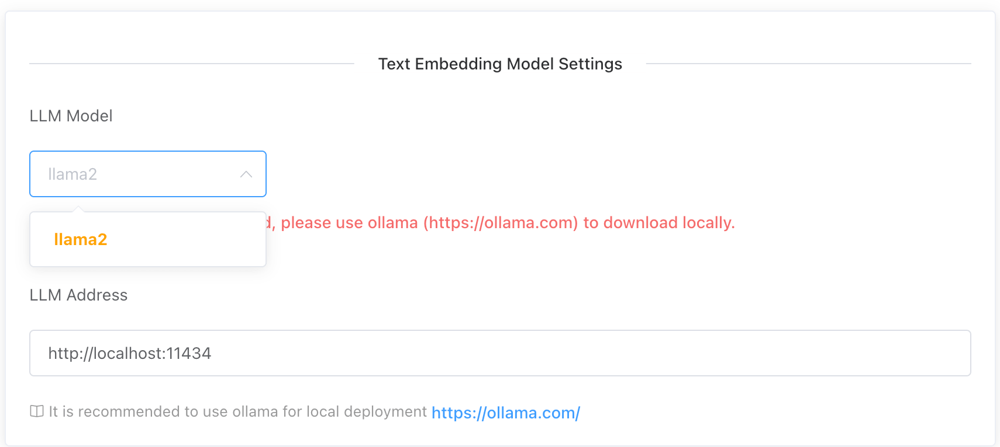
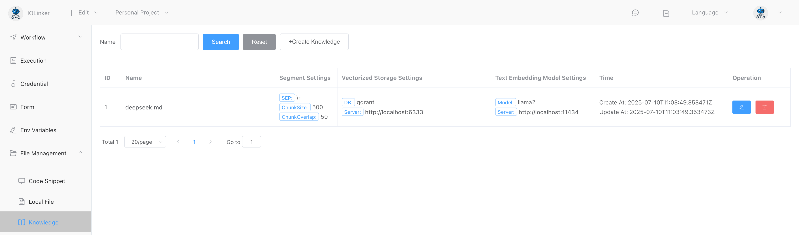
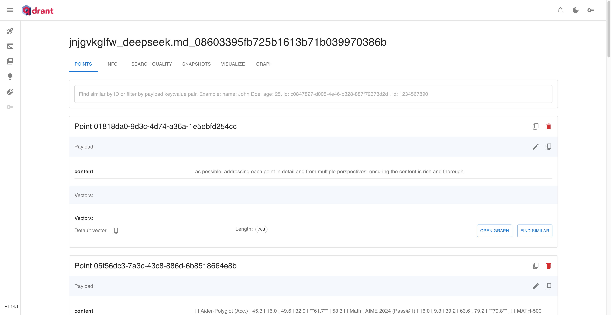
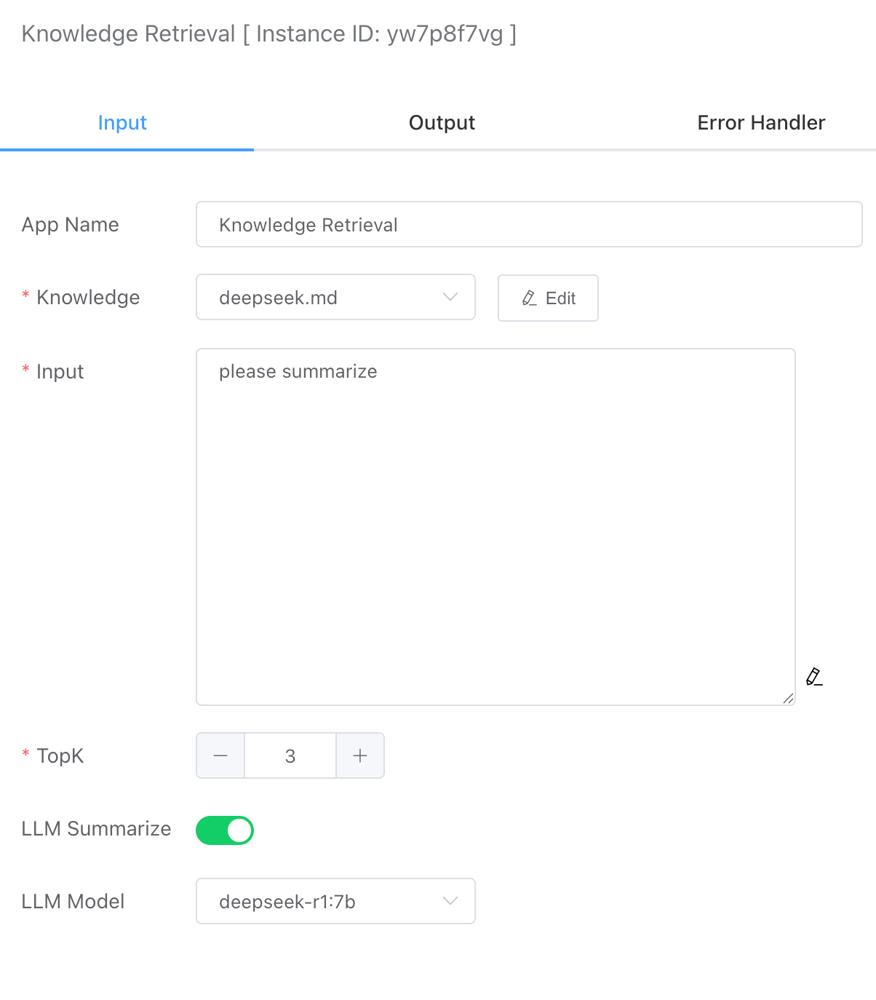

RAG (Retrieval-Augmented Generation) is a hybrid approach that combines retrieval-based and generative strategies. RAG aims to enhance the accuracy and reliability of a model when generating responses. It achieves this by retrieving relevant information from a large knowledge base and using a generative model (such as a Transformer) to produce appropriate answers. This method enables the model to leverage external knowledge during response generation, thereby improving the quality and precision of the answers.


The following diagram illustrates the complete implementation process of RAG.



- **Indexing**: Text is vectorized and stored in a vector database.
- **Retrieval**: The system finds the most relevant text chunks based on semantic similarity to the user's query.
- **Generation**: The LLM synthesizes the retrieved segments and produces the final response.


## Ollama LLM Local Deployment

Since we are building a local RAG setup without using any commercial LLM APIs, the large language model employed is the open-source Ollama. Official website: https://ollama.com/.



The Ollama project supports cross-platform deployment, including macOS, Linux, and Windows, with a very simple setup process. For specific deployment methods, you can refer directly to the official website—we won't cover them here separately.

**Note:** The LLM has relatively high hardware requirements.


## Local Deployment of Qdrant Vector Database

For local deployment of Qdrant, Docker is the recommended approach. Refer to the official documentation: https://qdrant.tech/documentation/guides/installation/#docker

```
docker pull qdrant/qdrant
docker run -p 6333:6333 qdrant/qdrant
```

After successful deployment, you can access the Qdrant console at: http://localhost:6333/dashboard#/console




## Creaet Knowledge

Here, we'll use an online introduction to Deepseek as a text document to import into our vector database.

Clicking the [Edit] button will display a dropdown with the [Add Knowledge Base] button.



Below is the interface for adding a knowledge base:



After installing Ollama, you'll need to download the corresponding model locally. Once the download is complete, it will appear in the dropdown menu:



Larger documents will require longer vectorization processing time. After successful processing, you can find them under **[File Management] > [Knowledge]** on the left side.



Click the name to navigate to the Qdrant admin page and view the vectorized data:



## Knowledge Retrieval


### Input



#### Knowledge

The system will display the document knowledge base uploaded earlier.


#### Input

Question or command text.


#### TopK

Returns the most relevant K fragments of associated documents.


#### LLM Summarize

By default, it is not enabled, and the top K associated fragments retrieved are returned. If it is enabled, the execution time here will be longer because the processing of large models is time-consuming. If it simply returns the searched content, the speed will be very fast.


#### LLM Model

The LLM large model that can be called by the local ollama is used to summarize and analyze the TopK fragments returned previously.


### Output

- answer。If LLM summary is checked, the large model will analyze and summarize the returned docs document fragments and output the results.
- docs。Returns the top K most relevant document fragments.


For example, the following is a summary of the deekseep.txt document.

```json
[
  {
    "answer": "<think>\nOkay, so I need to figure out how to help the user who asked for a summary. They provided some context about summarizing but didn't give any specific question yet. Hmm, maybe they just want me to explain what summarizing is and why it's important.\n\nAlright, let's start by defining summarization. It's like taking a long text and making it shorter while keeping the main points. People use it when they read articles or reports because it helps them understand quickly without reading everything.\n\nI should mention different scenarios where summarizing is useful. Like in school for essays, work for presentations, or even personal notes to remember important stuff. It's also helpful for understanding complex topics by breaking them down into key ideas.\n\nAnother point is that a good summary captures the main points but doesn't include details like examples or quotes unless they're essential. This makes it more concise and focused on what's most important.\n\nI should also talk about why summarizing matters. It helps with comprehension, especially for complex texts. It saves time by avoiding unnecessary information. Plus, it aids in retaining information better because you focus on the key parts.\n\nOh, and sometimes people use summaries to prepare for exams or create outlines before writing essays. That's another practical use case.\n\nWait, but I should make sure not to include any made-up answers if I don't know something. Since this is a general explanation, it's okay. Maybe add that summarization skills improve with practice so it becomes easier over time.\n\nPutting it all together, the summary should cover what it is, when it's used, how to do it effectively, and its benefits.\n</think>\n\nSummarizing is a process of condensing written or spoken information into a shorter version while retaining the essential details. It serves various purposes, such as aiding comprehension, saving time by avoiding unnecessary details, preparing for exams, creating outlines before writing essays, and understanding complex topics more efficiently. Effective summarization involves capturing key points without including minor details like examples or quotes unless they are crucial. Additionally, summarizing helps in retaining information better and can be a valuable skill that improves with practice.",
    "docs": [
      {
        "pageContent": "## 1. Introduction",
        "score": 254.64194
      },
      {
        "pageContent": "as possible, addressing each point in detail and from multiple perspectives, ensuring the content is rich and thorough.",
        "score": 232.98473
      },
      {
        "pageContent": "# The user's message is: {question}''' ```",
        "score": 219.9914
      }
    ]
  }
]
```

