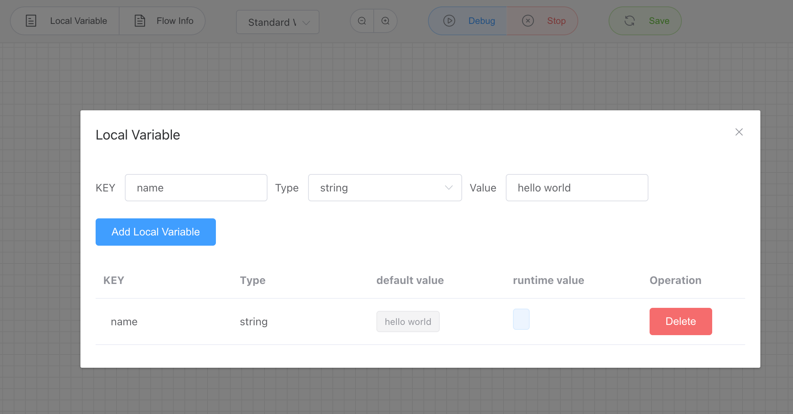
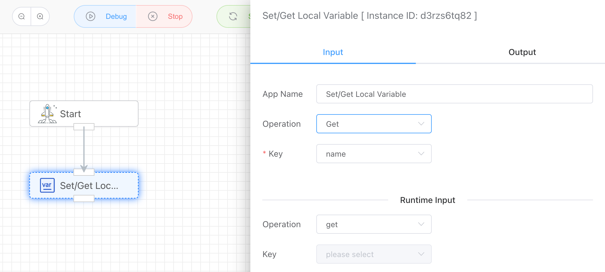

## Read and Write Local Environment Variables

Each workflow can maintain its own local variables during execution to store temporary data. When designing a workflow, there is a **Local Variables** menu in the toolbar. By clicking on it, you can add local variables that the workflow can read and write. Currently, it supports two types: strings and numbers.

Each local variable has a default value as well as a runtime value.

**Note: You must save the workflow before adding local variables, as local variables need to be bound to a specific workflow.**

After setting the local variables, you can perform read and write operations on the variables using the **Get/Set Local Variables** application.

## Input

### Operation

Supports two types of operations: read and write.

### Key

The variable object to read or write, which is from the list of previously created local environment variables.

## Output

Output the specific Key value.