## Indroduction

Support for native scripting languages and embedded virtual machine scripting languages.

<iframe width="800" height="600" src="https://www.youtube.com/embed/y9pIw0eYlYw" frameborder="0" allowfullscreen></iframe>

> The native type requires the installation of an interpreter corresponding to the scripting language.

> The embedded type does not require the installation of a local interpreter, it uses the tool's embedded virtual machine to interpret and execute scripts.

- Native
  - Python
  - JavaScript
  - PHP
  - Shell
- Embedded VM
  - JavaScript
  - Lua
  - Go


## How to use

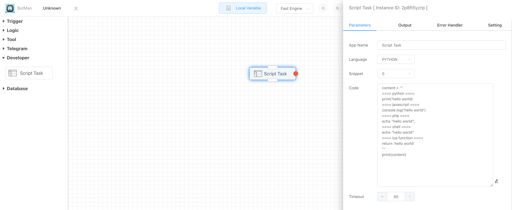


###  1. Select target language

- Native
  - Python
  - JavaScript
  - PHP
  - Shell
- Embedded VM
  - JavaScript
  - Lua
  - Go


### 2.New script or refer or import code snippet

According to the selected language type, the tool will return the corresponding code snippet list, you can refer to the script or import these code snippets without repeated programming.

> Create new script

The **Snippet** drop-down option selects **None**

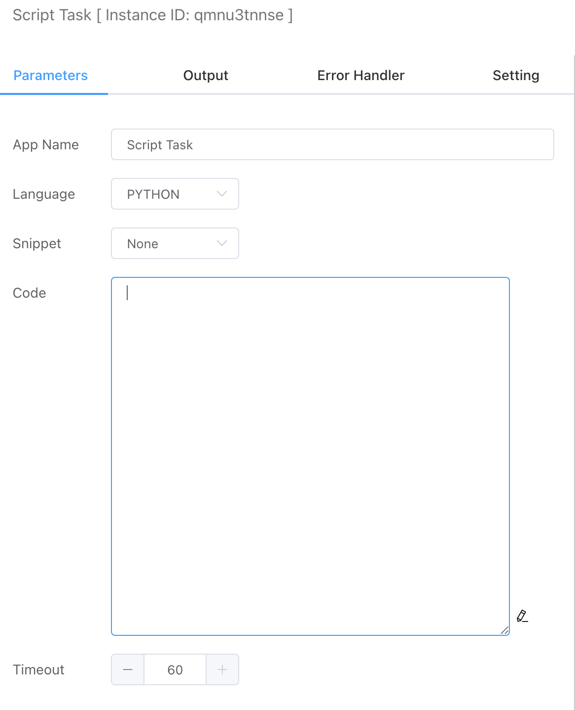

> Import code snippet

Select target code snippet and choose **Import** option.

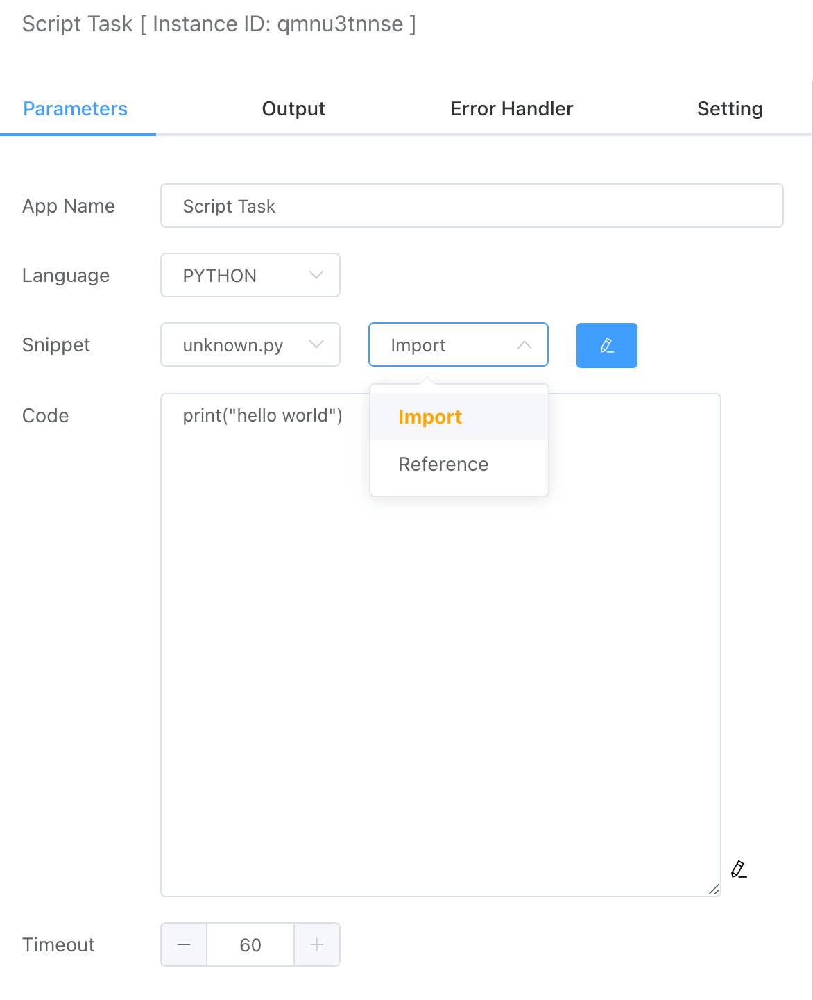

> Refer code snippet

Select target code snippet and choose **Refer** option.

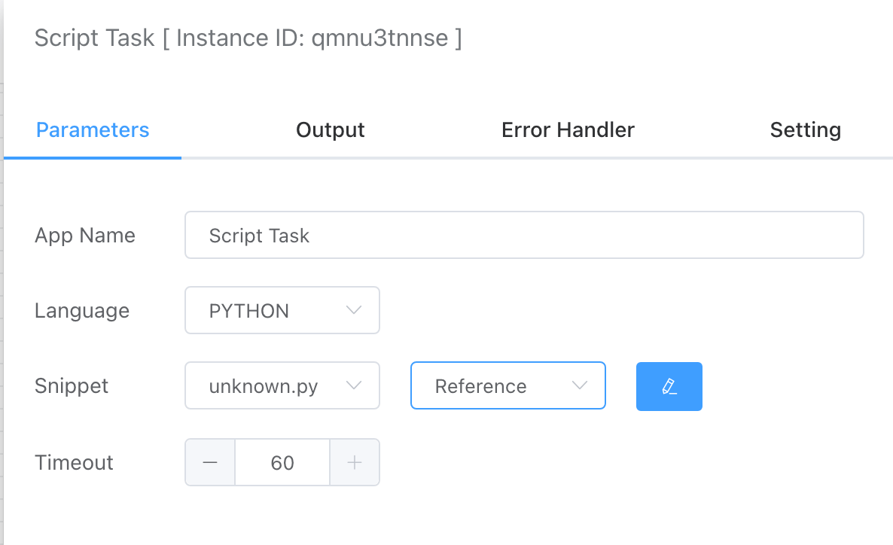

About the code snippet, you can refer to the [How to create code snippet](how-to-create-code-snippet.md) tutorial.

### 3. Debug

Debug and get result.

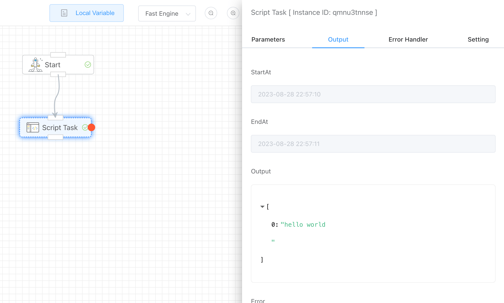


### 4. Error Handler

Exceptions will occur during the running of the script, here are 4 error response mechanisms to choose from.

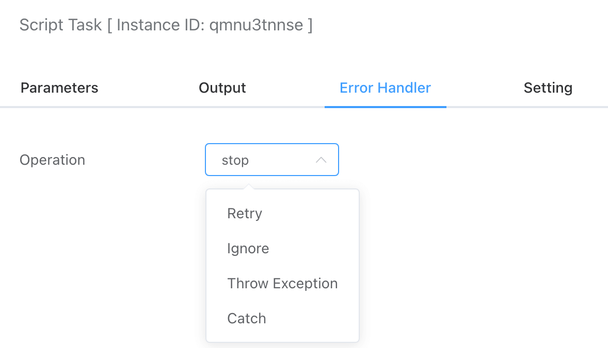


- Retry

  You can choose the number of retries and the interval between retries.

  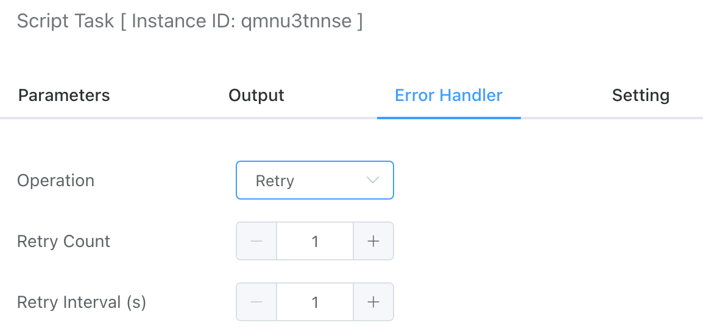

- Ignore

  Ignore the error and continue.

- Throw Exception

  Do not respond to processing, throw an exception.

- Catch Error

​		You can set the branch that responds to processing errors.

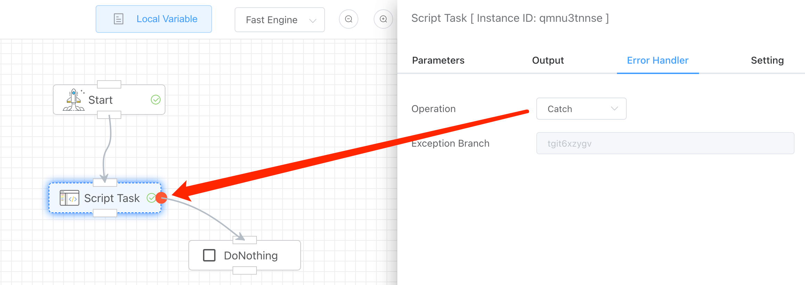


Let debug a error code:

```python
print('xxxx'
```

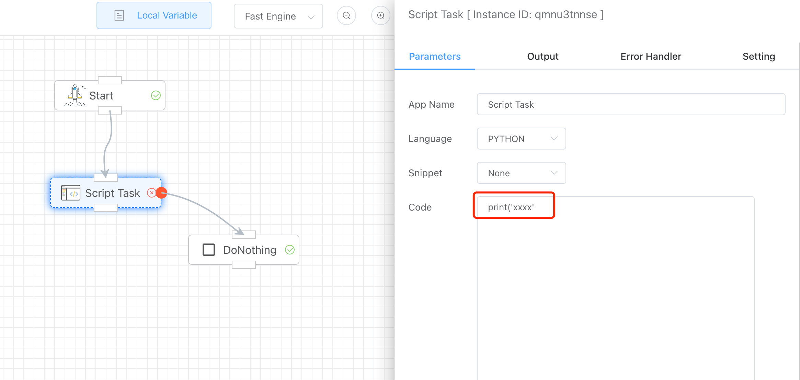

Capture and output error information, and select the error branch for response processing.

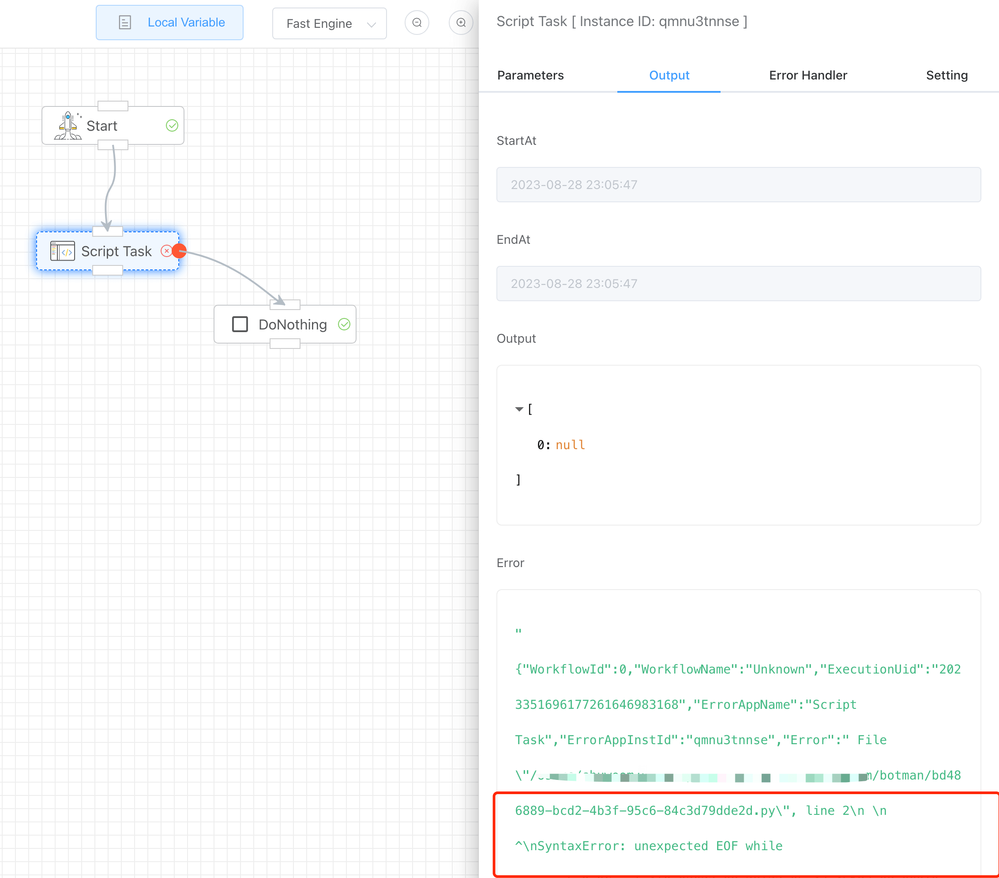

### 5. Advanced settings

Enabling distributed locks can realize that in a multi-threaded or distributed environment, only one app instance of the current workflow is executed at the same time, avoiding competition.

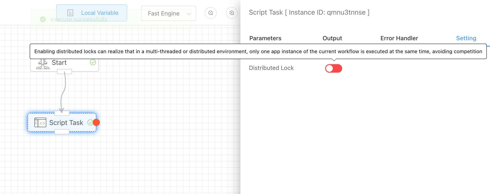