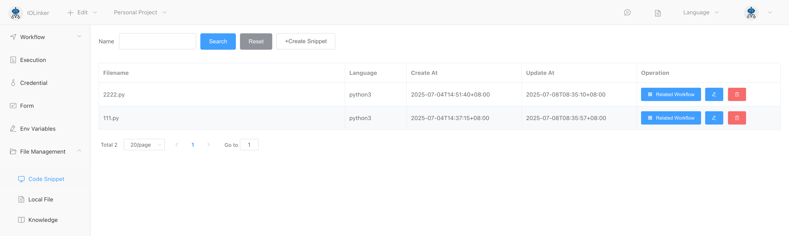

## Code Execution

Supports executing Python, JavaScript, PHP, Golang, LUA, and Shell scripts using either a local native virtual machine (such as a local Python environment) or an integrated system virtual machine that does not rely on the local environment.


## Input


### Language

> Local Native Virtual Machine

- Python3
- JavaScript
- PHP
- LUA
- SHELL

**Note:** The local native virtual machine depends on the current machine environment; if the corresponding virtual machine is not available, the script cannot be executed.

> Built-in Virtual Machine

- JavaScript
- LUA
- Go

**Note:** The built-in virtual machine does not depend on the local environment and can execute scripts directly.


### Snippet

Code snippets will be displayed under the corresponding programming language list in **File Management** -> **Code Files**.




For the selected code files, two types of operations are supported:

- **Copy**  
  This operation will create a copy of the currently selected code, allowing modifications to this code without affecting the original referenced code.

- **Reference**  
  This operation references the selected code, which can only be opened for editing and modification in the **Code Snippet** section.


In the code editor under **Code Snippet**, you can write code and debug it simultaneously:


### Code

The code that is currently to be executed.


### Timeout

Set the timeout for script execution. If the execution exceeds this time, the system will forcibly terminate it and output an error message:

```json
{
    "WorkflowId": 0,
    "WorkflowName": "Unknown",
    "ExecutionUid": "227174016812625920",
    "ErrorAppName": "Code Execution",
    "ErrorAppInstId": "oj2ku2mtzs",
    "Error": "execute command timeout",
    "CreateAt": "xxx"
}
```


## Output

Here, the terminal output will be used as the output result of the APP. For example:

- **Python3**

  Output can be done using `print`:

  ```python
  print('xxx')
  ```

  Note: The `print` method includes a newline by default, which can affect the output. If you want to output without a newline, you can use:

  ```python
  print('xx', end='')
  ```

- **JavaScript**

  Output can be done using `console.log`:

  ```javascript
  console.log('xxx')
  ```

- **PHP**

  Output can be done using `echo`:

  ```php
  <?php
  echo "123";
  ```

