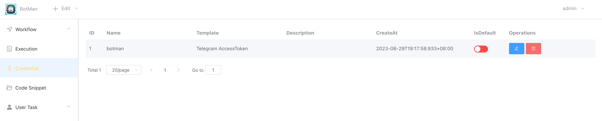
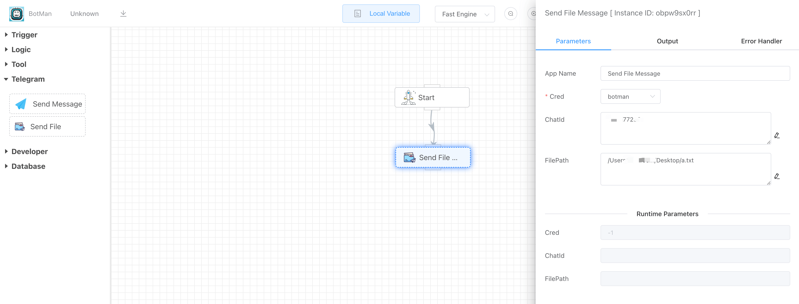
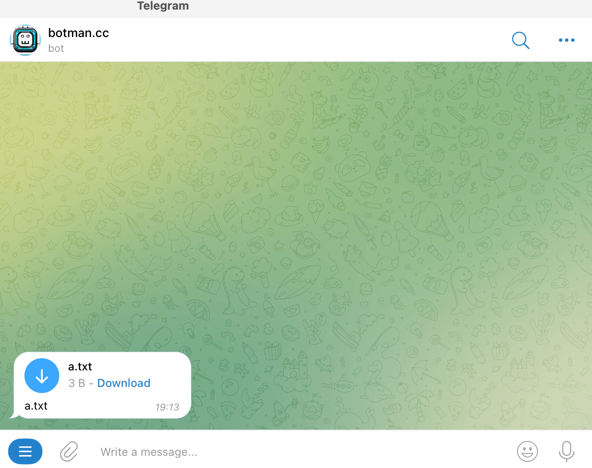

## Indroduction

Send local file to telegram user.

## How to use

### 1. Create telegram credential

### 2. Select telegram credential

### 3. Chatid

The chatid here refers to the id of the telegram user, which is a string of numbers.

You can get the userid through the /userid command of the iolinker robot. Refer to [how to get telegram userid](how_to_get_telegram_userid_by_botman.md).

### 4. FilePath

Input local file absolute path.

Result:

