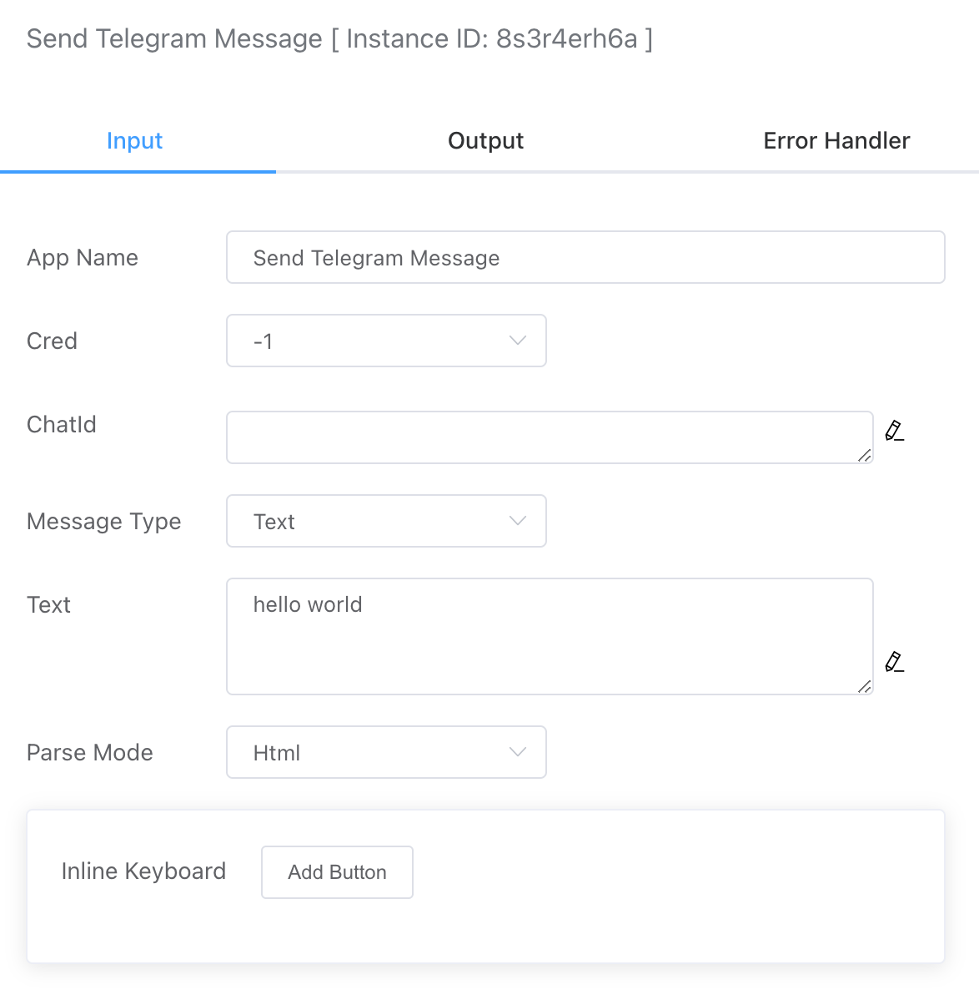
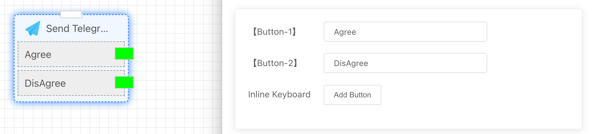

## Send Telegram Message

Supports sending messages in various formats, including text, images, files, and GIFs.


## Input




### Credential

You need to first create the necessary credentials in **Credential**.


### ChatId

The recipient of the message should be specified by their Telegram ID. To find your own Chat ID, you can use the following Telegram bot:

Bot Address：[@userinfobot](https://telegram.me/userinfobot)


### Message Type

Currently, the following types are supported:

- Text
- Image
- File
- Video
- Audio
- Gif

Selecting different message types requires different input content. For example, the Text type will be associated with a text input box.


### Parse Mode

Currently, the following types are supported:

- Html
- Markdown


### Inline Keyboard

If you need to send a message with button types, you can add buttons here. The created buttons can also be linked to subsequent branch processes, as shown in the figure below.




## Output

If the send is successful, the result will display "ok."

```json
{
    "result": "ok"
}
```

