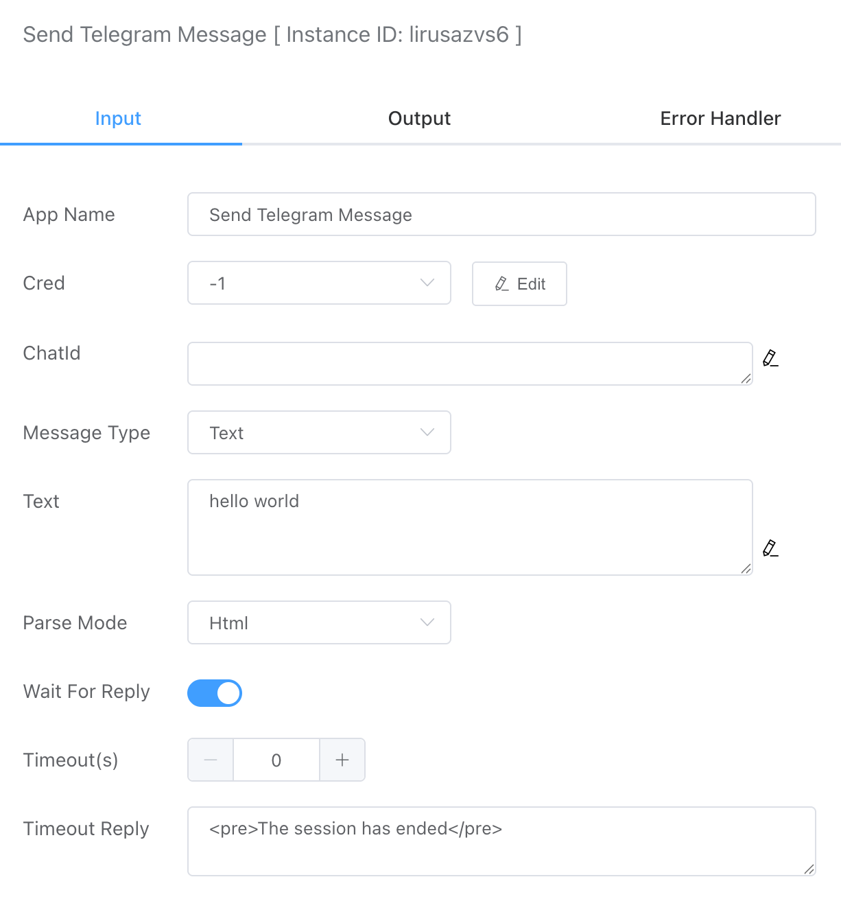

## Send Telegram Message

Supports sending messages in various formats, including text, images, files, and GIFs.


<iframe 
    width="800" 
    height="600" 
    src="https://www.youtube.com/embed/FzeWsT5-ox4"  frameborder="0" 
    allow="accelerometer; autoplay; encrypted-media; gyroscope; picture-in-picture" 
    allowfullscreen>
</iframe>

## Input



### Credential

You need to first create the necessary credentials in **Credential**.


### ChatId

The recipient of the message should be specified by their Telegram ID. To find your own Chat ID, you can use the following Telegram bot:

Bot Address：[@userinfobot](https://telegram.me/userinfobot)


### Message Type

Currently, the following types are supported:

- Text
- Image
- File
- Video
- Audio
- Gif

Selecting different message types requires different input content. For example, the Text type will be associated with a text input box.


### Parse Mode

Currently, the following types are supported:

- Html
- Markdown


### Wait For Reply

Wait until the message is received before continuing to execute.

- Timeout

  Set the timeout for waiting for a reply message

- Timeout Reply

  Set the prompt message sent when the wait timeout


## Output

If the send is successful, the result will display "ok."

```json
{
    "isTimeout": true,
    "reply": "",
    "result": "ok"
}
```

