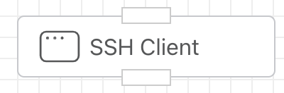
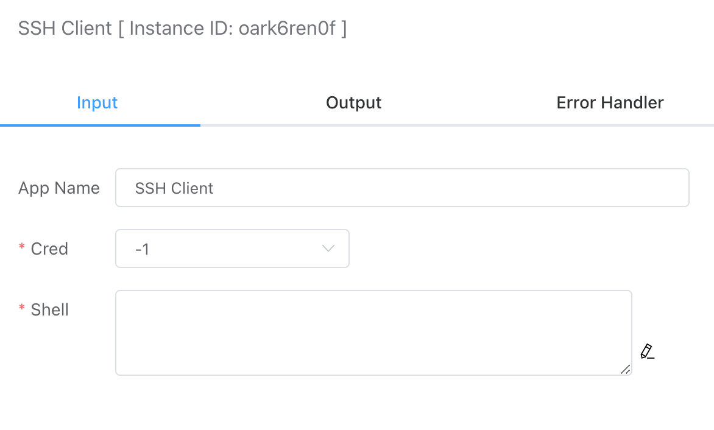
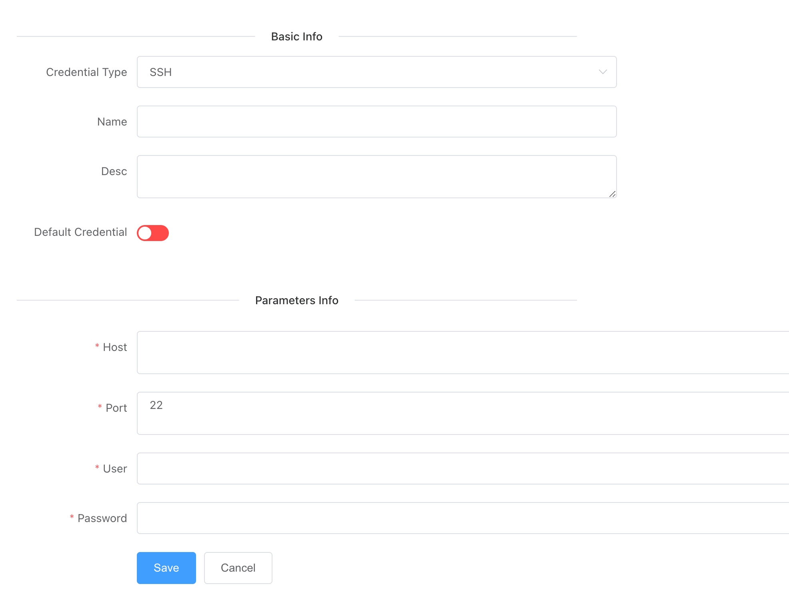

## SSH Remote Execution

Allows remote login to a machine via SSH and execution of shell commands.



## Input



- ### Credentials

  You can create SSH credential types in the "Credential Management" section. The following options need to be configured:

  - **Host**: The remote IP address.
  - **Port**: The SSH remote host port, default is 22.
  - **User**: The login username.
  - **Password**: The login password.




### Command Line

The shell command to be executed on the target remote host. For example:

```shell
ps -ef
```


## Output

The string output from the shell command.


