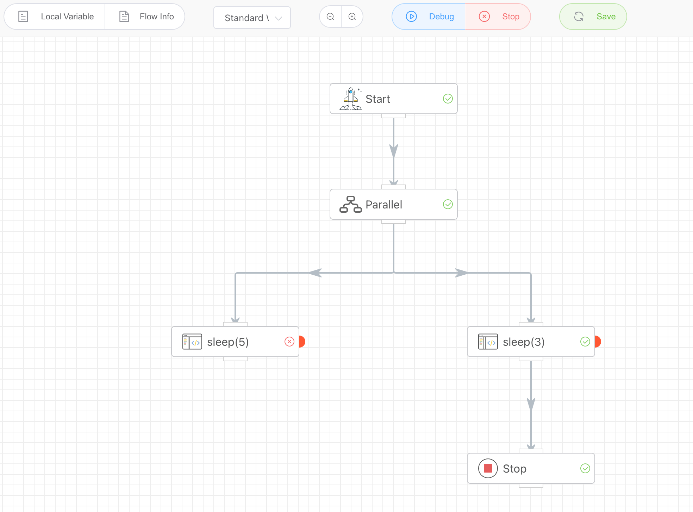

## Stop Execution

Forcefully terminate the currently running workflow. When execution reaches this node, if any APPs are still running, they will also be forcibly stopped.

## Input

None

## Output

None
