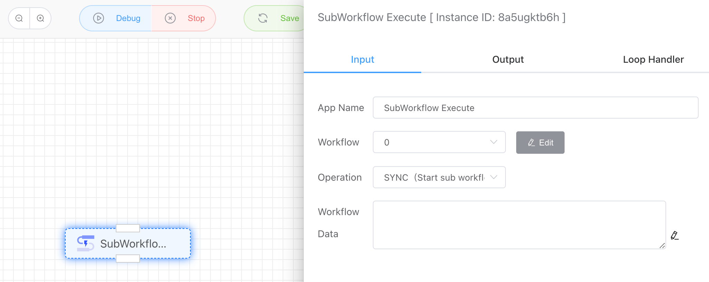
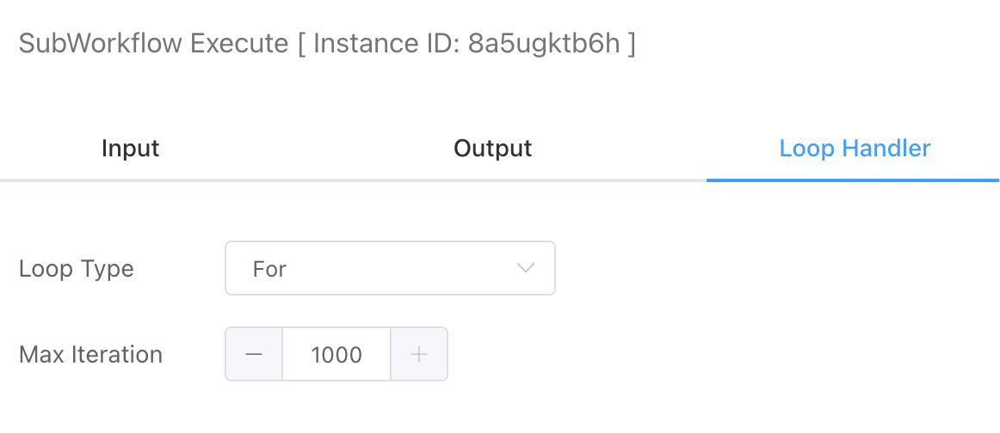

## Subworkflow Execution

Subworkflows can be called for execution in either synchronous or asynchronous modes. The synchronous mode waits for the subworkflow to finish before continuing execution, while the asynchronous mode calls the subworkflow and proceeds without waiting for its completion.

## Input

### Workflow

Here, you can choose either a synchronous API or an asynchronous API workflow.

### Operation

- **Synchronous**: Triggers the subworkflow execution and waits for it to finish before continuing.
- **Asynchronous**: Triggers the subworkflow execution without waiting for it to finish, allowing the process to continue.

### Workflow Parameter Passing

This allows for similar implementation of Post request JSON parameters for both synchronous and asynchronous APIs.

## Loop Configuration

Subworkflow execution also supports setting a maximum loop count for executing the subworkflow.

## Output

None

