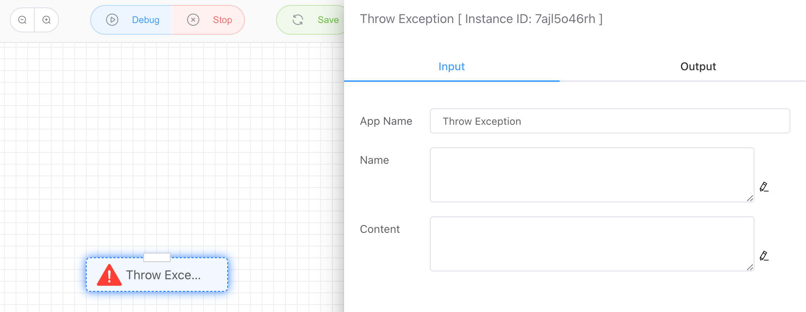
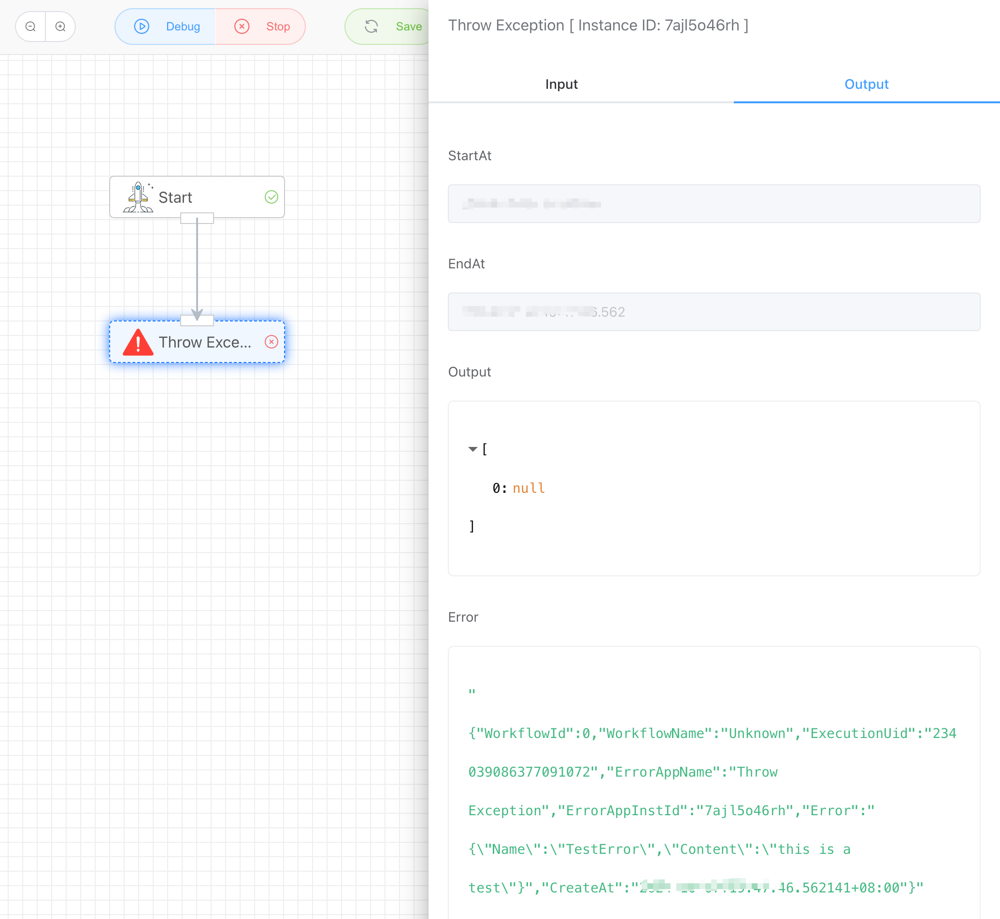

## Throw Exception

Exceptions can be thrown, causing the workflow to stop running due to an error.

## Input

### Name

Exception title.

### Content

Detailed content of the exception.

## Output

None. Error messages will be displayed in the **Error** section.

