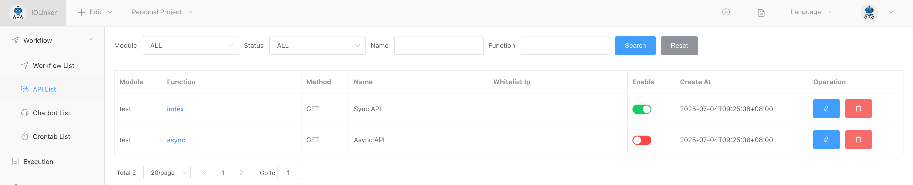
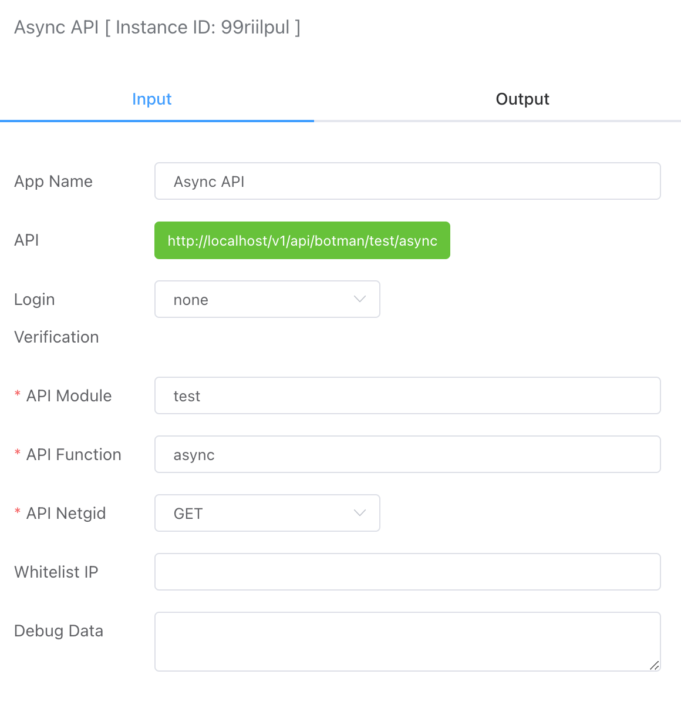
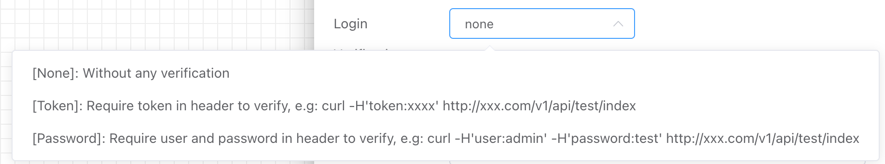

## Async API Trigger

Generate an HTTP service API interface that triggers a workflow to run asynchronously when called, returning the execution instance ID immediately without waiting for the workflow to finish.


The created workflows can be found under the **【Workflow List】** or **【API List】** in the **【Workflow】** section.

Note: The API can only be used normally after it is enabled; otherwise, an error message will indicate that the interface is not enabled.




## Input




### Authentication Methods

Currently, the following three authentication methods are supported:




- No Authentication

  All requests do not require authentication.

  For example:

  ```http
  curl -d '{}' http://8.218.xxx.xx/v1/api/iolinker/test/async
  {"response":{"uid":"2023331691312889545691136"}}
  ```

- Token Authentication

  When requesting the API, you need to include the Token in the Header for authentication.

  For example:

  ```http
  // Invalid Request Method
  curl http://8.218.xxx.xx/v1/api/iolinker/test/async
  {"response":{"error":{"code":"requestError.invalidParams","message":"Token is required"}}}
  ```

  ```http
  // Valid Request Method
  curl -H'token:123456' http://8.218.xxx.xx/v1/api/admin/test/async
  {"response":{"uid":"213995413340041216"}}
  ```


- Username and Password Authentication

  When requesting the API, you need to include the username and password in the Header for authentication.

  For example:

  ```http
  // Invalid Request Method
  curl http://8.218.xxx.xx/v1/api/iolinker/test/async
  {"response":{"error":{"code":"requestError.invalidParams","message":"User/Password is required"}}}
  ```

  ```http
  // Valid Request Method
  curl -H'user:iolinker' -H'password:123456' http://8.218.xxx.xx/v1/api/iolinker/test/async
  {"response":{"uid":"213995413340041216"}}
  ```


### API Module

The API module is primarily used to categorize interfaces, allowing for different modules based on products.


### API Methods

The names of the interfaces under the module.


### API Methods

Currently, both GET and POST methods are supported.


### Debugging Data

Simulated user requests for the interface, including the POST parameters, to facilitate user debugging of the interface.


## Output

- `uid` represents the execution record ID.

```json
{
    "response": {
        "uid": "213996969363910656"
    }
}
```

