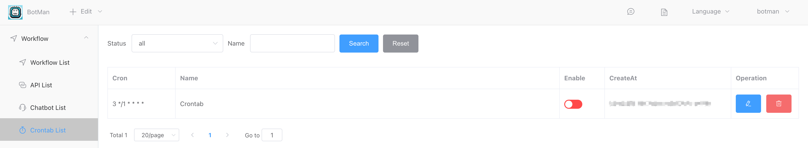

## Crontab Trigger

Workflows can be set to run periodically, supporting intervals such as minutes, hours, days, weeks, and months. The syntax is the same as the crontab format in Linux systems.

The created workflows can be found under the **【Workflow List】** or **【Crontab List】** in the **【Workflow】** menu.

## Input

### Periodic Expression

The five fields are defined as follows:

- **Minute**: 0-59. Note that for minute-level tasks, the execution second will be randomly fixed at a certain moment, not necessarily at the 0-second mark of each minute (for example, it could be at the 3rd second of every minute), but the running cycle will be every minute.
- **Hour**: 1-23
- **Day**: 1-31
- **Month**: 1-12
- **Week**: 0-6 (0 represents Sunday)

There are also some other special characters:

- **\***: Represents any time.
  
- **,**: Represents multiple values. For example, `0 2,4 * * *` means it runs at 2:00 and 4:00 every day.

- **-**: Represents a range. For example, `0 1-5 * * *` means it runs every day at 1:00, 2:00, 3:00, 4:00, and 5:00.

- **/n**: Indicates an interval. For example, `0 */2 * * *` means it runs every 2 hours.

Examples：

| Expression               | Description                                                  |
| ------------------------ | ------------------------------------------------------------ |
| */10 * * * *             | Run every 10 minutes                                         |
| 43 21 * * *              | Run every day at 21:43                                       |
| 15 05 * * *              | Run every day at 5:15                                        |
| 0 17 * * *               | Run every day at 17:00                                       |
| 0 17 * * 1               | Run at 17:00 every Monday                                    |
| 0,10 17 * * 0,2,3        | Run at 17:10 every Sunday, Tuesday, and Wednesday            |
| 0-10 17 1 * *            | Run every month on the 1st from 17:00 to 17:10               |
| 42 4 1 * *               | Run every month on the 1st at 4:42                           |
| 0 21 * * 1-6             | Run at 21:00 from Monday to Saturday                         |
| 0,10,20,30,40,50 * * * * | Run at the 0, 10, 20, 30, 40, and 50 minutes of every hour   |
| */10 * * * *             | Run every 10 minutes, which is equivalent to the previous example: |
| * 1 * * *                | Run every minute from 00:00 to 01:00 every day               |
| 0 1 * * *                | Run every day at 1:00                                        |
| 0 */1 * * *              | Run every hour                                               |
| 0 * * * *                | Run every hour                                               |
| 2 8-20/3 * * *           | Run at 8:02, 11:02, 14:02, 17:02, and 20:02 every day        |
| 30 5 1,15 * *            | Run at 5:30 on the 1st and 15th of every month               |

### Allowing Multiple Tasks to Run Simultaneously

If checked, each workflow will be triggered to run when the scheduled time is reached, regardless of whether there are any ongoing workflows that have not completed.

If unchecked, the system will check for any ongoing workflows at the time the scheduled period is reached. If there are any still running, the new workflow will not execute. If none are running, the new workflow will execute. For example, if a workflow task is created to run every minute and one task takes longer than a minute to complete, this logic will be used to prevent overlapping executions.

## Output

None

