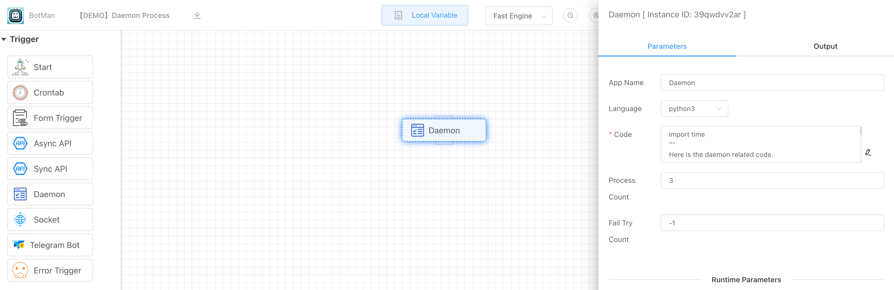
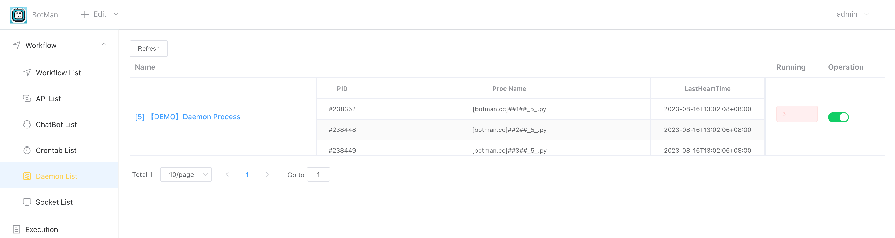
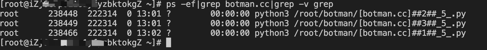

## Indroduction

If you want to run long-running daemon processes, and control the number of concurrent processes, you can use Daemon app.

<iframe width="800" height="600" src="https://www.youtube.com/embed/dkA3ZZ-SWi0" frameborder="0" allowfullscreen></iframe>

## How To Use

### 1. Select [Language]

We support  the following programming languages:

- python
- php
- javascript

### 2. Code

Depending on the scripting language of choice, write the daemon code.

### 3. Set [Process Count]

Set the number of concurrent processes.

### 4. Set [Fail Try Count]

Default value is -1, which means that everytime the daemon process exists, the system will automatically detect and restart .

### 5. Enable Daemon Workflow

You can enable the daemon workflow in [Daemon List] or in [Workflow List] page.

Through the **[ps]** command, you can see the daemon process running in the background.

