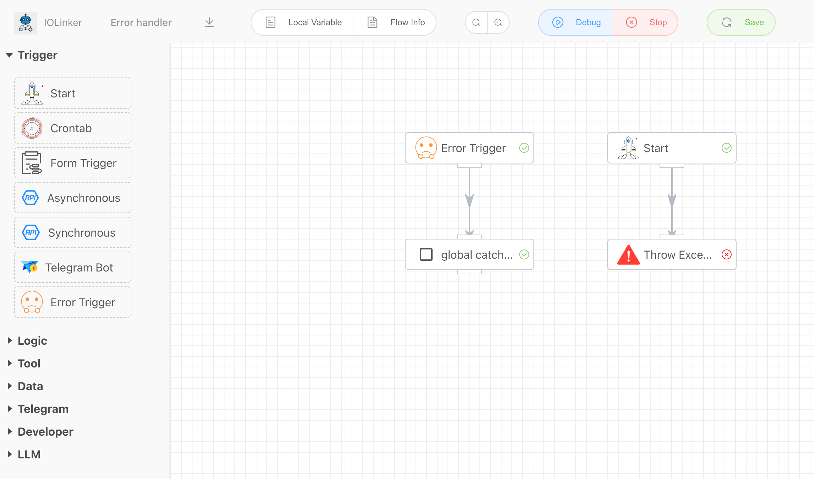

## Error Trigger


Globally capture exceptions or errors thrown during the workflow execution. As shown in the figure below, when the error trigger catches an exception during the workflow execution, it can initiate a new exception handling branch to continue the process. Here, the business can independently respond to the captured exception information, such as sending alerts, etc.




<iframe 
    width="800" 
    height="600" 
    src="https://www.youtube.com/embed/qaK4fCVEfmg"  frameborder="0" 
    allow="accelerometer; autoplay; encrypted-media; gyroscope; picture-in-picture" 
    allowfullscreen>
</iframe>

## Input

None


## Output

The output information will indicate which node in the workflow, at what time, and what kind of error occurred.


```json
[
  {
    "CreateAt": "2025-05-13T19:53:20.390535+08:00",
    "Error": "{\"Name\":\"test\",\"Content\":\"throw error\"}",
    "ErrorAppInstId": "v3g1sjx7pk",
    "ErrorAppName": "Throw Exception",
    "ExecutionUid": "313004680261140480",
    "WorkflowId": 18,
    "WorkflowName": "Error handler"
  }
]
```

