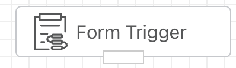
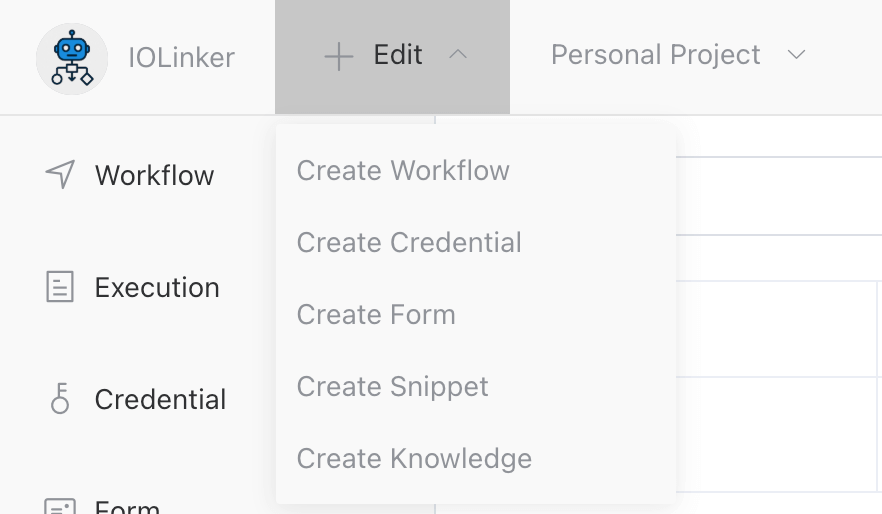
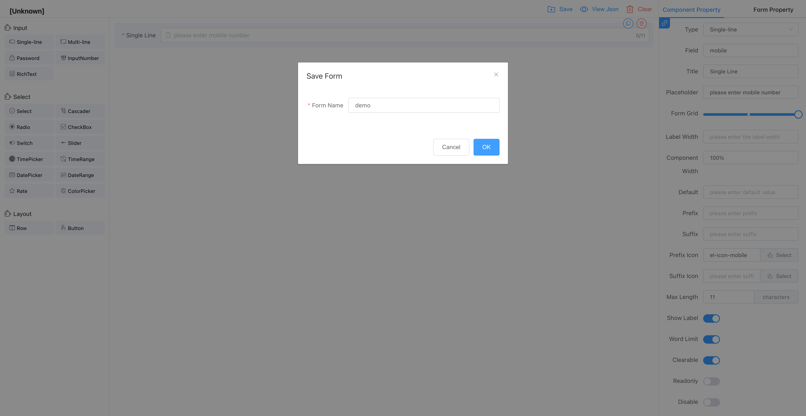
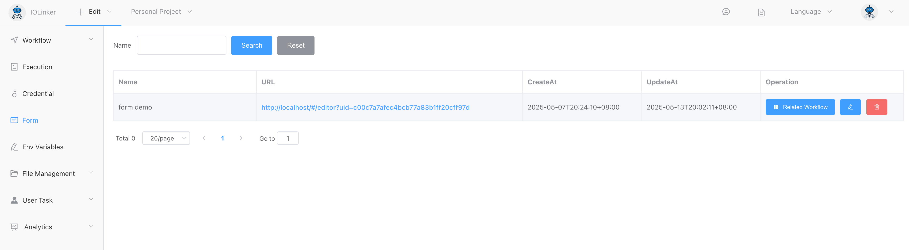
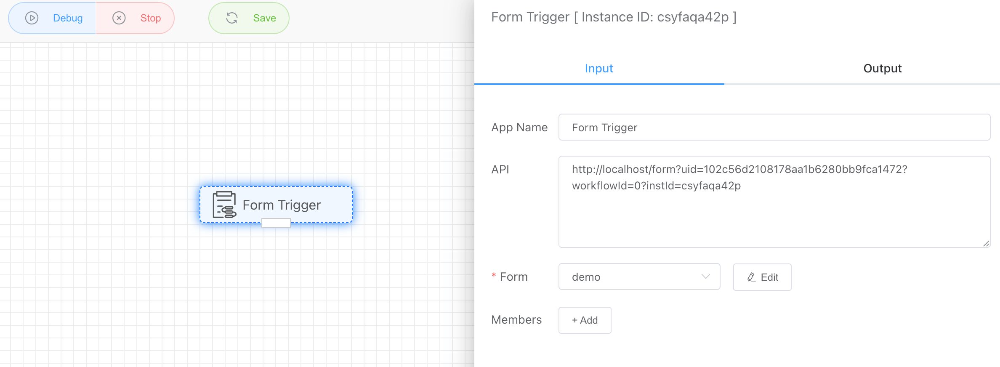
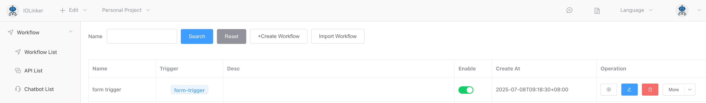
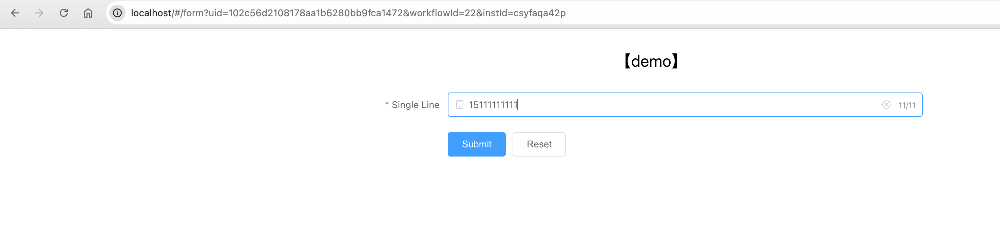
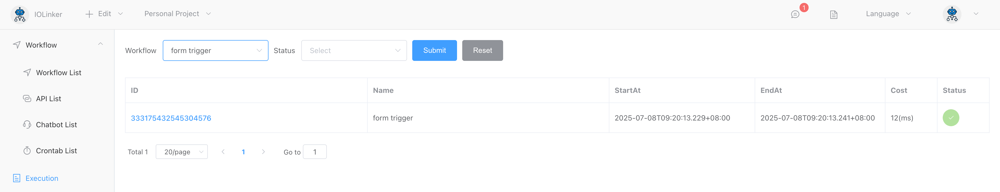
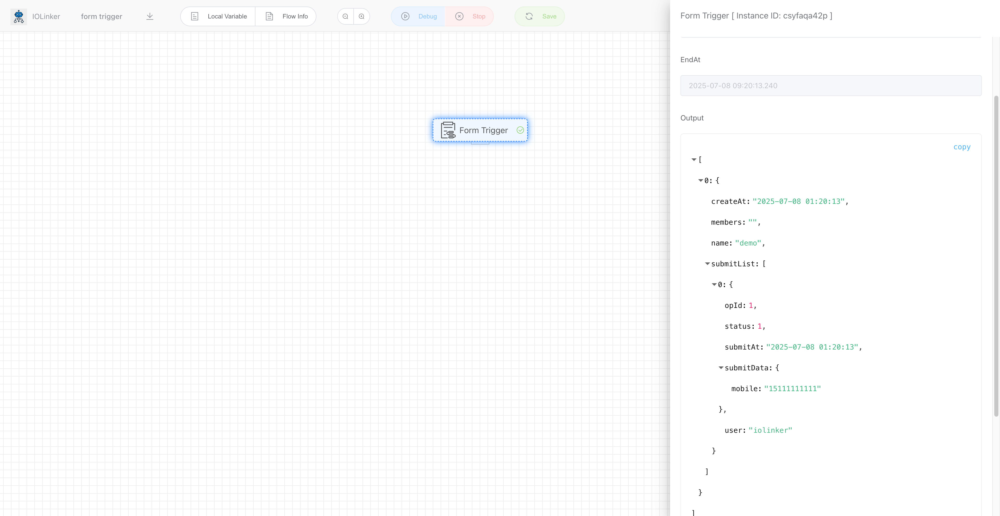
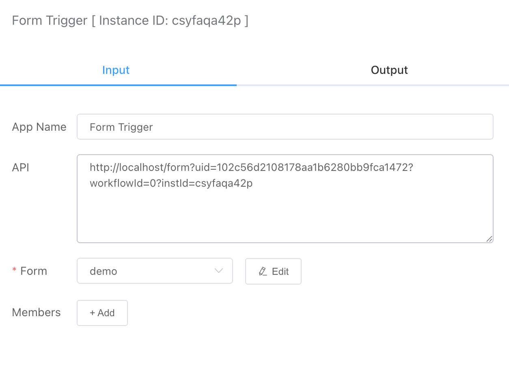

## Form Trigger

The workflow execution is triggered by submitting the form.



### Steps

#### 1. Create Form



#### 2. Design And Save Form



The saved form can be viewed in the [Form] menu option on the left:



#### 3. Create Workflow And Connect Form

Use [Form Trigger] and select the previously created form in the form drop-down list. You will see that the API option will generate a form submission address. This address is uniquely bound to the workflow. You can submit the form by opening the address to trigger the workflow execution.



#### 4. Submit Form

You can see the form submission address in [Workflow] and click it to enter the form submission address.



点击【Submit】提交按钮，后就可以在执行记录看到一条工作流执行记录。



#### 5. View form submission records

Form submission record (workflow execution record):



Click View Details to see the data submitted by the form:




## Input

### Form

Here you can drop down and select the form you want to associate.

### Members

Set the members who are allowed to fill in the form. If not set, all members in the project space can submit the form.



## Output

As shown below, the output will show the data submitted by the submitter at the time, as well as the values of each option in the form (under submitData).

```
[
  {
    "createAt": "2025-05-07 20:31:29",
    "members": "",
    "name": "form demo",
    "submitList": [
      {
        "opId": 43,
        "status": 1,
        "submitAt": "2025-05-07 20:31:29",
        "submitData": {
          "mobile": "15111111111"
        },
        "user": "iolinker"
      }
    ]
  }
]
```

