## Form Trigger

This trigger app supports visual design of forms, and triggers workflow execution through form submission operations.

<iframe width="800" height="600" src="https://www.youtube.com/embed/rc-CeafECOA" frameborder="0" allowfullscreen></iframe>

## How To Use

### 1. Save workflow first!

Before designing the form, you need to save the workflow first (this is mainly to obtain the workflow id to associate with the generated form url).

Click the [save] button on right side.

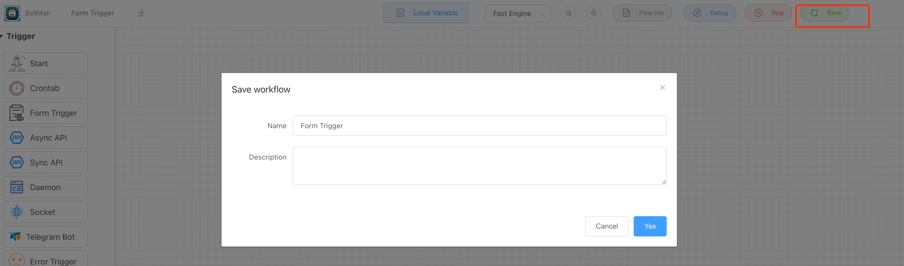

### 2.Drag the [Form Trigger] into canvas and jump to form visual editor

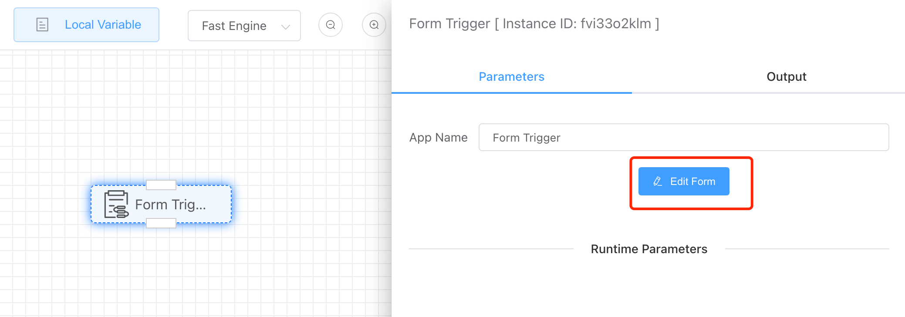

Click the [Edit Form] button, jump to the form editor below.

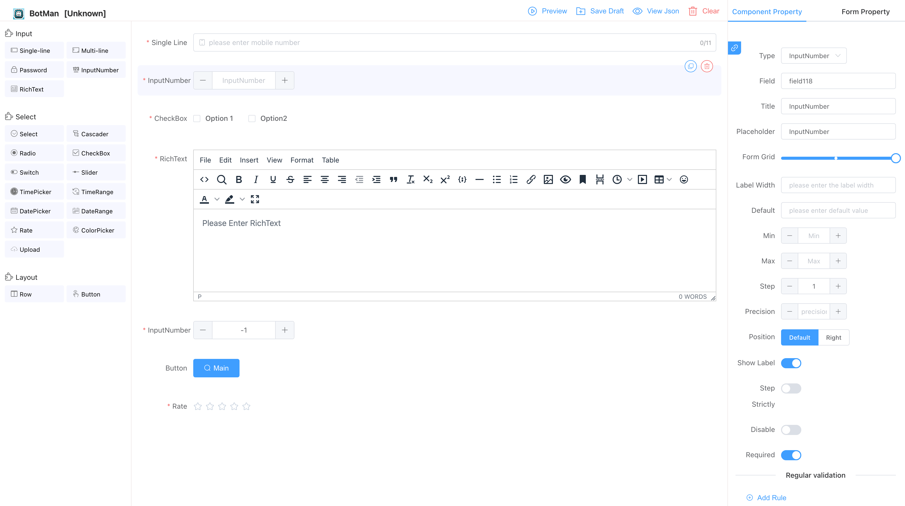

After designing the form, click **[Save Draft]** , after that, you can preview the form by click **[Preview]** button.

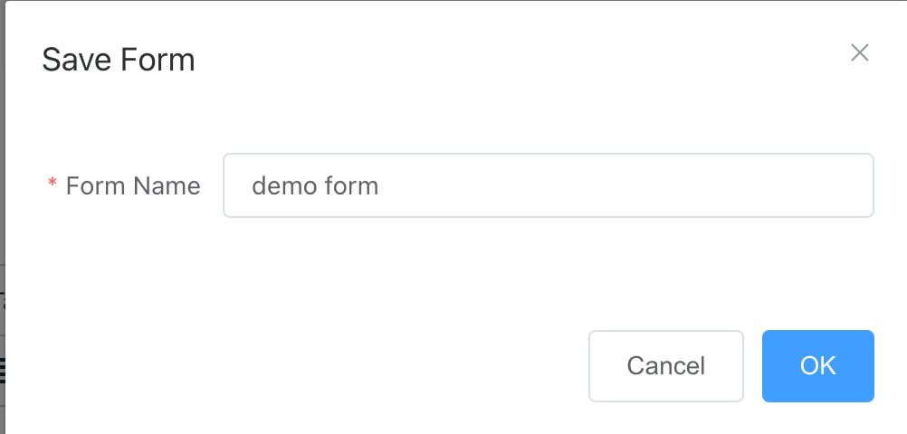

The following is the preview effect demo of the form.

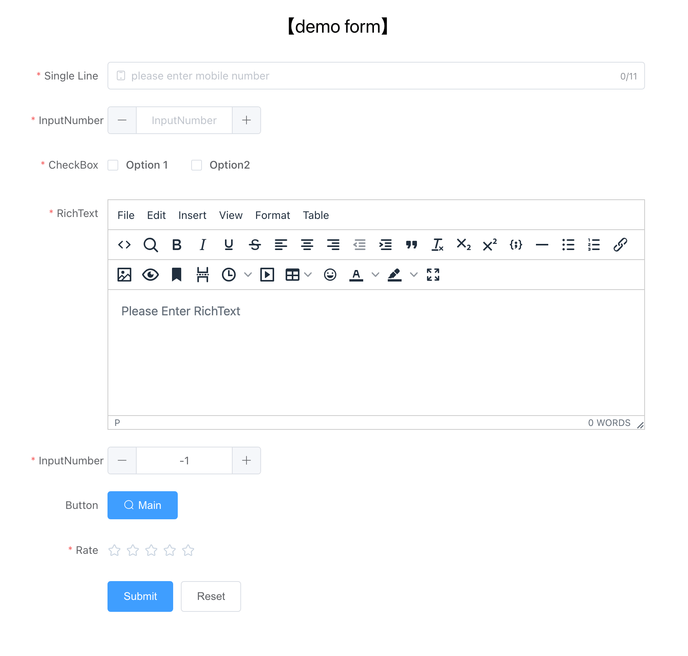

### 3.Save the workflow

After the form is designed and saved, return to the process editing interface to continue designing the process after the form is submitted.

Go back to **[Workflow List]** page, you will see the form workflow just created, and you can click the form link to jump to the form submission page.

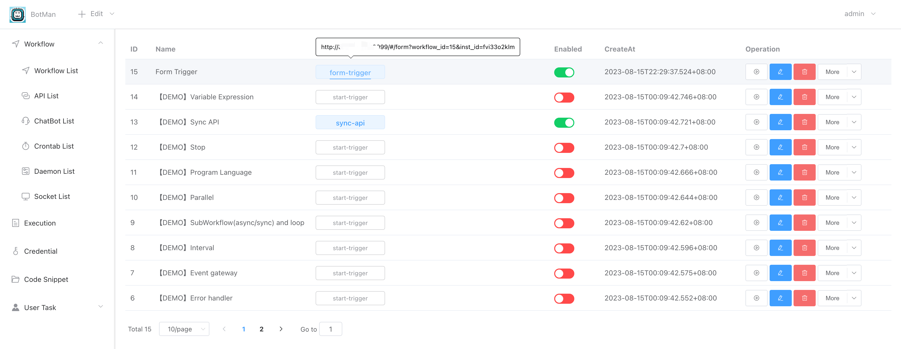

### 4. Submit form

> Form Submission Page

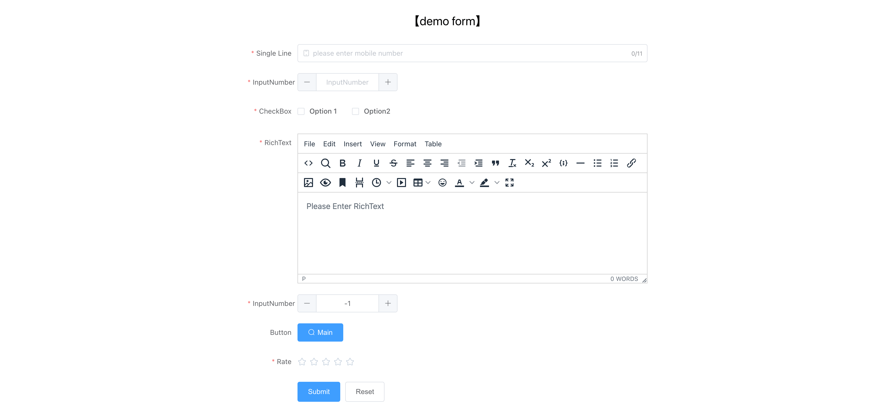

Every time the form is submitted, the workflow will be triggered to create and execute an execution instance.

### 5. Form submission history

You can see the form submission history on the **[DONE]** tab page of page **[User Task > Form]** or page **[Execution]**.

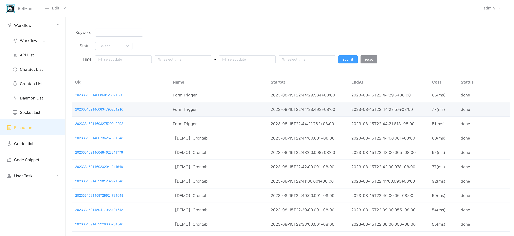

See the form trigger app output.

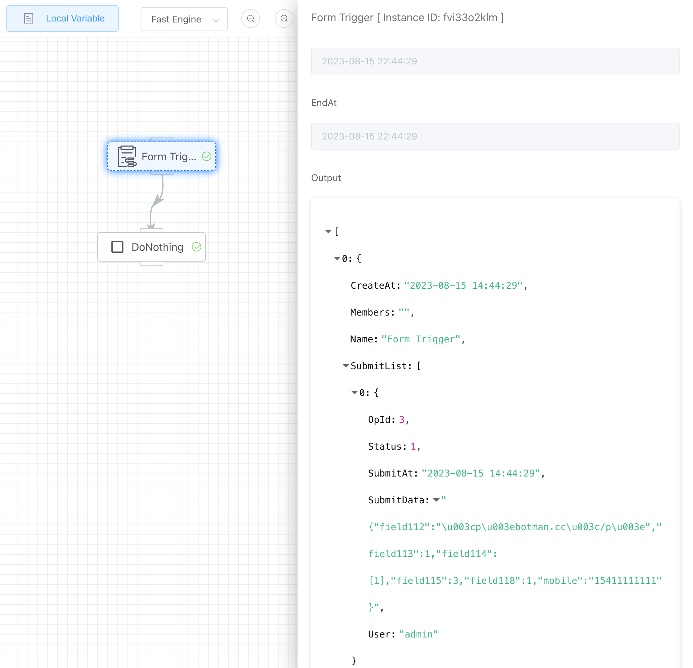

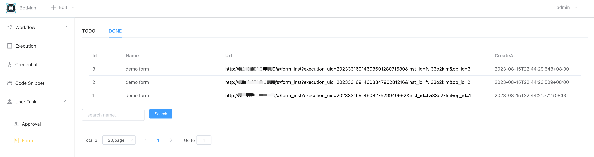

You can click the submittion url to see the detailed content.

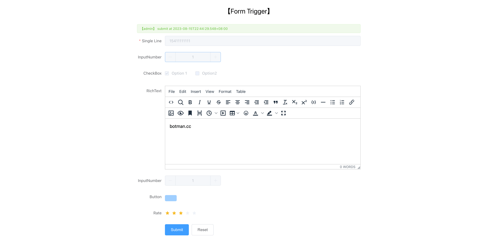