## Indroduction

By listening to the app through Socket, you can respond to udp and tcp client requests and trigger workflow execution.

<iframe width="800" height="600" src="https://www.youtube.com/embed/ro24OHsGIEc" frameborder="0" allowfullscreen></iframe>

## How To Use

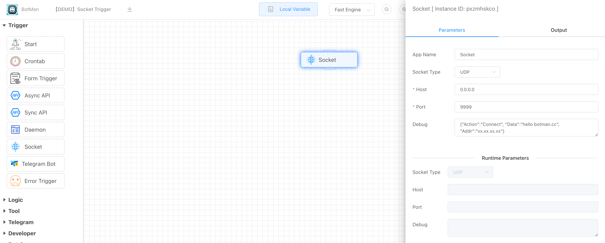

### 1. Select [Socket Type]

- UDP
- TCP


### 2. Receive Events (TCP)

If you choose tcp server to monitor, you can choose the type of event to respond to.

- Connect

  When the TCP client connects to the server, the **Connect** event will be generated to trigger workflow execution.

- Data

  Every time the TCP client sends data to the server, a **Data** event will be generated to trigger workflow execution.

- Close

  When the TCP client close the connection to server, the **Close** event will be generated to trigger workflow execution.

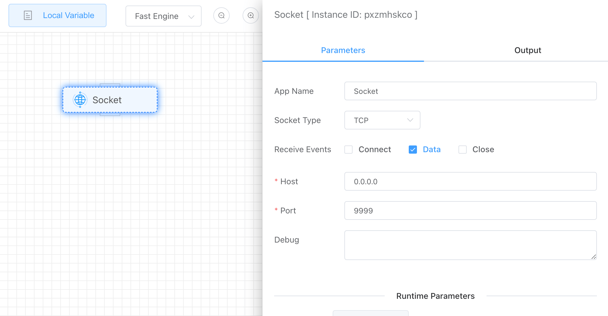

### 3. Set [Host]

Set the host address that the socket server listens to.


### 4. Set [Port]

Set the port bound to the socket server.


### 5. Set [Debug]

[Debug] is used to simulate the parameters sent by socket clients, which is for easy debugging.

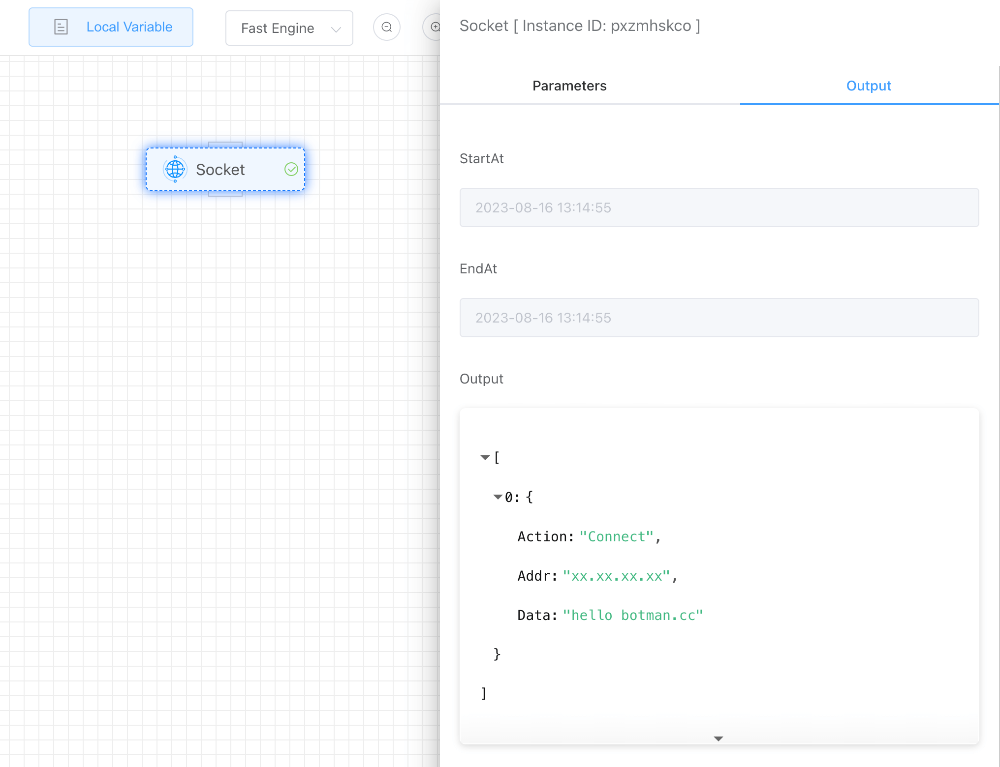


### 6. Enable socket server

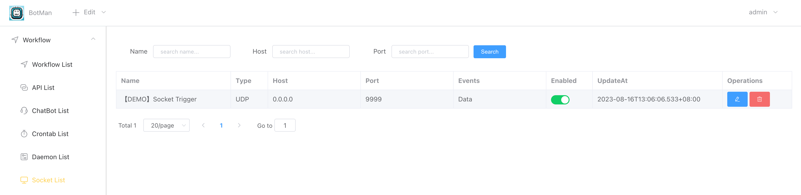


### 7.Socket server process

View the listening port through the **[netstat]** command.

```shell
netstat -anp|grep [port]
```

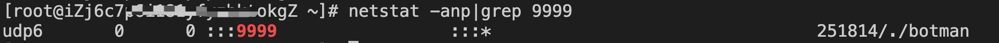

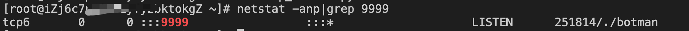


### 8. [UDP Client] Send data to udp socket server

First, create the udp socket workflow and enable it.

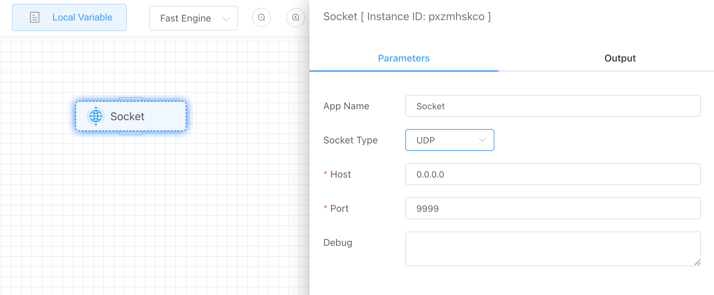

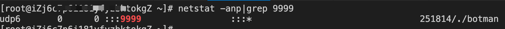

udp_client.py

```python
import socket

msgFromClient       = "Hello UDP Server"
bytesToSend         = str.encode(msgFromClient)
serverAddressPort   = ("127.0.0.1", 9999)
bufferSize          = 1024

UDPClientSocket = socket.socket(family=socket.AF_INET, type=socket.SOCK_DGRAM)
UDPClientSocket.sendto(bytesToSend, serverAddressPort)
```

Every time data is sent to the udp server, the workflow execution will be triggered.

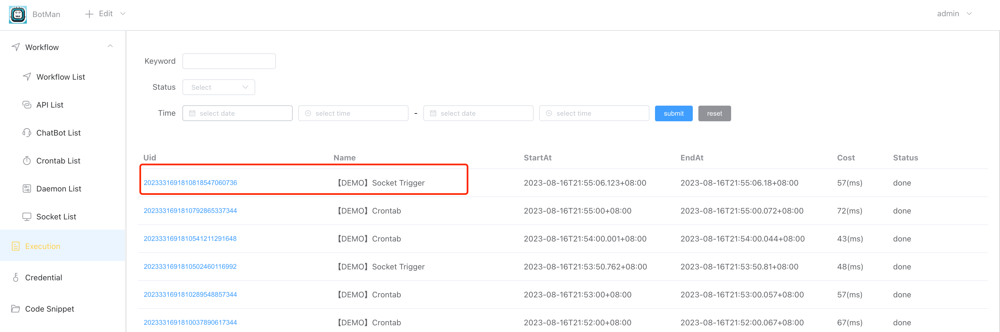


Data sent from udp client.

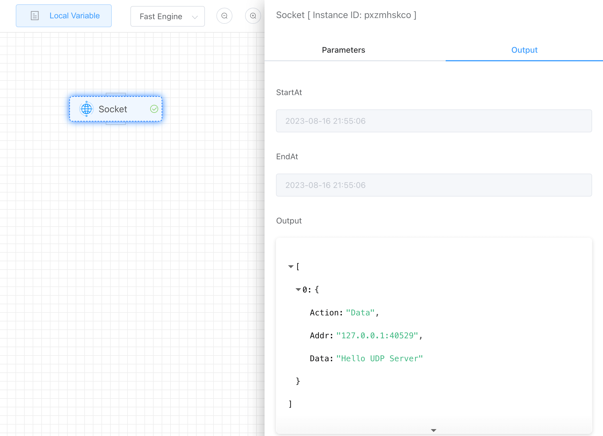


### 9. [TCP Client] Send data to tcp socket server

First, create the tcp socket workflow and enable it.

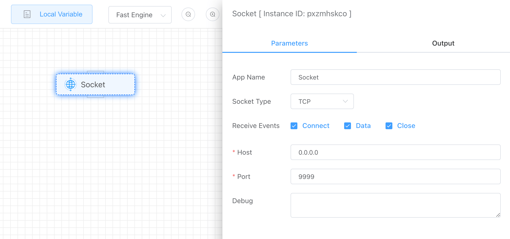


tcp_client.py

```python
import socket
import time

client = socket.socket(socket.AF_INET, socket.SOCK_STREAM)
ROBOT_IP= "0.0.0.0"
ROBOT_PORT = 9999
client.connect((ROBOT_IP,ROBOT_PORT))
cmd = 'Hello TCP Server'
client.send(bytes(cmd+'\0','ascii'))
```

The following are the three execution records generated by the Connect, Data, and Close events triggered by the TCP client.

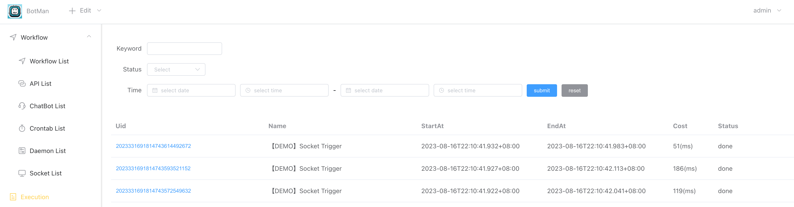


> Connect Event

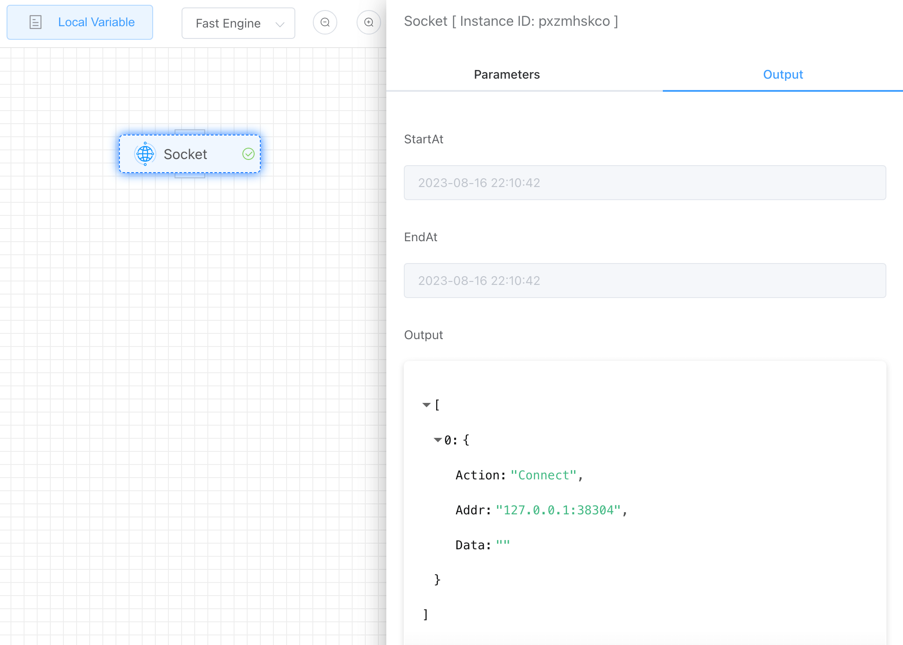

> Data Event

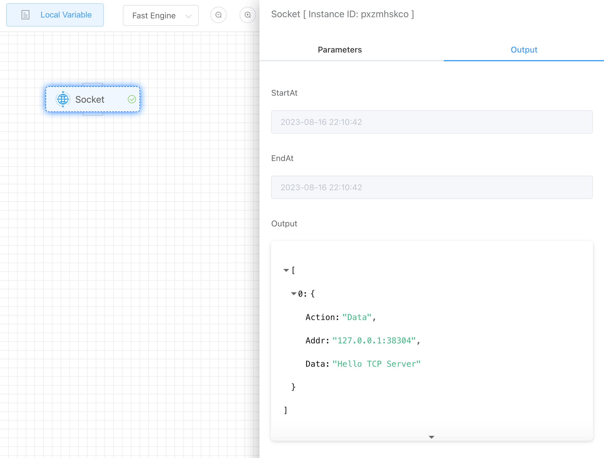

> Close Event

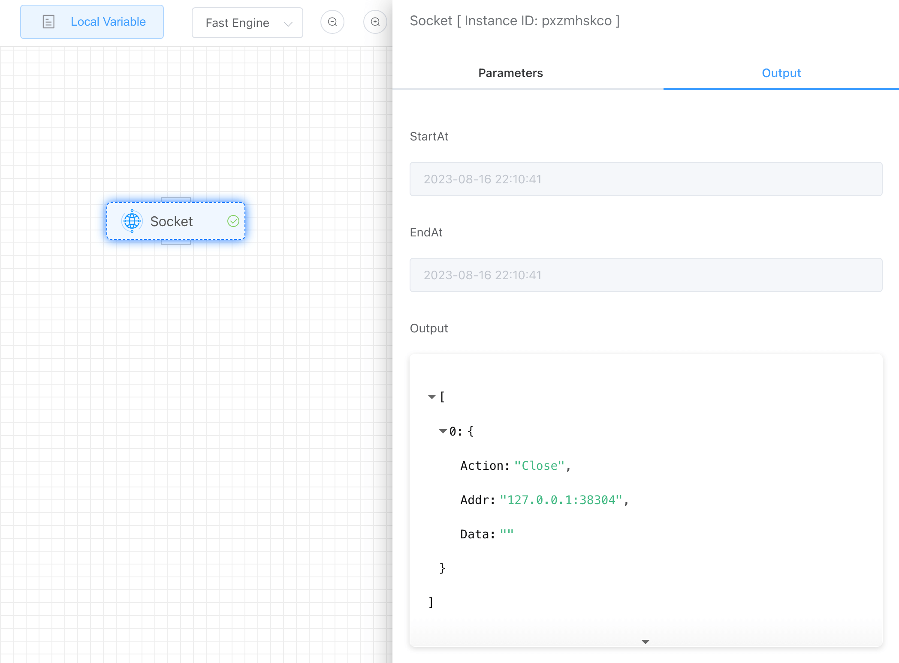