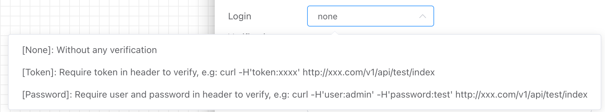

## Sync API Trigger

Generate an HTTP service API interface that, when called, will trigger the workflow to run, wait for the workflow to finish, and return the output results.


The created workflows can be found under the **【Workflow List】** or **【API List】** in the **【Workflow】** section.

Note: The API can only be used normally after it is enabled; otherwise, an error message will indicate that the interface is not enabled.


## Input


### Authentication Methods

Currently, the following three authentication methods are supported:




- No Authentication

  All requests do not require authentication.

  For example:

  ```http
  curl -d '{}' http://8.218.xxx.xx/v1/api/iolinker/test/sync
  {"response":{"code":0,"data":"iolinker.com","msg":"","uid":"2023331691312889545691136"}}
  ```

- Token Authentication

  When requesting the API, you need to include the Token in the Header for authentication.

  For example:

  ```http
  // Invalid Request Method
  curl http://8.218.xxx.xx/v1/api/iolinker/test/sync
  {"response":{"error":{"code":"requestError.invalidParams","message":"Token is required"}}}
  ```

  ```http
  // Valid Request Method
  curl -H'token:123456' http://8.218.xxx.xx/v1/api/admin/test/sync
  {"response":{"data":{"code":0,"msg":"ok"},"code":0,"msg":"","uid":"213995413340041216"}}
  ```


- Username and Password Authentication

  When requesting the API, you need to include the username and password in the Header for authentication.

  For example:

  ```http
  // Invalid Request Method
  curl http://8.218.xxx.xx/v1/api/iolinker/test/sync
  {"response":{"error":{"code":"requestError.invalidParams","message":"User/Password is required"}}}
  ```

  ```http
  // Valid Request Method
  curl -H'user:iolinker' -H'password:123456' http://8.218.xxx.xx/v1/api/iolinker/test/sync
  {"response":{"data":{"code":0,"msg":"ok"},"code":0,"msg":"","uid":"213995413340041216"}}
  ```


### API Module

The API module is primarily used to categorize interfaces, allowing for different modules based on products.


### API Methods

The names of the interfaces under the module.


### API Methods

Currently, both GET and POST methods are supported.


### Debugging Data

Simulated user requests for the interface, including the POST parameters, to facilitate user debugging of the interface.


## Output

By default, if no output is set, the synchronous API interface output is as follows:

- The `data` field represents the output of the interface. Since no output is set, it defaults to an empty string.

- The `code` and `msg` fields indicate error information during execution, with a normal default value of 0.

- `uid` represents the execution record ID.

```json
{
    "response": {
        "data": "",
        "code": 0,
        "msg": "",
        "uid": "213996969363910656"
    }
}
```


If the output is set (using the **【Output】** application), for example, outputting a JSON structure: `{"name":"hello world"}`, the output result is as follows:

```json
{
    "response": {
        "data": {
            "name": "hello world"
        },
        "code": 0,
        "msg": "",
        "uid": "213996969363910656"
    }
}
```

