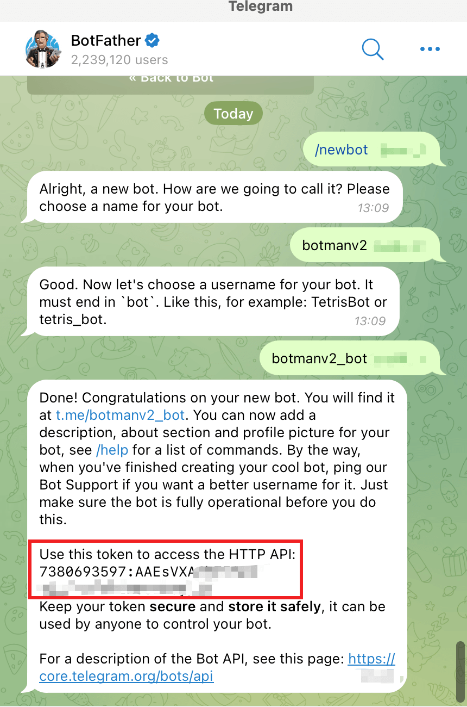

## Telegram Bot Trigger

You can respond to messages sent by users on the Telegram bot.


## Input


### Create Telegram Credential

#### Token

Here, the Token is a string returned when creating a Telegram bot through BotFather, as shown in the image below.



#### Message Reception

`getUpdates` is a polling method suitable for environments without a domain name, typically in an internal network. `webhook` is a passive method for receiving messages, suitable for public networks with a domain that has a valid certificate.


- The [getUpdates mode](https://core.telegram.org/bots/api#getupdates) actively polls the `getUpdates` interface provided by Telegram to retrieve messages and event data sent to the bot. This method does not require a domain name or exposure on the public internet like WebHook; it can also receive callback messages from the Telegram bot within an internal network. Below is the workflow principle for this mode:

  

  

- The [webhook mode](https://core.telegram.org/bots/api#setwebhook) requires providing a callback URL (which must be an HTTPS domain) to Telegram. Telegram will push the messages and event data received by the bot to this callback interface. This method offers higher real-time responsiveness, but it requires the user to expose the system to the public internet and provide a domain with an HTTPS certificate. Below is the workflow principle for this mode:

  


### Message Types


- **Text**

  Text messages require specifying commands and their parameters, as detailed below.

- **Event**

  - Enter chat event
  - Exit chat event

  Event messages do not require specifying commands or parameters. Currently, responses are supported for enter and exit chat events.


### Authorized Members

By default, all users have permission to use the bot commands. If specific members need to be designated, their Telegram ID must be set.


### Commands and Parameters

You can set commands and their accepted parameters. For example, the `/test` command can be set up as follows. If you want to pass parameters, you would enter them in the bot's input window as shown below. The system will automatically parse the output parameter values.

Currently, the following parameter types are supported:

- Boolean
- Integer
- Float
- String

```
/test -h 1.1.1.1 -p 22
```

The application output is as follows:

```json
{
    "cmdParameters": {
        "h": "1.1.1.1",
        "p": 22
    },
    "command": "/test -h 1.1.1.1 -p 22",
    "from": {
        "chatType": "private",
        "id": "34412xx",
        "username": "tester"
    },
    "origin": ""
}
```


### Debugging Data

Debugging data simulates the output results of the application during runtime, making it easier for users to debug while designing workflows.


## Output

```json
{
    "cmdParameters": {
        "h": "1.1.1.1",
        "p": 22
    },
    "command": "/test -h 1.1.1.1 -p 22",
    "from": {
        "chatType": "private",
        "id": "34412xx",
        "username": "tester"
    },
    "origin": ""
}
```

- **cmdParameters**

  Parses and outputs the values of the various parameters passed in by the user's command.

- **command**

  The complete command entered by the user.

- **from**

  - **chatType**: `private` indicates a one-on-one chat message, while `group` indicates a group chat message.
  - **id**: Represents the Telegram ID of the user who sent the message.
  - **username**: Represents the username of the user who sent the message.


