## Indroduction

The telegram bot trigger supports setting keywords to respond.

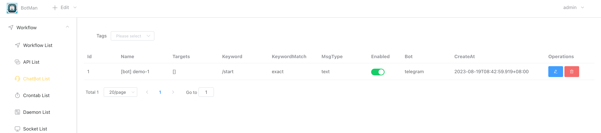

## How To Use

### 1. Create telegram credential [Access Token]

If the **[Default Cred]** switch is enabled, then there is no need to manually select the credentials when editing the telegram bot app, the system will automatically select the default credentials.

**Remark**: how to create telegram bot and get access token , please refer to [How to create telegram bot and get token](how_to_create_telegram_bot_and_get_token.md)

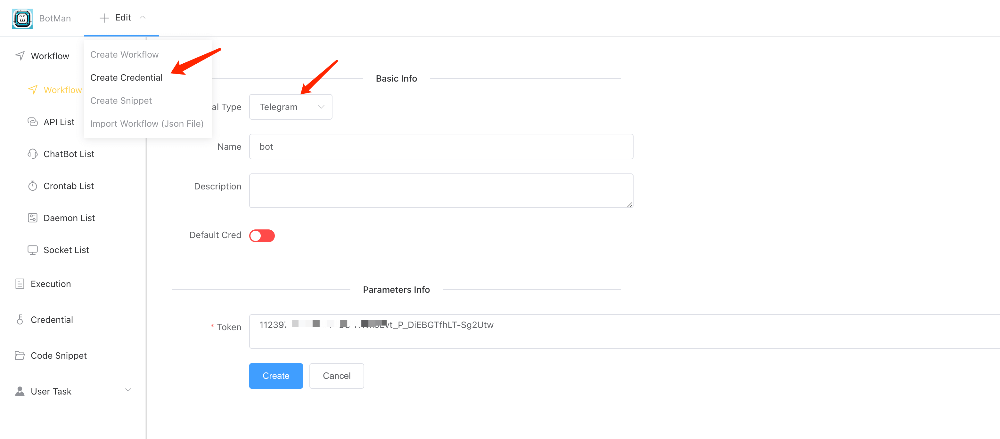

If enable the **[Default Cred]** above, then no need manually select.

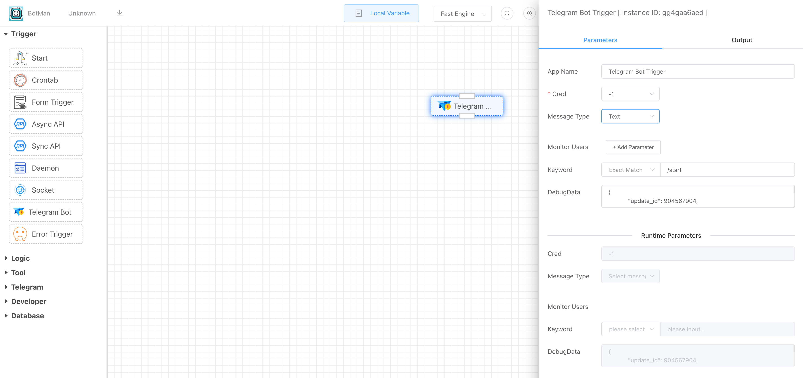

### 2. Configure [Message Type]

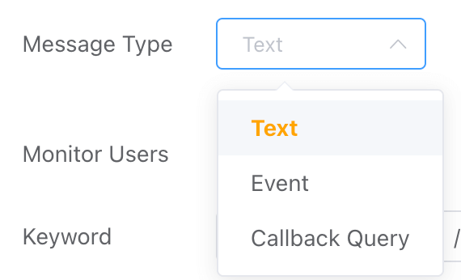

- Text 

  Set specific keywords to respond, such as **/start** or **help**, etc.

  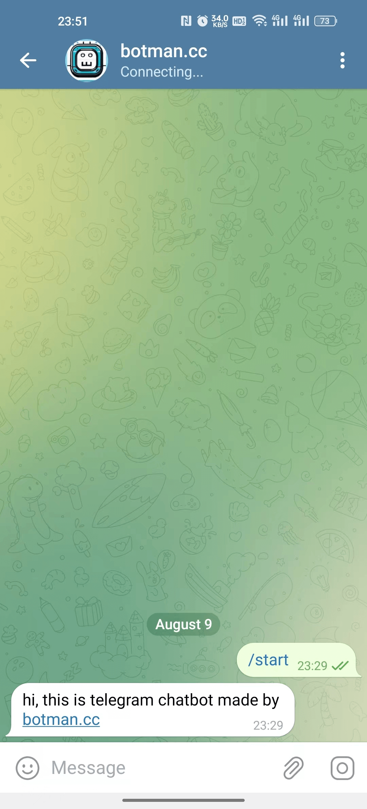

- Event
  - Enter Group Event
  - Exit Group Event

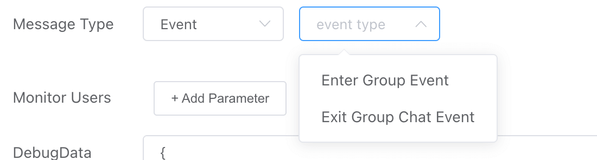

### 3. Configure **[Monitor Users]**

If it is not set by default, any user's message to the telegram robot will trigger a response as long as it hits the rule.

If you only want the robot's command response to be used only by yourself, you can select your own account from the drop-down list.

Remark: Please remember to associate your userid and admin account on telegram: [How to get telegram userid and associate it to admin account](how_to_get_telegram_userid_by_iolinker.md)

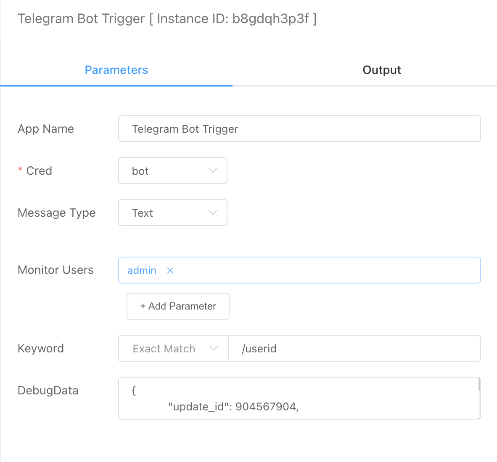

### 4. Configure [Keyword]

- Exact Match

  Only when the message sent by the user exactly equal to the keyword, the workflow will be triggered to response.

- Fuzzy Match

  As long as the content of the message sent by the user contains the set keywords,the workflow will be triggered to response.

- Regex Match

  You can match the message sent by the user by configure a regular expression, as long as it hits, the workflow will be triggered to response.

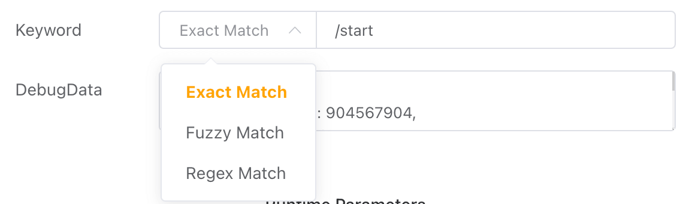

### 5. Set [Debug Data]

[Debug Data] is used to simulate the parameters passed by user message, which is for easy debugging.

### 6. Demo [Exact Match Text]

#### 6.1 Create telegram bot workflow

This is the telegram bot we created.

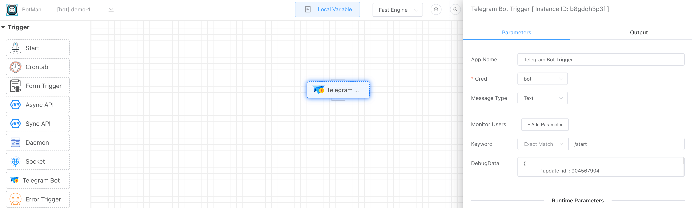

#### 6.2 Enable telegram bot workflow

You can enable it in [ChatBot List] or in [Workflow List] page.

#### 6.3 Send message to telegram bot in telegram app

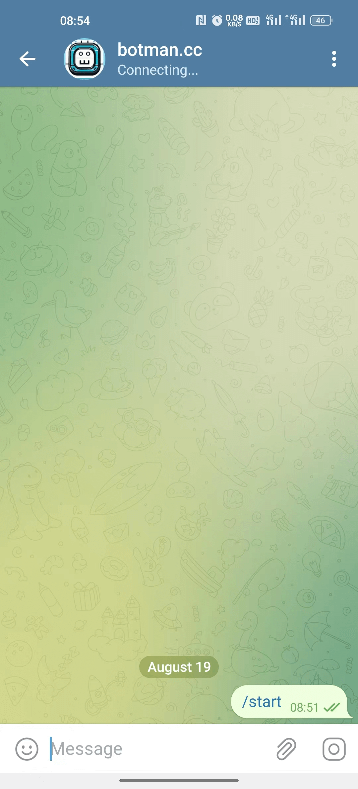

#### 6.4 Find the execution detail

You can see the execution in [Execution List], and the message sent by user.

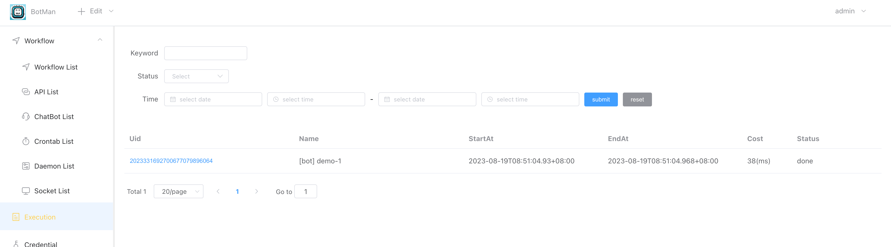

> The user messages that meet the matching rules pulled from the telegram api will be used as the output of the **[Telegram Bot Trigger]** app.

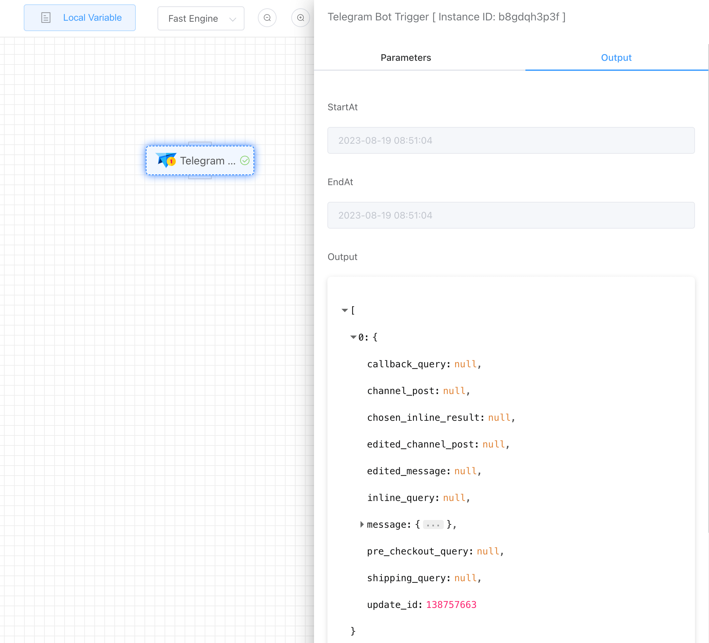