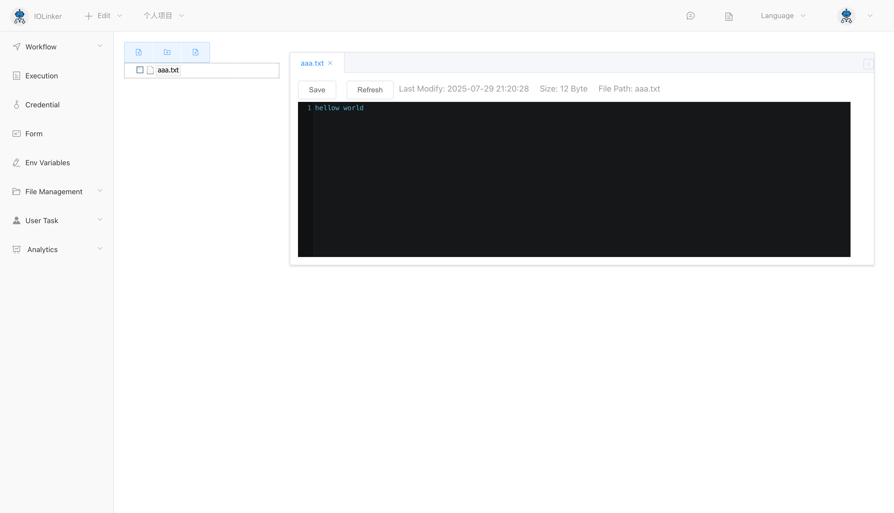
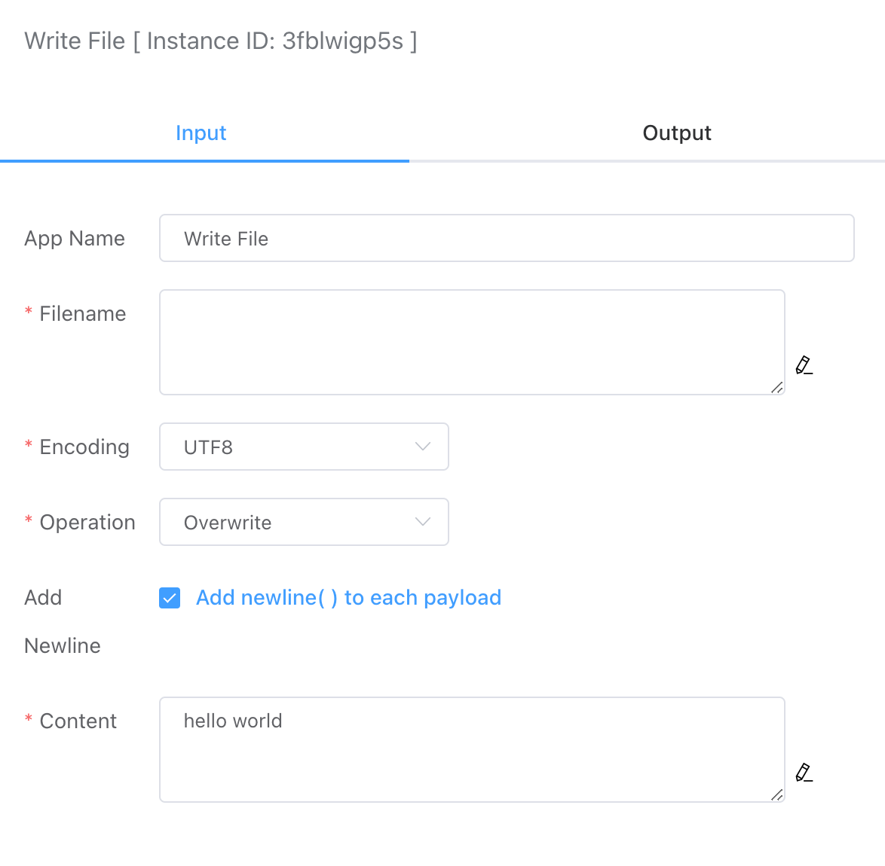

## Write File

You can write text data to a local file.

Successfully written files can be viewed under **File Management** in the **Local File** section, where they can also be edited and updated.

## Input

### Filename

The name of the saved file, for example: `test.txt`.

### Encoding

Currently, UTF-8 encoding format is supported.

### Operations

- **Overwrite**:  
  If a file with the same name exists, its data will be overwritten. If no such file exists, a new file will be created.

- **Append**:  
  If a file with the same name exists, data will be added to the end of the file. If no such file exists, a new file will be created.

- **Delete File**:  
  Delete the specified file by name.

### Add Newline

Set whether to add a newline after each piece of data.

### Content

The text data content to be written.

## Output

Displays the number of bytes written.

