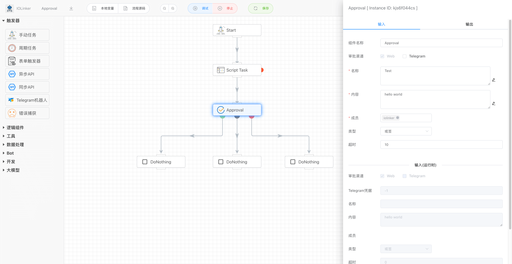
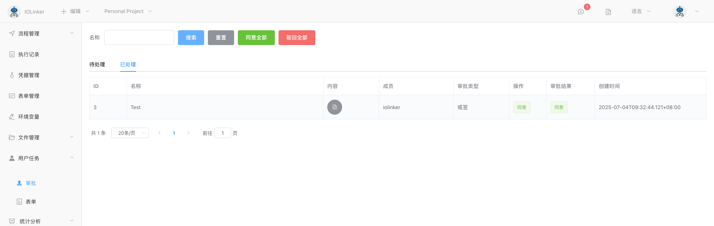

## 审批

支持或签、会签审批方式，同时支持在Web网页上和Telegram上审批，并且可以设置超时时间及其响应分支。

节点绿色输出表示审批同意，红色表示不同意，中间灰色表示超时。



个人待审批的数据可以在【用户任务】下的【审批】查看，支持一键批量操作。


点击审批详情，可以看到审批的完整内容和操作。





## 入参

### 审批渠道

默认Web包含必选，Telegram可选，勾选Telegram则需要配置关联的机器人凭据（Token），需要到凭据那里创建。


### 名称

审批名称。


### 内容

审批内容。


### 成员

审批成员，这里会显示账号列表下的用户，支持模糊搜索。如果启用了Telegram审批，则需要再用户列表哪里配置用户的TelegramID，否则无法发消息给Telegram用户。


### 类型

支持两种常见审批类型：

- 或签：只须一个审批人处理，若该审批人同意即可进入到下一个节点，若该审批人拒绝则审批流程结束
- 会签：所有审批人都同意才会进入下一个节点，若有任意一个审批人拒绝，审批单就会不通过且审批流程结束


### 超时

默认为0表示没有超时的限制，如果大于0，则审批时间超过指定的时间，就会结束审批流程，并流转到中间的超时分支。

用户可以在这里设置超时的响应动作。


## 出参

输出包含两个字段，其中：

- approval：表示审批的详情，包括审批标题、内容、成员和审批结果等信息
- operationList：表示每个审批成员提交的结果和留言等信息。

如下是某个输出结果：

```json
[
    {
        "approval": {
            "appInstId": "kjs6f044cs",
            "attr": "Any",
            "content": "hello world",
            "createAt": "2024-01-01T0xxxx",
            "endAt": "2024-01-01 xxxx",
            "executionUid": "2172667998xxxx",
            "expireAt": 0,
            "id": 4,
            "index": 0,
            "isTimeout": false,
            "name": "Test",
            "startAt": "2024-01-01 xxxx",
            "status": -99,
            "template": "approval",
            "timeout": 0,
            "updateAt": "2024-01-xxxx",
            "users": "botman",
            "workflowId": 1,
            "workflowUser": "botman"
        },
        "operationList": [
            {
                "approvalId": 4,
                "comment": "",
                "createAt": "2024-01-xxxx",
                "id": 4,
                "name": "Test",
                "status": 0,
                "updateAt": "2024-01-xxxx",
                "user": "botman"
            }
        ]
    }
]
```

