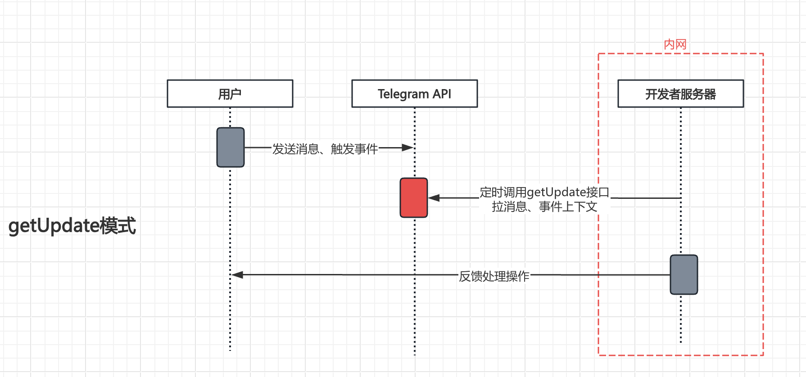
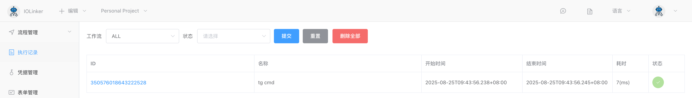
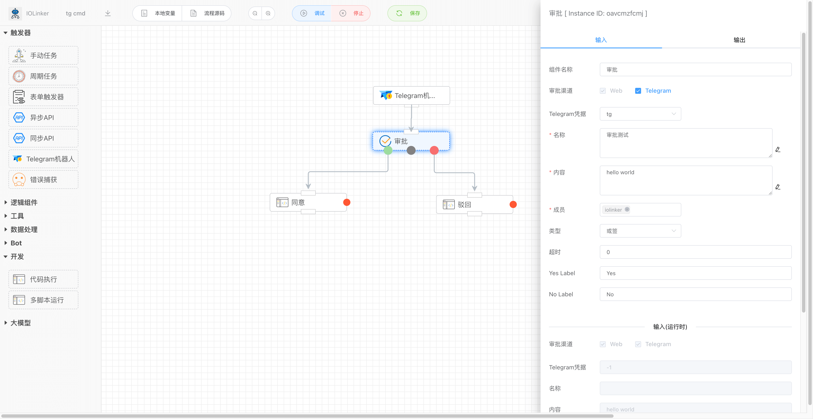
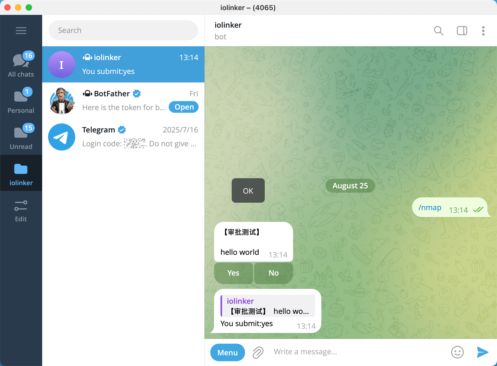
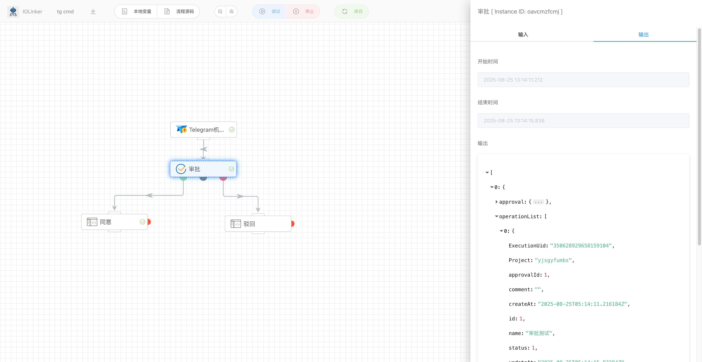

# 不会写Python代码也可以实现复杂的Telegram交互机器人吗?

下面这篇文章会告诉你怎样用一种低代码编排的方式来实现一个复杂的Telegram交互机器人，即时不懂编程的人也可以快速实现一个自己的机器人，而且是可以用指令交互的机器人！！！

## 一、效果演示

先说重点，看看我们要做成的Telegram机器人效果是怎样的：

## 二、接收Telegram回调消息的两种方式

对于普通的个人开发者来说，使用getUpdate方式的要求门槛较少，不需要太多前提条件。除非对实时性要求高、且需要处理大量的消息，就可以考虑选择webhook模式。

### （1）getUpdate模式

主动拉Telegram提供的getUpdate接口来获取发送给机器人的消息以及事件数据，这种方式不需要像WebHook那样提供域名并暴露在公网上，在内网也可以接受Telegram机器人的回调消息。如下是该模式的流程原理。

> 优点

- 不需要暴露公网机器，可在内网拉Telegram回调消息，安全性高
- 不需要域名，不需要HTTPS证书
- 不需要向Telegram BotFather注册webhook接口，直接调用拉数据

> 缺点

- 需要定时轮询方式拉取消息，实时性稍微差一点
- 需要自己本地存储处理上次同步过的消息，避免重复响应消息
- 仅适合消息量较小的业务场景

### （2）webhook模式

提供一个回调地址（需要https的域名）给Telegram，Telegram会把机器人收到的消息和事件数据推送到这个回调接口，这种方式实时性会更高，但是相对低会要求用户把系统暴露到公网上，且需要提供一个带HTTPS证书的域名。如下是该模式的流程原理。

> 优点

- 实时性较强，适合处理消息多的业务场景
- 不需要记录上次同步的消息，实现较简单

> 缺点

- 需要一台暴露在公网的机器，可能存在被攻击风险
- 需要一个带HTTPS证书的域名
- 需要手动向Telegram平台的BotFather注册这个回调接口

## 三、实现方式

### 1、Telegram Python库

相信下面这个库，很多用python实现Telegram机器人的开发者应该见过或者使用过。这个开源Python库封装了很多Telegram的官方API，大大降低了调用Telegram接口的难度。但是还是无法避免需要写大量的代码，特别是要想实现有复杂交互能力的Telegram机器人，还涉及到各种编程技术以及涉及到本地数据的存储维护等问题。

这种对于有编程能力的开发者尚且有些困难，更别说那些没学过编程技术的人了！！！

开源Telegram Python库：https://github.com/python-telegram-bot/python-telegram-bot

Telegram官网机器人API（非常多！！）：

当然，这种麻烦的实现方式不在我们的考虑范围内，下面看另一个方法。

### 2、使用IOLinker 编排工具

#### (1) 下载iolinker并启动

参考官网文章：[如何运行Iolinker](https://iolinker.com/zh/how-to-run-iolinker.html) 

#### (2) 创建Telegram凭据

这里相信大部分人应该都有，就不详细展开，主要是取官方的BotFather申请。

创建完凭据后，进入IOLinker的凭据管理页面，录入前面创建的Telegram凭据：

#### (3) 创建并配置Telegram机器人触发器

点击【编辑】菜单栏下的【添加流程】按钮：

在左侧【触发器】分类下，选择【Telegram触发器】，双击并按照下图配置。
- 凭据：使用前面创建的Telegram凭据
- 消息类型：这里选择文本
- 授权成员：默认不填即支持响应所有人的输入
- 触发范围：选择命令输入触发。备注：默认是任意输入触发，即不管输入什么字符串都会响应
- 命令：这里我们使用每个机器人默认都带的/start命令
- 命令行参数：参考文档：[命令行参数使用](https://iolinker.com/zh/trigger_telegram.html#%E5%91%BD%E4%BB%A4%E5%92%8C%E5%8F%82%E6%95%B0)
- 调试数据：这里主要是模仿Telegram机器人触发器执行后的输出结果，可以在不实际运行机器人时模拟数据输出

到这里，如果我们直接保存，并启用，实际上是可以运行了，只不过这里只是捕获用户的输入没有给用户实际反馈，实际如下：

在Telegram机器人输入`/start`指令后，我们可以在工作流列表中看到工作流响应执行的记录。

点击执行记录，可以看到详细的响应数据。

#### (4) 添加Telegram Bot审批交互功能

点击左侧的【逻辑组件】选择【审批】APP，拖入编辑器并双击配置。

- 审批渠道：默认可以在网页审批，这里我们勾选多Telegram
- Telegram凭据：勾选前面创建的Telegram凭据
- 名称：消息名称
- 内容：审批的内容
- 成员：这里默认只能选择集（在设置栏目查看）。注意：这里需要再【设置】-》【账号】下设置自己Telegram的账号ID，关于查询自己Telegram ID，查看文档：[如何查看Telegram ID](https://iolinker.com/zh/send_telegram_message.html#chatid)
- 类型：或签，即只要有一个审批即可
- 超时：这里可以设置多少秒后超时，进入中间灰色远点连线指向的分支
- Yes Label：设置审批通过的标签名称
- No Label：设置审批驳回的标签名称

如下图，设置了审批APP后，可以设置同意（绿色圆点）和驳回（红色圆点）的后续响应分支，例如执行其他python代码之类的。也可以使用Telegram发送消息。

#### (5) 保存并启用

保存后，可以再【流程管理】下的【机器人列表】看到创建的机器人信息，也可以在【工作流列表】看到。

#### (6) 测试机器人

打开创建的机器人，输入`/start`命令，我们会看到机器人给我们发送了审批的交互按钮。

点击【Yes】或【No】按钮，执行后续同意或驳回分支的流程。

我们回到【执行记录】可以看到工作流的响应记录，这里可以看到工作流根据机器人的交互选择了对应的分支流程执行。

整个过程熟练的话，可以不到一分钟完成，相比过去写代码速度回高效很多！！

