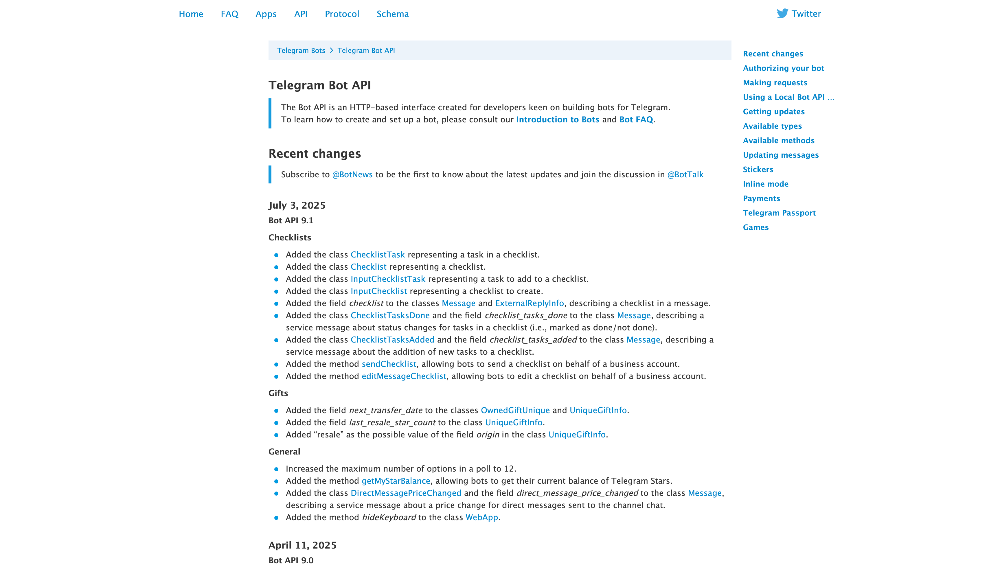

# 不会写Python代码也可以实现复杂的Telegram交互机器人吗?

下面这篇文章会告诉你怎样用一种低代码编排的方式来实现一个复杂的Telegram交互机器人，即时不懂编程的人也可以快速实现一个自己的机器人，而且是可以用指令交互的机器人！！！

## 一、效果演示

先说重点，看看我们要做成的Telegram机器人效果是怎样的：

## 二、接收Telegram回调消息的两种方式

对于普通的个人开发者来说，使用getUpdate方式的要求门槛较少，不需要太多前提条件。除非对实时性要求高、且需要处理大量的消息，就可以考虑选择webhook模式。

### （1）getUpdate模式

主动拉Telegram提供的getUpdate接口来获取发送给机器人的消息以及事件数据，这种方式不需要像WebHook那样提供域名并暴露在公网上，在内网也可以接受Telegram机器人的回调消息。如下是该模式的流程原理。

> 优点

- 不需要暴露公网机器，可在内网拉Telegram回调消息，安全性高
- 不需要域名，不需要HTTPS证书
- 不需要向Telegram BotFather注册webhook接口，直接调用拉数据

> 缺点

- 需要定时轮询方式拉取消息，实时性稍微差一点
- 需要自己本地存储处理上次同步过的消息，避免重复响应消息
- 仅适合消息量较小的业务场景

### （2）webhook模式

提供一个回调地址（需要https的域名）给Telegram，Telegram会把机器人收到的消息和事件数据推送到这个回调接口，这种方式实时性会更高，但是相对低会要求用户把系统暴露到公网上，且需要提供一个带HTTPS证书的域名。如下是该模式的流程原理。

> 优点

- 实时性较强，适合处理消息多的业务场景
- 不需要记录上次同步的消息，实现较简单

> 缺点

- 需要一台暴露在公网的机器，可能存在被攻击风险
- 需要一个带HTTPS证书的域名
- 需要手动向Telegram平台的BotFather注册这个回调接口

## 三、实现方式

### 1、Telegram Python库

相信下面这个库，很多用python实现Telegram机器人的开发者应该见过或者使用过。这个开源Python库封装了很多Telegram的官方API，大大降低了调用Telegram接口的难度。但是还是无法避免需要写大量的代码，特别是要想实现有复杂交互能力的Telegram机器人，还涉及到各种编程技术以及涉及到本地数据的存储维护等问题。

这种对于有编程能力的开发者尚且有些困难，更别说那些没学过编程技术的人了！！！

开源Telegram Python库：https://github.com/python-telegram-bot/python-telegram-bot

Telegram官网机器人API（非常多！！）：

当然，这种麻烦的实现方式不在我们的考虑范围内，下面看另一个方法。

### 2、使用IOLinker 编排工具

