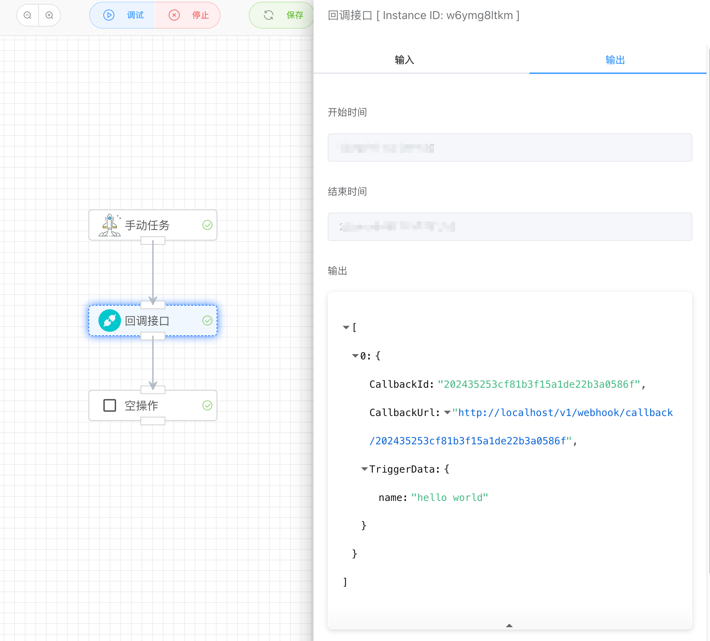

## 回调接口

执行【回调接口】应用汇生产一个唯一的URL地址，应用汇等待接口被调用才继续往下执行，否则汇一直处于睡眠状态等待。

该回调地址可以通过Post传第参数给应用并输出显示到TriggerData数据中。

```
>> curl -d '{"name":"hello world"}' http://localhost/v1/webhook/callback/202435253cf81b3f15a1de22b3a0586f
>> {"response":{}}
```




如果重复提交，会提示错误，确保每个回调接口只能被调用一次。

```
>> curl -d '{"name":"hello world"}' http://localhost/v1/webhook/callback/202435253cf81b3f15a1de22b3a0586f
>> {"response":{"error":{"code":"requestError.repeatedOperation","message":"requestError.repeatedOperation"}}}
```


## 输入

无


## 输出

- CallbackId：任务ID
- CallbackUrl：回调地址
- TriggerData：接收到的post数据

```
{
    "CallbackId": "202435253cf81b3f15a1de22b3a0586f",
    "CallbackUrl": "http://localhost/v1/webhook/callback/202435253cf81b3f15a1de22b3a0586f",
    "TriggerData": {
        "name": "hello world"
    }
}
```

